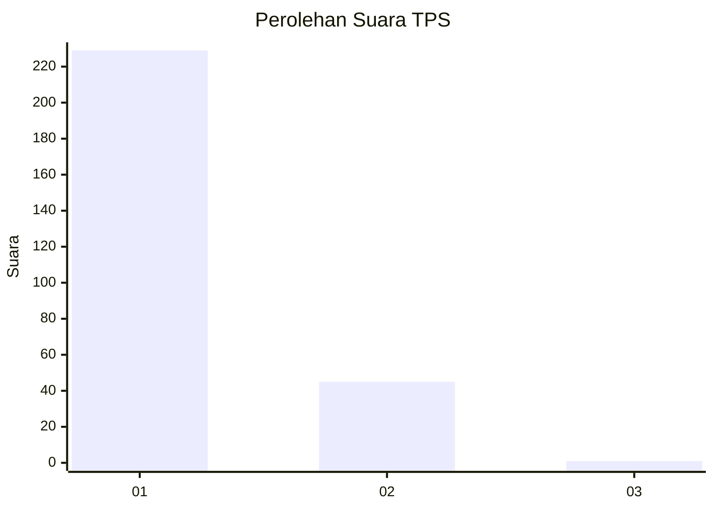
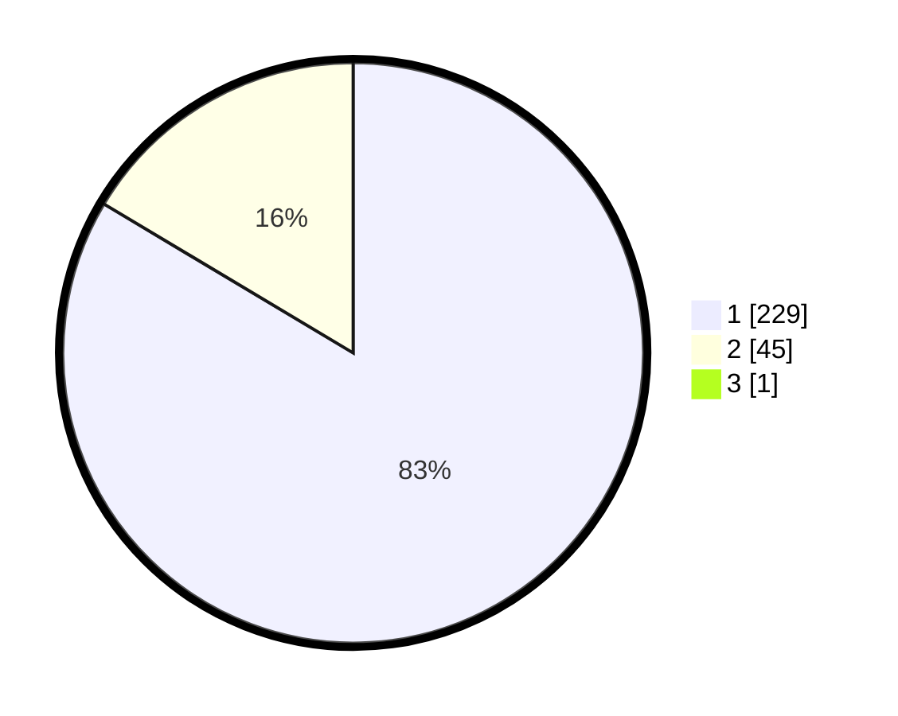

# Hasil

## Grafik

## Tabel

| No. | Nama Paslon    | Suara | Suara (raw) | Persentase |
|:--- |:-------------- | -----:| -----------:| ----------:|
| 1   | ANIES MUHAIMIN | 229   | [229][p-1]  | 83,27      |
| 2   | PRABOWO GIBRAN | 45    | [45][p-2]   | 16,36      |
| 3   | GANJAR MAHFUD  | 1     | [1][p-3]    | 0,36       |

[p-1]: https://github.com/gigit-pemilu/pemilu-2024-35-jawa-timur/blob/main/pilpres/hitung-suara/sub/35-jawa-timur/sub/27-sampang/sub/05-omben/sub/2016-rongdalam/sub/007-tps/sub/paslon-1.txt
[p-2]: https://github.com/gigit-pemilu/pemilu-2024-35-jawa-timur/blob/main/pilpres/hitung-suara/sub/35-jawa-timur/sub/27-sampang/sub/05-omben/sub/2016-rongdalam/sub/007-tps/sub/paslon-2.txt
[p-3]: https://github.com/gigit-pemilu/pemilu-2024-35-jawa-timur/blob/main/pilpres/hitung-suara/sub/35-jawa-timur/sub/27-sampang/sub/05-omben/sub/2016-rongdalam/sub/007-tps/sub/paslon-3.txt

## Foto C Plano

https://sirekap-obj-formc.kpu.go.id/d7ca/pemilu/ppwp/35/27/05/20/16/3527052016007-20240215-113811--cb719d5b-0924-4633-bca1-19fa036b0e2f.jpg

https://sirekap-obj-formc.kpu.go.id/d7ca/pemilu/ppwp/35/27/05/20/16/3527052016007-20240215-114300--27a8435a-0f55-4826-b406-26a61107e9d8.jpg

https://sirekap-obj-formc.kpu.go.id/d7ca/pemilu/ppwp/35/27/05/20/16/3527052016007-20240215-114631--14aee278-63c1-43d8-83b8-032a1d36179a.jpg

## Metadata

| Key        | Value               |
| ---------- | ------------------- |
| Time Stamp | 2024-02-25 16:00:00 |

