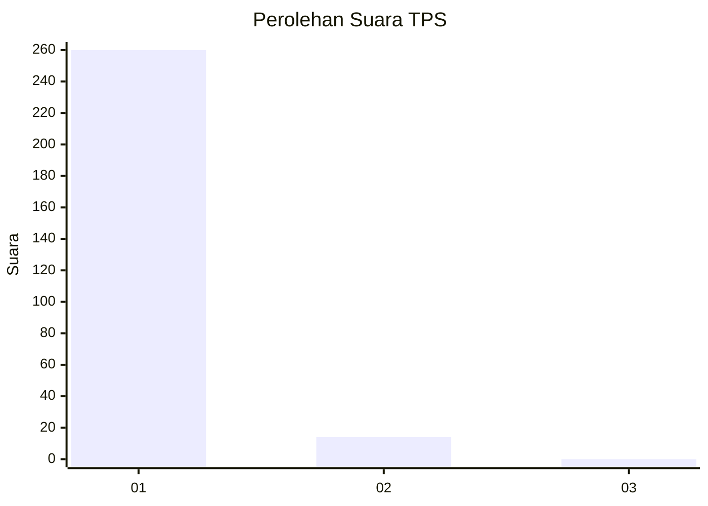
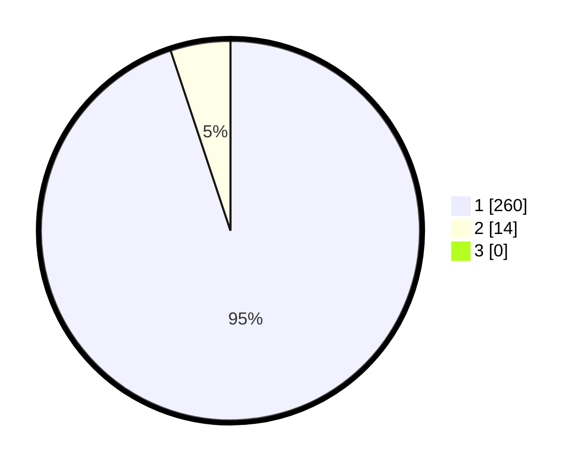

# Hasil

## Grafik

## Tabel

| No. | Nama Paslon    | Suara | Suara (raw) | Persentase |
|:--- |:-------------- | -----:| -----------:| ----------:|
| 1   | ANIES MUHAIMIN | 260   | [260][p-1]  | 94,89      |
| 2   | PRABOWO GIBRAN | 14    | [14][p-2]   | 5,11       |
| 3   | GANJAR MAHFUD  | 0     | [0][p-3]    | 0,00       |

[p-1]: https://github.com/gigit-pemilu/pemilu-2024-35-jawa-timur/blob/main/pilpres/hitung-suara/sub/35-jawa-timur/sub/27-sampang/sub/05-omben/sub/2016-rongdalam/sub/008-tps/sub/paslon-1.txt
[p-2]: https://github.com/gigit-pemilu/pemilu-2024-35-jawa-timur/blob/main/pilpres/hitung-suara/sub/35-jawa-timur/sub/27-sampang/sub/05-omben/sub/2016-rongdalam/sub/008-tps/sub/paslon-2.txt
[p-3]: https://github.com/gigit-pemilu/pemilu-2024-35-jawa-timur/blob/main/pilpres/hitung-suara/sub/35-jawa-timur/sub/27-sampang/sub/05-omben/sub/2016-rongdalam/sub/008-tps/sub/paslon-3.txt

## Foto C Plano

https://sirekap-obj-formc.kpu.go.id/dfef/pemilu/ppwp/35/27/05/20/16/3527052016008-20240214-214846--220ed739-eaba-4047-a66f-584ee053dea2.jpg

https://sirekap-obj-formc.kpu.go.id/dfef/pemilu/ppwp/35/27/05/20/16/3527052016008-20240214-215042--d047e356-788f-43f8-8b3a-ba0931dc2f4d.jpg

https://sirekap-obj-formc.kpu.go.id/dfef/pemilu/ppwp/35/27/05/20/16/3527052016008-20240214-215203--85757a23-dbaa-4ff1-a16c-b6da8718c2c0.jpg

## Metadata

| Key        | Value               |
| ---------- | ------------------- |
| Time Stamp | 2024-02-17 10:00:02 |

