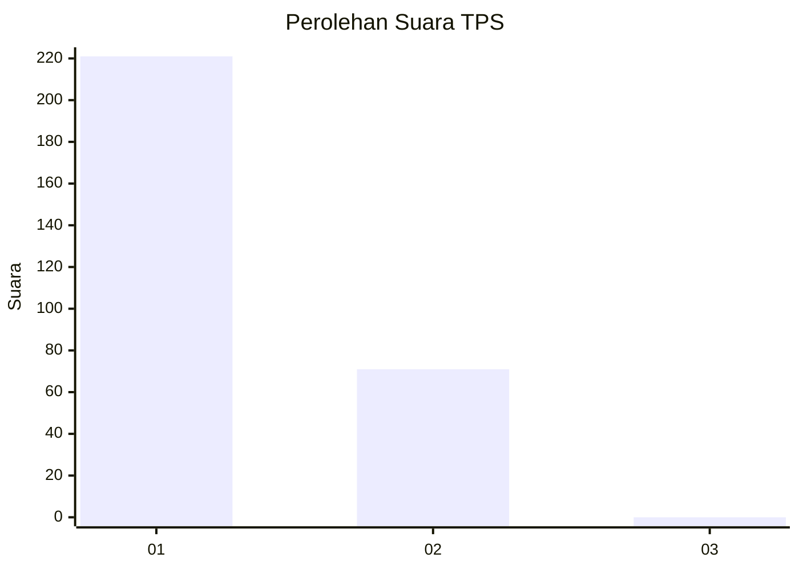
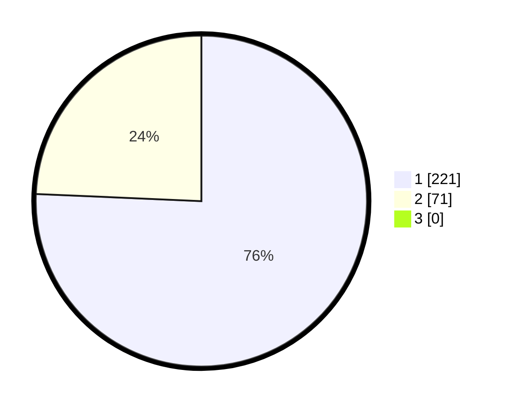

# Hasil

## Grafik

## Tabel

| No. | Nama Paslon    | Suara | Suara (raw) | Persentase |
|:--- |:-------------- | -----:| -----------:| ----------:|
| 1   | ANIES MUHAIMIN | 221   | [221][p-1]  | 75,68      |
| 2   | PRABOWO GIBRAN | 71    | [71][p-2]   | 24,32      |
| 3   | GANJAR MAHFUD  | 0     | [0][p-3]    | 0,00       |

[p-1]: https://github.com/gigit-pemilu/pemilu-2024-35-jawa-timur/blob/main/pilpres/hitung-suara/sub/35-jawa-timur/sub/27-sampang/sub/05-omben/sub/2016-rongdalam/sub/009-tps/sub/paslon-1.txt
[p-2]: https://github.com/gigit-pemilu/pemilu-2024-35-jawa-timur/blob/main/pilpres/hitung-suara/sub/35-jawa-timur/sub/27-sampang/sub/05-omben/sub/2016-rongdalam/sub/009-tps/sub/paslon-2.txt
[p-3]: https://github.com/gigit-pemilu/pemilu-2024-35-jawa-timur/blob/main/pilpres/hitung-suara/sub/35-jawa-timur/sub/27-sampang/sub/05-omben/sub/2016-rongdalam/sub/009-tps/sub/paslon-3.txt

## Foto C Plano

https://sirekap-obj-formc.kpu.go.id/640b/pemilu/ppwp/35/27/05/20/16/3527052016009-20240215-103946--6422d42d-bc1e-4f9e-acc4-284f9336eea6.jpg

https://sirekap-obj-formc.kpu.go.id/640b/pemilu/ppwp/35/27/05/20/16/3527052016009-20240214-221054--27b94b9f-0148-457e-8e95-7025f8537e3c.jpg

https://sirekap-obj-formc.kpu.go.id/640b/pemilu/ppwp/35/27/05/20/16/3527052016009-20240214-221349--5fcd72a7-96e3-4d20-b52d-21518d14fed6.jpg

## Metadata

| Key        | Value               |
| ---------- | ------------------- |
| Time Stamp | 2024-02-16 22:30:00 |

