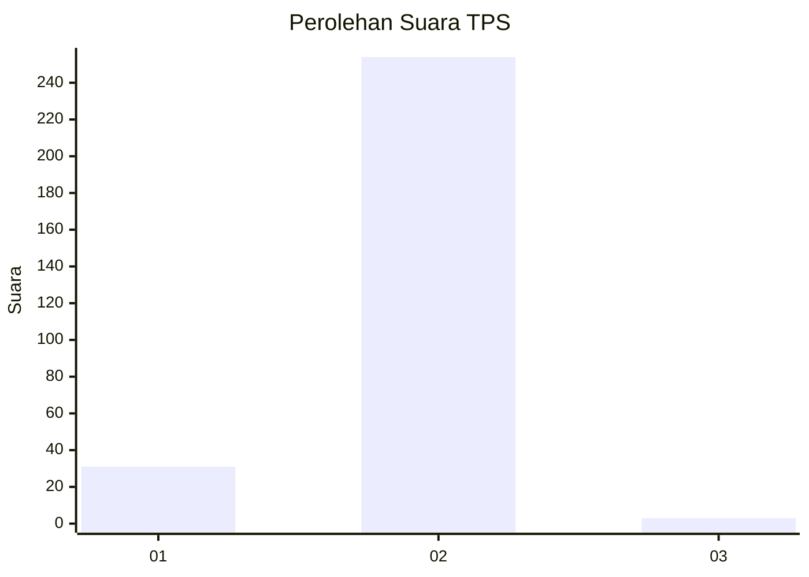
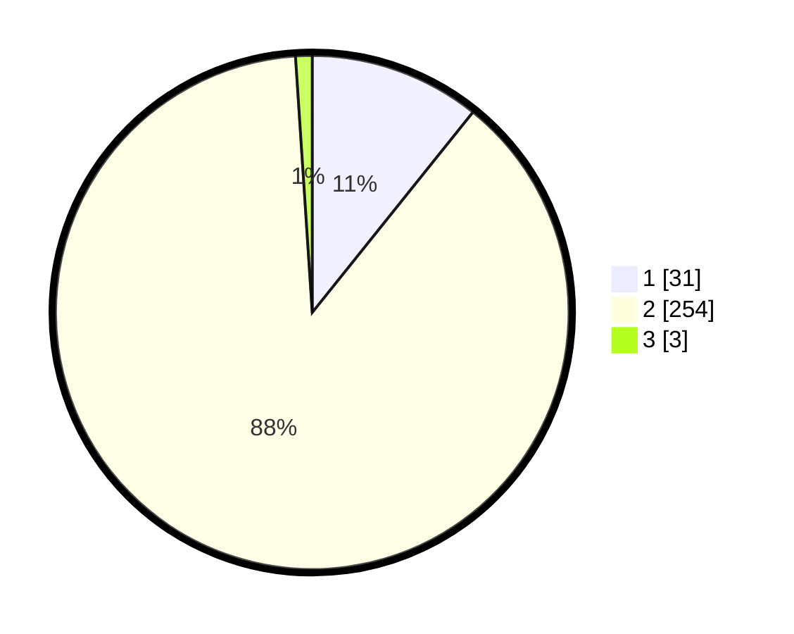

# Hasil

## Grafik

## Tabel

| No. | Nama Paslon    | Suara | Suara (raw) | Persentase |
|:--- |:-------------- | -----:| -----------:| ----------:|
| 1   | ANIES MUHAIMIN | 31    | [31][p-1]   | 10,76      |
| 2   | PRABOWO GIBRAN | 254   | [254][p-2]  | 88,19      |
| 3   | GANJAR MAHFUD  | 3     | [3][p-3]    | 1,04       |

[p-1]: https://github.com/gigit-pemilu/pemilu-2024-35-jawa-timur/blob/main/pilpres/hitung-suara/sub/35-jawa-timur/sub/27-sampang/sub/05-omben/sub/2016-rongdalam/sub/010-tps/sub/paslon-1.txt
[p-2]: https://github.com/gigit-pemilu/pemilu-2024-35-jawa-timur/blob/main/pilpres/hitung-suara/sub/35-jawa-timur/sub/27-sampang/sub/05-omben/sub/2016-rongdalam/sub/010-tps/sub/paslon-2.txt
[p-3]: https://github.com/gigit-pemilu/pemilu-2024-35-jawa-timur/blob/main/pilpres/hitung-suara/sub/35-jawa-timur/sub/27-sampang/sub/05-omben/sub/2016-rongdalam/sub/010-tps/sub/paslon-3.txt

## Foto C Plano

https://sirekap-obj-formc.kpu.go.id/d125/pemilu/ppwp/35/27/05/20/16/3527052016010-20240215-141943--f9d4e307-8ad0-40b4-a5b3-b33960330574.jpg

https://sirekap-obj-formc.kpu.go.id/d125/pemilu/ppwp/35/27/05/20/16/3527052016010-20240215-090232--e173ff5d-fd67-4b62-bae8-5c23ea5f6a19.jpg

https://sirekap-obj-formc.kpu.go.id/d125/pemilu/ppwp/35/27/05/20/16/3527052016010-20240215-090603--1649853a-3837-4dd7-89d5-75e6c9af0be5.jpg

## Metadata

| Key        | Value               |
| ---------- | ------------------- |
| Time Stamp | 2024-02-16 22:30:00 |

