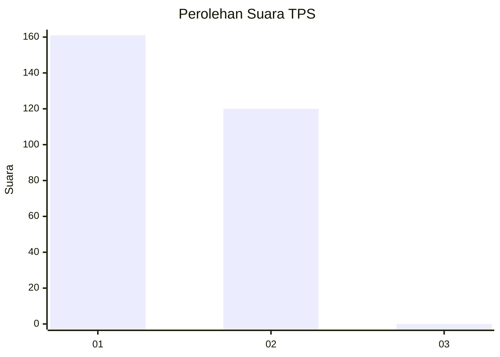
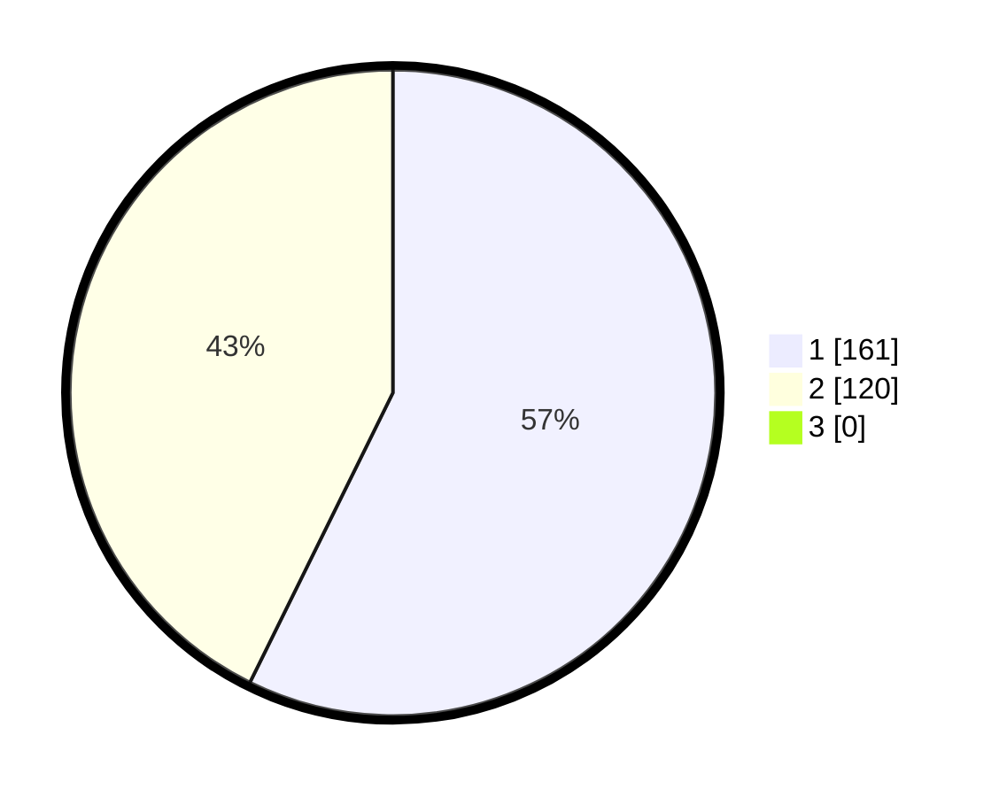

# Hasil

## Grafik

## Tabel

| No. | Nama Paslon    | Suara | Suara (raw) | Persentase |
|:--- |:-------------- | -----:| -----------:| ----------:|
| 1   | ANIES MUHAIMIN | 161   | [161][p-1]  | 57,30      |
| 2   | PRABOWO GIBRAN | 120   | [120][p-2]  | 42,70      |
| 3   | GANJAR MAHFUD  | 0     | [0][p-3]    | 0,00       |

[p-1]: https://github.com/gigit-pemilu/pemilu-2024-35-jawa-timur/blob/main/pilpres/hitung-suara/sub/35-jawa-timur/sub/27-sampang/sub/05-omben/sub/2016-rongdalam/sub/011-tps/sub/paslon-1.txt
[p-2]: https://github.com/gigit-pemilu/pemilu-2024-35-jawa-timur/blob/main/pilpres/hitung-suara/sub/35-jawa-timur/sub/27-sampang/sub/05-omben/sub/2016-rongdalam/sub/011-tps/sub/paslon-2.txt
[p-3]: https://github.com/gigit-pemilu/pemilu-2024-35-jawa-timur/blob/main/pilpres/hitung-suara/sub/35-jawa-timur/sub/27-sampang/sub/05-omben/sub/2016-rongdalam/sub/011-tps/sub/paslon-3.txt

## Foto C Plano

https://sirekap-obj-formc.kpu.go.id/ead8/pemilu/ppwp/35/27/05/20/16/3527052016011-20240214-205904--1480be94-d53f-4222-a430-b9f95754d35c.jpg

https://sirekap-obj-formc.kpu.go.id/ead8/pemilu/ppwp/35/27/05/20/16/3527052016011-20240214-210106--b9245c62-5fad-4da4-affe-68ce0389bf37.jpg

https://sirekap-obj-formc.kpu.go.id/ead8/pemilu/ppwp/35/27/05/20/16/3527052016011-20240214-210452--635e120f-2799-431f-8e45-6c2b45e66cc5.jpg

## Metadata

| Key        | Value               |
| ---------- | ------------------- |
| Time Stamp | 2024-02-16 22:30:00 |

