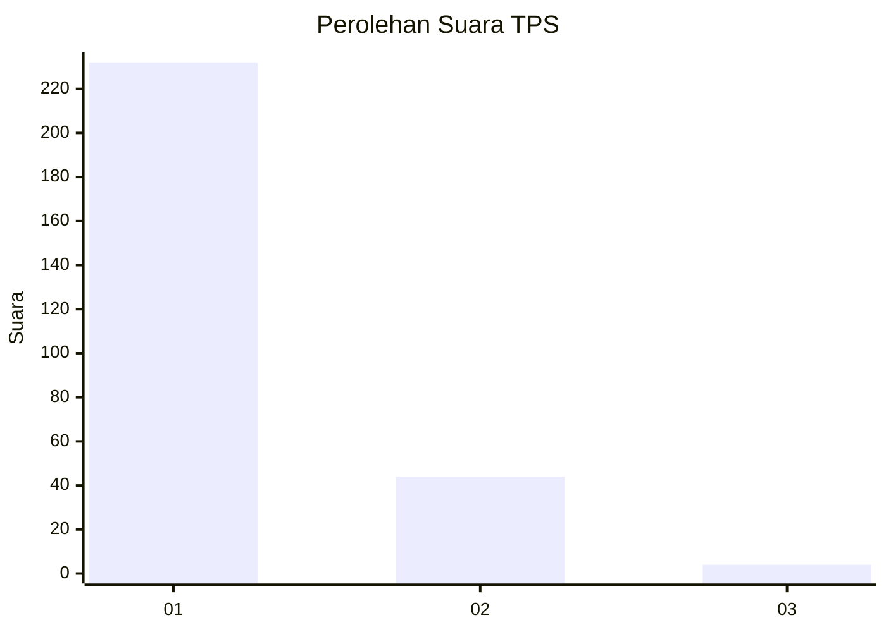
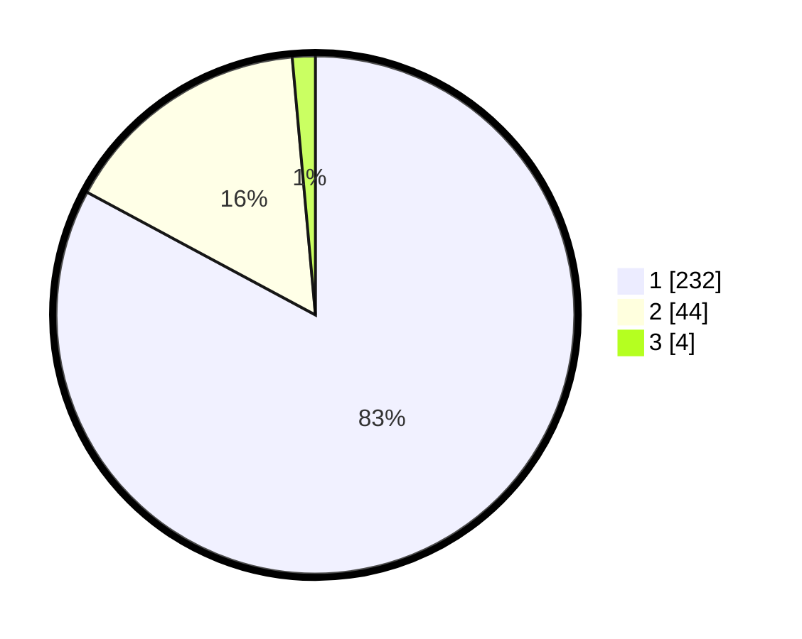

# Hasil

## Grafik

## Tabel

| No. | Nama Paslon    | Suara | Suara (raw) | Persentase |
|:--- |:-------------- | -----:| -----------:| ----------:|
| 1   | ANIES MUHAIMIN | 232   | [232][p-1]  | 82,86      |
| 2   | PRABOWO GIBRAN | 44    | [44][p-2]   | 15,71      |
| 3   | GANJAR MAHFUD  | 4     | [4][p-3]    | 1,43       |

[p-1]: https://github.com/gigit-pemilu/pemilu-2024/blob/main/pilpres/hitung-suara/sub/35-jawa-timur/sub/27-sampang/sub/05-omben/sub/2016-rongdalam/sub/012-tps/sub/paslon-1.txt
[p-2]: https://github.com/gigit-pemilu/pemilu-2024/blob/main/pilpres/hitung-suara/sub/35-jawa-timur/sub/27-sampang/sub/05-omben/sub/2016-rongdalam/sub/012-tps/sub/paslon-2.txt
[p-3]: https://github.com/gigit-pemilu/pemilu-2024/blob/main/pilpres/hitung-suara/sub/35-jawa-timur/sub/27-sampang/sub/05-omben/sub/2016-rongdalam/sub/012-tps/sub/paslon-3.txt

## Foto C Plano

https://sirekap-obj-formc.kpu.go.id/7b66/pemilu/ppwp/35/27/05/20/16/3527052016012-20240215-142745--f3c31b0a-314a-4572-bdd9-636fd45cad1a.jpg

https://sirekap-obj-formc.kpu.go.id/7b66/pemilu/ppwp/35/27/05/20/16/3527052016012-20240215-142838--cb86a7fc-31eb-487e-adcb-d30ab60c59f1.jpg

https://sirekap-obj-formc.kpu.go.id/7b66/pemilu/ppwp/35/27/05/20/16/3527052016012-20240215-143118--668ef25a-0240-4dde-94d4-eeb7a1af5ec2.jpg

## Metadata

| Key        | Value               |
| ---------- | ------------------- |
| Time Stamp | 2024-02-16 22:30:00 |

