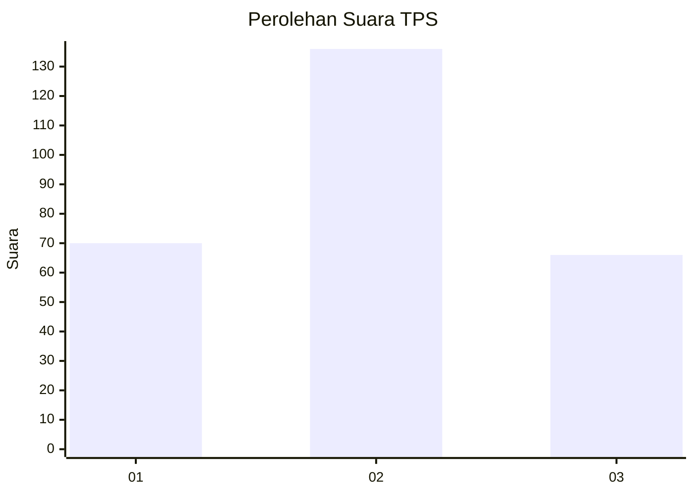
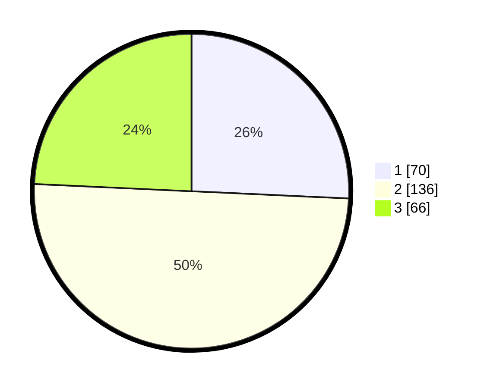

# Hasil

## Grafik

## Tabel

| No. | Nama Paslon    | Suara | Suara (raw) | Persentase |
|:--- |:-------------- | -----:| -----------:| ----------:|
| 1   | ANIES MUHAIMIN | 70    | [70][p-1]   | 25,74      |
| 2   | PRABOWO GIBRAN | 136   | [136][p-2]  | 50,00      |
| 3   | GANJAR MAHFUD  | 66    | [66][p-3]   | 24,26      |

[p-1]: https://github.com/gigit-pemilu/pemilu-2024/blob/main/pilpres/hitung-suara/sub/35-jawa-timur/sub/27-sampang/sub/05-omben/sub/2017-napo-laok/sub/003-tps/sub/paslon-1.txt
[p-2]: https://github.com/gigit-pemilu/pemilu-2024/blob/main/pilpres/hitung-suara/sub/35-jawa-timur/sub/27-sampang/sub/05-omben/sub/2017-napo-laok/sub/003-tps/sub/paslon-2.txt
[p-3]: https://github.com/gigit-pemilu/pemilu-2024/blob/main/pilpres/hitung-suara/sub/35-jawa-timur/sub/27-sampang/sub/05-omben/sub/2017-napo-laok/sub/003-tps/sub/paslon-3.txt

## Foto C Plano

https://sirekap-obj-formc.kpu.go.id/d713/pemilu/ppwp/35/27/05/20/17/3527052017003-20240214-215428--c9a42c46-5685-420b-91ab-4cab5d1b3fae.jpg

https://sirekap-obj-formc.kpu.go.id/d713/pemilu/ppwp/35/27/05/20/17/3527052017003-20240214-215947--70d7568e-931b-405e-8769-8c1bbeb1480a.jpg

https://sirekap-obj-formc.kpu.go.id/d713/pemilu/ppwp/35/27/05/20/17/3527052017003-20240214-220100--4b6800cf-3037-4292-9bea-d0cb1f032961.jpg

## Metadata

| Key        | Value               |
| ---------- | ------------------- |
| Time Stamp | 2024-02-15 20:30:46 |

## DATA PEMILIH TETAP

Jumlah pemilih dalam DPT: **274**.
 * L: **32**.
 * P: **242**.

## DATA PENGGUNA HAK PILIH

Jumlah pengguna hak pilih dalam DPT: **276**.
 * L: **434**.
 * P: **644**.

Jumlah pengguna hak pilih dalam DPTb: **88**.
 * L: **478**.
 * P: **88**.

Jumlah pengguna hak pilih dalam DPK: **482**.
 * L: **808**.
 * P: **888**.

Jumlah pengguna hak pilih: **228**.
 * L: **134**.
 * P: **244**.

## JUMLAH SUARA SAH DAN TIDAK SAH

JUMLAH SELURUH SUARA SAH: **272**.

JUMLAH SUARA TIDAK SAH: **2**.

JUMLAH SELURUH SUARA SAH DAN SUARA TIDAK SAH: **274**.

