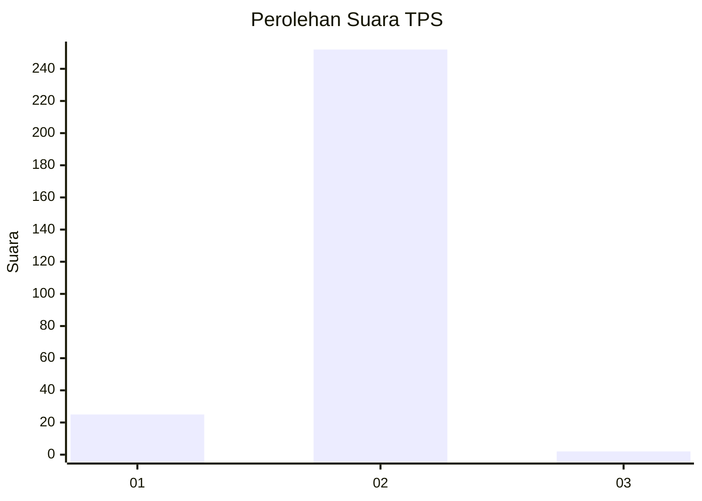
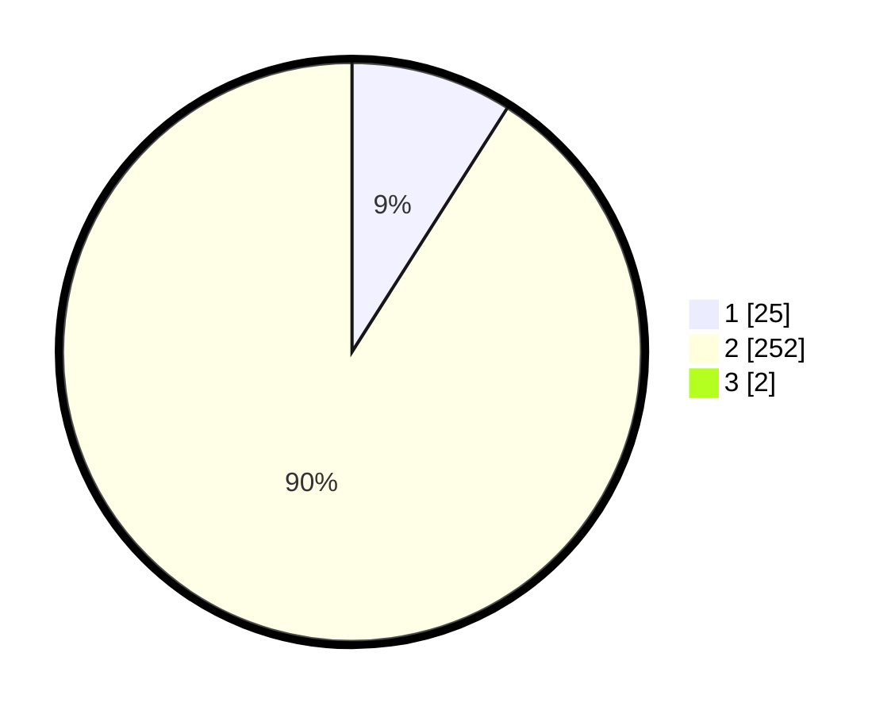

# Hasil

## Grafik

## Tabel

| No. | Nama Paslon    | Suara | Suara (raw) | Persentase |
|:--- |:-------------- | -----:| -----------:| ----------:|
| 1   | ANIES MUHAIMIN | 25    | [25][p-1]   | 8,96       |
| 2   | PRABOWO GIBRAN | 252   | [252][p-2]  | 90,32      |
| 3   | GANJAR MAHFUD  | 2     | [2][p-3]    | 0,72       |

[p-1]: https://github.com/gigit-pemilu/pemilu-2024-35-jawa-timur/blob/main/pilpres/hitung-suara/sub/35-jawa-timur/sub/27-sampang/sub/05-omben/sub/2018-napo-daya/sub/002-tps/sub/paslon-1.txt
[p-2]: https://github.com/gigit-pemilu/pemilu-2024-35-jawa-timur/blob/main/pilpres/hitung-suara/sub/35-jawa-timur/sub/27-sampang/sub/05-omben/sub/2018-napo-daya/sub/002-tps/sub/paslon-2.txt
[p-3]: https://github.com/gigit-pemilu/pemilu-2024-35-jawa-timur/blob/main/pilpres/hitung-suara/sub/35-jawa-timur/sub/27-sampang/sub/05-omben/sub/2018-napo-daya/sub/002-tps/sub/paslon-3.txt

## Foto C Plano

https://sirekap-obj-formc.kpu.go.id/bdb1/pemilu/ppwp/35/27/05/20/18/3527052018002-20240214-202230--4b8100ab-deca-4cf7-b495-e6ff8ee49ebd.jpg

https://sirekap-obj-formc.kpu.go.id/bdb1/pemilu/ppwp/35/27/05/20/18/3527052018002-20240214-202413--4b1de67a-d43d-4b6c-bf21-8a2d0acdbec3.jpg

https://sirekap-obj-formc.kpu.go.id/bdb1/pemilu/ppwp/35/27/05/20/18/3527052018002-20240214-202554--530f0145-2cda-4263-9aea-bf5279eece79.jpg

## Metadata

| Key        | Value               |
| ---------- | ------------------- |
| Time Stamp | 2024-02-15 00:41:44 |

