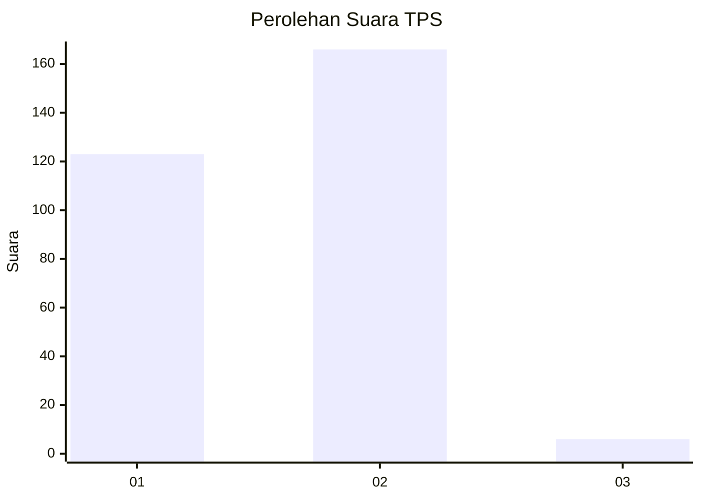
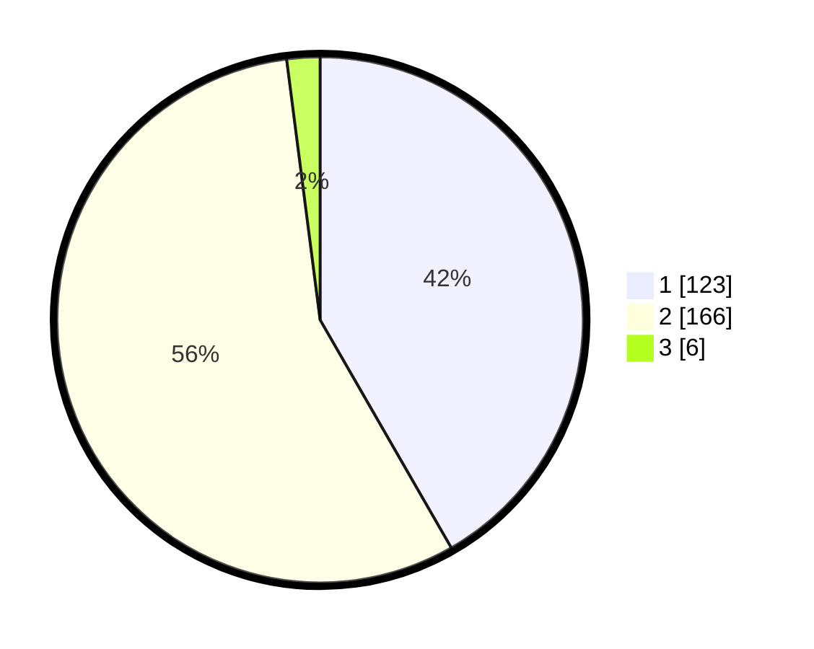

# Hasil

## Grafik

## Tabel

| No. | Nama Paslon    | Suara | Suara (raw) | Persentase |
|:--- |:-------------- | -----:| -----------:| ----------:|
| 1   | ANIES MUHAIMIN | 123   | [123][p-1]  | 41,69      |
| 2   | PRABOWO GIBRAN | 166   | [166][p-2]  | 56,27      |
| 3   | GANJAR MAHFUD  | 6     | [6][p-3]    | 2,03       |

[p-1]: https://github.com/gigit-pemilu/pemilu-2024/blob/main/pilpres/hitung-suara/sub/35-jawa-timur/sub/27-sampang/sub/05-omben/sub/2019-karanggayam/sub/002-tps/sub/paslon-1.txt
[p-2]: https://github.com/gigit-pemilu/pemilu-2024/blob/main/pilpres/hitung-suara/sub/35-jawa-timur/sub/27-sampang/sub/05-omben/sub/2019-karanggayam/sub/002-tps/sub/paslon-2.txt
[p-3]: https://github.com/gigit-pemilu/pemilu-2024/blob/main/pilpres/hitung-suara/sub/35-jawa-timur/sub/27-sampang/sub/05-omben/sub/2019-karanggayam/sub/002-tps/sub/paslon-3.txt

## Foto C Plano

https://sirekap-obj-formc.kpu.go.id/7461/pemilu/ppwp/35/27/05/20/19/3527052019002-20240214-233404--323bdc17-9508-47df-b22e-9e66ed7f5549.jpg

https://sirekap-obj-formc.kpu.go.id/7461/pemilu/ppwp/35/27/05/20/19/3527052019002-20240214-233734--67b1d0b3-eefb-4337-a946-57a0a1628c13.jpg

https://sirekap-obj-formc.kpu.go.id/7461/pemilu/ppwp/35/27/05/20/19/3527052019002-20240215-093911--9fcd34f5-e50e-4ee7-9ee3-1af20e07c7dc.jpg

## Metadata

| Key        | Value               |
| ---------- | ------------------- |
| Time Stamp | 2024-02-16 22:30:00 |

