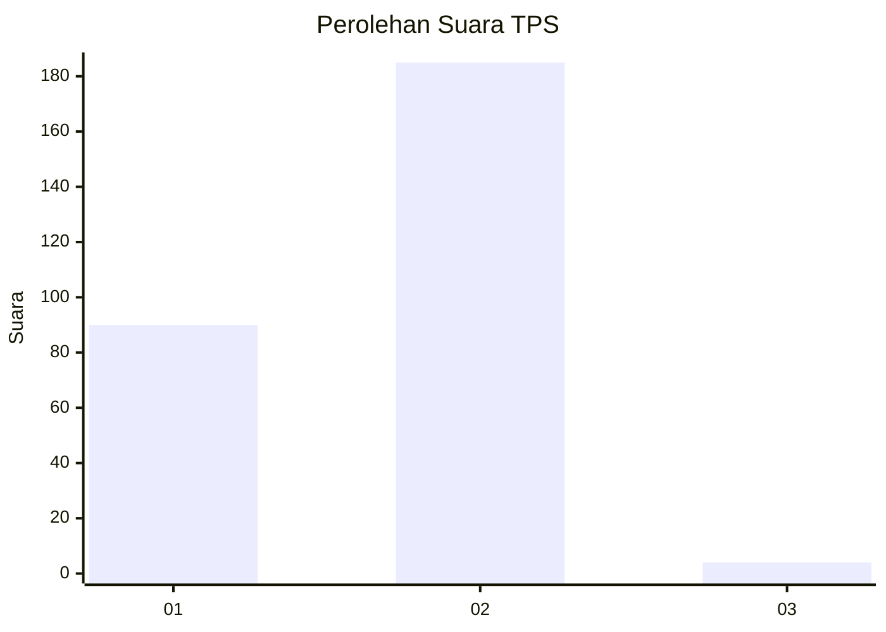
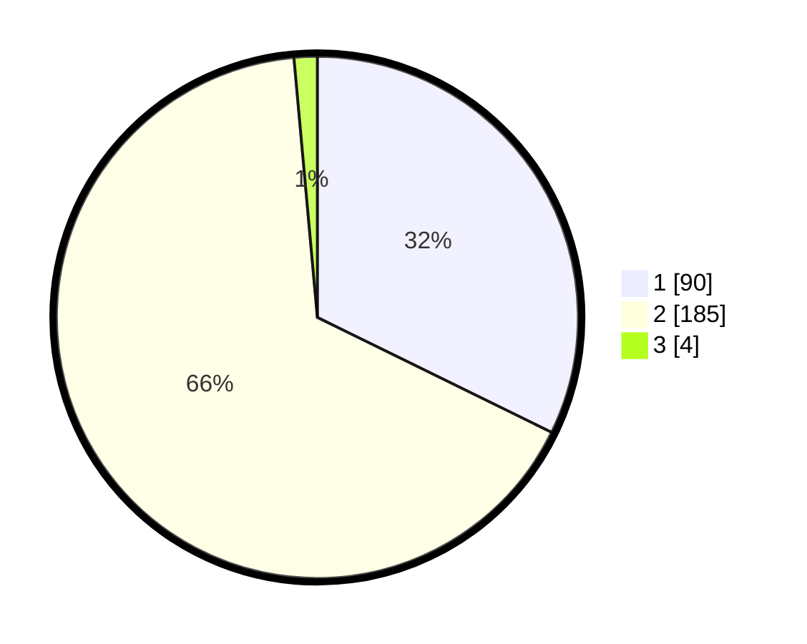

# Hasil

## Grafik

## Tabel

| No. | Nama Paslon    | Suara | Suara (raw) | Persentase |
|:--- |:-------------- | -----:| -----------:| ----------:|
| 1   | ANIES MUHAIMIN | 90    | [90][p-1]   | 32,26      |
| 2   | PRABOWO GIBRAN | 185   | [185][p-2]  | 66,31      |
| 3   | GANJAR MAHFUD  | 4     | [4][p-3]    | 1,43       |

[p-1]: https://github.com/gigit-pemilu/pemilu-2024-35-jawa-timur/blob/main/pilpres/hitung-suara/sub/35-jawa-timur/sub/27-sampang/sub/05-omben/sub/2019-karanggayam/sub/003-tps/sub/paslon-1.txt
[p-2]: https://github.com/gigit-pemilu/pemilu-2024-35-jawa-timur/blob/main/pilpres/hitung-suara/sub/35-jawa-timur/sub/27-sampang/sub/05-omben/sub/2019-karanggayam/sub/003-tps/sub/paslon-2.txt
[p-3]: https://github.com/gigit-pemilu/pemilu-2024-35-jawa-timur/blob/main/pilpres/hitung-suara/sub/35-jawa-timur/sub/27-sampang/sub/05-omben/sub/2019-karanggayam/sub/003-tps/sub/paslon-3.txt

## Foto C Plano

https://sirekap-obj-formc.kpu.go.id/d04d/pemilu/ppwp/35/27/05/20/19/3527052019003-20240215-094225--920a1de7-3c6c-42f6-bbb0-2e10afd0c312.jpg

https://sirekap-obj-formc.kpu.go.id/d04d/pemilu/ppwp/35/27/05/20/19/3527052019003-20240214-232814--5447d9b7-5d1d-4342-afe8-b90ed60c018c.jpg

https://sirekap-obj-formc.kpu.go.id/d04d/pemilu/ppwp/35/27/05/20/19/3527052019003-20240215-095018--de4b75bc-f7e6-4253-b421-ade425a30eb2.jpg

## Metadata

| Key        | Value               |
| ---------- | ------------------- |
| Time Stamp | 2024-02-16 22:30:00 |

