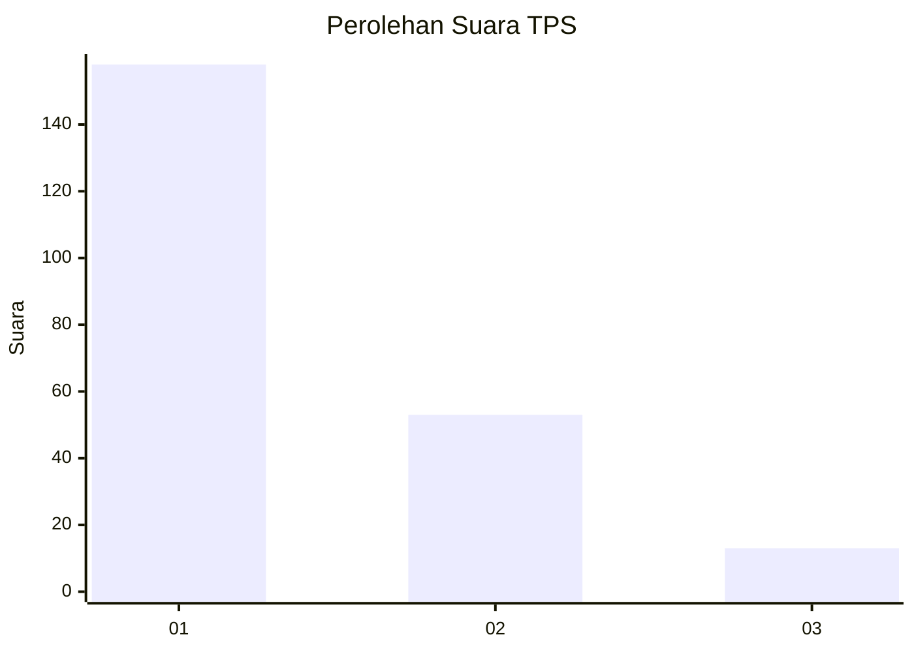
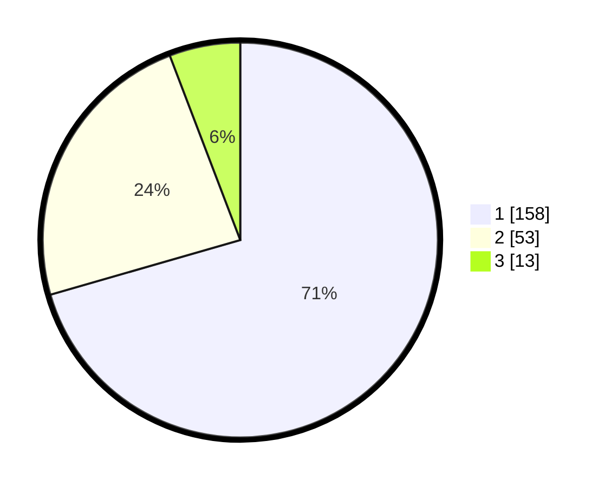

# Hasil

## Grafik

## Tabel

| No. | Nama Paslon    | Suara | Suara (raw) | Persentase |
|:--- |:-------------- | -----:| -----------:| ----------:|
| 1   | ANIES MUHAIMIN | 158   | [158][p-1]  | 70,54      |
| 2   | PRABOWO GIBRAN | 53    | [53][p-2]   | 23,66      |
| 3   | GANJAR MAHFUD  | 13    | [13][p-3]   | 5,80       |

[p-1]: https://github.com/gigit-pemilu/pemilu-2024/blob/main/pilpres/hitung-suara/sub/35-jawa-timur/sub/27-sampang/sub/05-omben/sub/2019-karanggayam/sub/004-tps/sub/paslon-1.txt
[p-2]: https://github.com/gigit-pemilu/pemilu-2024/blob/main/pilpres/hitung-suara/sub/35-jawa-timur/sub/27-sampang/sub/05-omben/sub/2019-karanggayam/sub/004-tps/sub/paslon-2.txt
[p-3]: https://github.com/gigit-pemilu/pemilu-2024/blob/main/pilpres/hitung-suara/sub/35-jawa-timur/sub/27-sampang/sub/05-omben/sub/2019-karanggayam/sub/004-tps/sub/paslon-3.txt

## Foto C Plano

https://sirekap-obj-formc.kpu.go.id/3969/pemilu/ppwp/35/27/05/20/19/3527052019004-20240214-234551--aef202d6-4265-4f87-aab9-6662296d320c.jpg

https://sirekap-obj-formc.kpu.go.id/3969/pemilu/ppwp/35/27/05/20/19/3527052019004-20240214-234852--605562e3-d18c-4997-953b-69865d2e08de.jpg

https://sirekap-obj-formc.kpu.go.id/3969/pemilu/ppwp/35/27/05/20/19/3527052019004-20240214-235117--52d8694b-96b2-4423-a25f-a537cbb26773.jpg

## Metadata

| Key        | Value               |
| ---------- | ------------------- |
| Time Stamp | 2024-02-16 22:30:00 |

