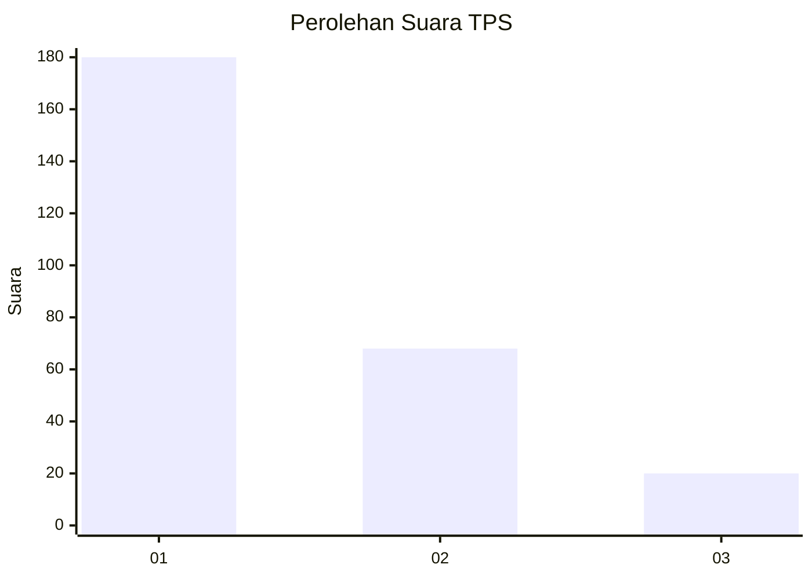
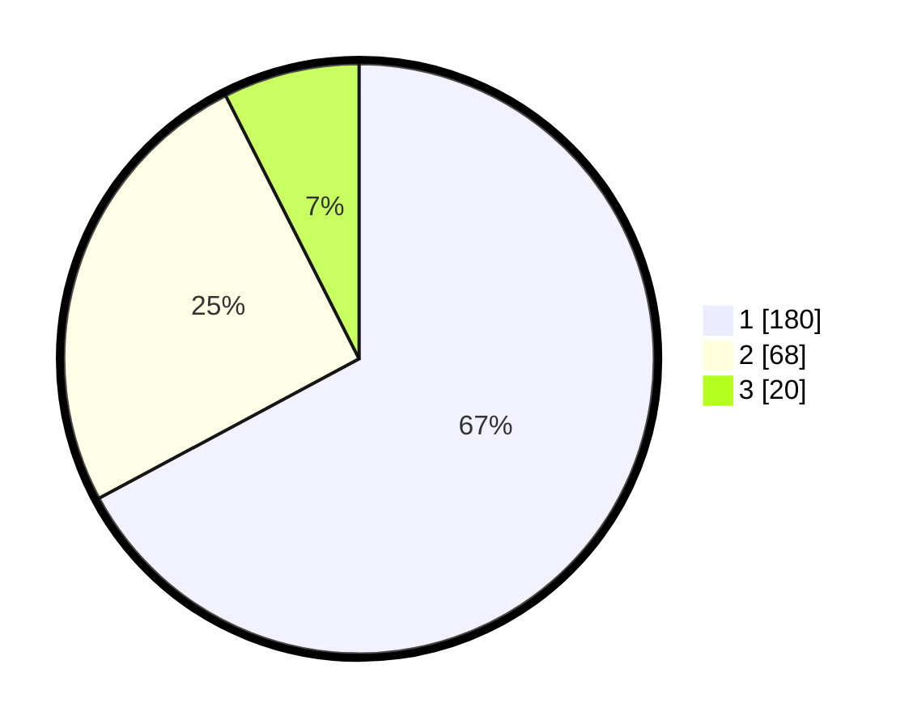

# Hasil

## Grafik

## Tabel

| No. | Nama Paslon    | Suara | Suara (raw) | Persentase |
|:--- |:-------------- | -----:| -----------:| ----------:|
| 1   | ANIES MUHAIMIN | 180   | [180][p-1]  | 67,16      |
| 2   | PRABOWO GIBRAN | 68    | [68][p-2]   | 25,37      |
| 3   | GANJAR MAHFUD  | 20    | [20][p-3]   | 7,46       |

[p-1]: https://github.com/gigit-pemilu/pemilu-2024/blob/main/pilpres/hitung-suara/sub/35-jawa-timur/sub/27-sampang/sub/05-omben/sub/2019-karanggayam/sub/005-tps/sub/paslon-1.txt
[p-2]: https://github.com/gigit-pemilu/pemilu-2024/blob/main/pilpres/hitung-suara/sub/35-jawa-timur/sub/27-sampang/sub/05-omben/sub/2019-karanggayam/sub/005-tps/sub/paslon-2.txt
[p-3]: https://github.com/gigit-pemilu/pemilu-2024/blob/main/pilpres/hitung-suara/sub/35-jawa-timur/sub/27-sampang/sub/05-omben/sub/2019-karanggayam/sub/005-tps/sub/paslon-3.txt

## Foto C Plano

https://sirekap-obj-formc.kpu.go.id/5800/pemilu/ppwp/35/27/05/20/19/3527052019005-20240215-120748--0d1906ae-ab46-4e25-95cf-fc3ac98436ef.jpg

https://sirekap-obj-formc.kpu.go.id/5800/pemilu/ppwp/35/27/05/20/19/3527052019005-20240214-235359--52e35e82-95ba-44cf-b83d-bb83476dd4ca.jpg

https://sirekap-obj-formc.kpu.go.id/5800/pemilu/ppwp/35/27/05/20/19/3527052019005-20240214-235514--1ccba9dd-e401-4446-8326-918f054c0ec9.jpg

## Metadata

| Key        | Value               |
| ---------- | ------------------- |
| Time Stamp | 2024-02-15 15:00:29 |

