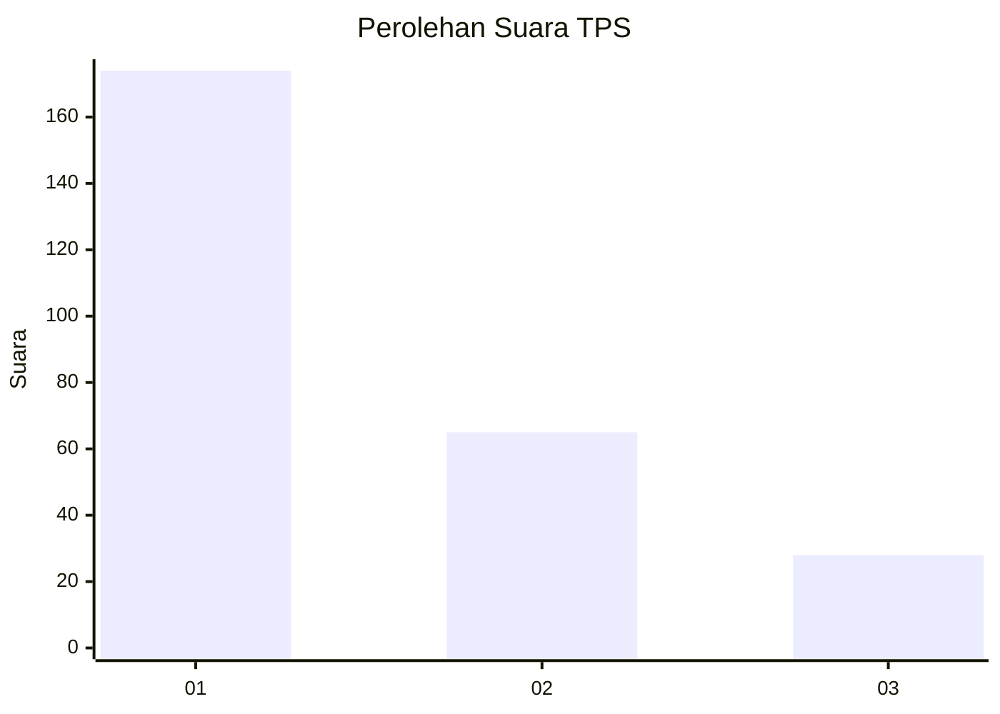
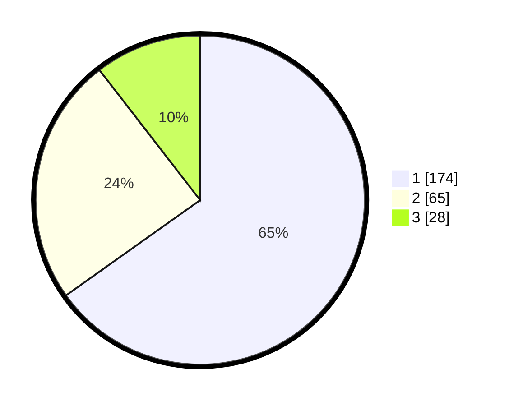

# Hasil

## Grafik

## Tabel

| No. | Nama Paslon    | Suara | Suara (raw) | Persentase |
|:--- |:-------------- | -----:| -----------:| ----------:|
| 1   | ANIES MUHAIMIN | 174   | [174][p-1]  | 65,17      |
| 2   | PRABOWO GIBRAN | 65    | [65][p-2]   | 24,34      |
| 3   | GANJAR MAHFUD  | 28    | [28][p-3]   | 10,49      |

[p-1]: https://github.com/gigit-pemilu/pemilu-2024/blob/main/pilpres/hitung-suara/sub/35-jawa-timur/sub/27-sampang/sub/05-omben/sub/2019-karanggayam/sub/006-tps/sub/paslon-1.txt
[p-2]: https://github.com/gigit-pemilu/pemilu-2024/blob/main/pilpres/hitung-suara/sub/35-jawa-timur/sub/27-sampang/sub/05-omben/sub/2019-karanggayam/sub/006-tps/sub/paslon-2.txt
[p-3]: https://github.com/gigit-pemilu/pemilu-2024/blob/main/pilpres/hitung-suara/sub/35-jawa-timur/sub/27-sampang/sub/05-omben/sub/2019-karanggayam/sub/006-tps/sub/paslon-3.txt

## Foto C Plano

https://sirekap-obj-formc.kpu.go.id/e07f/pemilu/ppwp/35/27/05/20/19/3527052019006-20240215-100640--d9595481-0d9d-4b9b-9a0e-6fbc9e4e7983.jpg

https://sirekap-obj-formc.kpu.go.id/e07f/pemilu/ppwp/35/27/05/20/19/3527052019006-20240215-100805--324df25c-5c57-4ba5-8f0b-ca0fdf9a40b0.jpg

https://sirekap-obj-formc.kpu.go.id/e07f/pemilu/ppwp/35/27/05/20/19/3527052019006-20240215-100919--54a6fa7d-16d2-4235-8f6b-36e6b2d1b92a.jpg

## Metadata

| Key        | Value               |
| ---------- | ------------------- |
| Time Stamp | 2024-02-16 22:30:00 |

