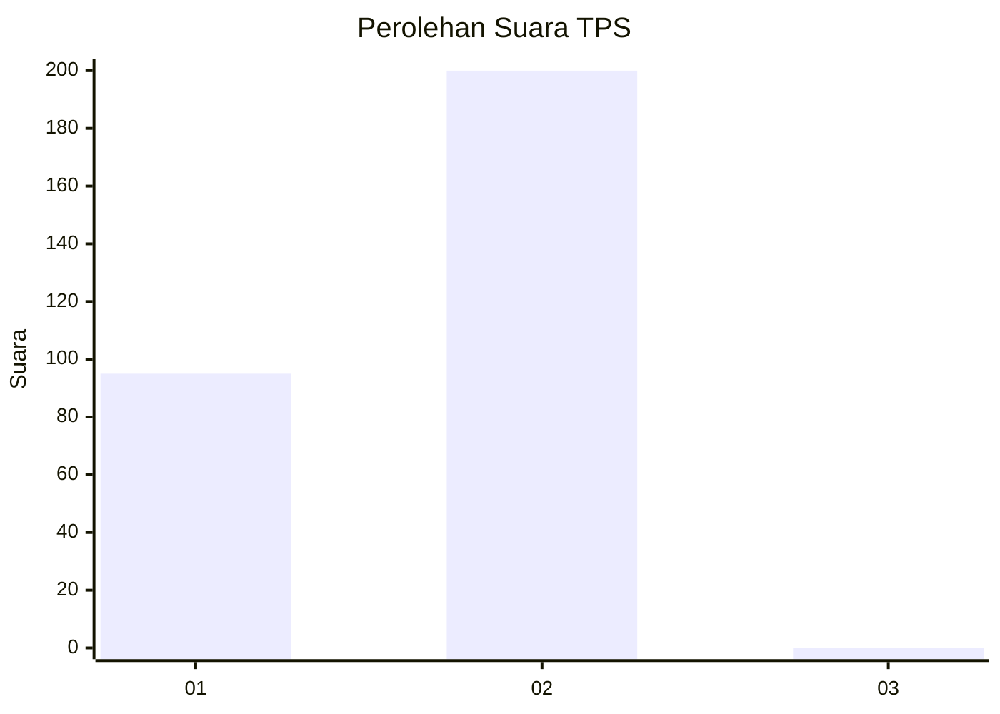
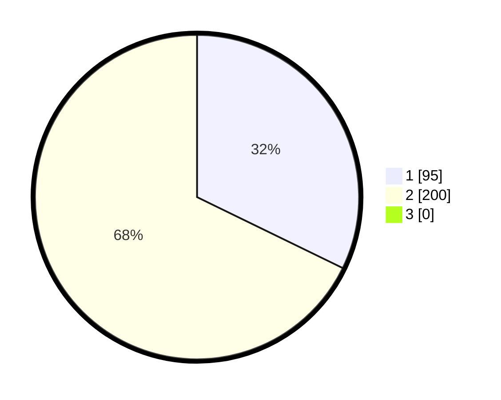

# Hasil

## Grafik

## Tabel

| No. | Nama Paslon    | Suara | Suara (raw) | Persentase |
|:--- |:-------------- | -----:| -----------:| ----------:|
| 1   | ANIES MUHAIMIN | 95    | [95][p-1]   | 32,20      |
| 2   | PRABOWO GIBRAN | 200   | [200][p-2]  | 67,80      |
| 3   | GANJAR MAHFUD  | 0     | [0][p-3]    | 0,00       |

[p-1]: https://github.com/gigit-pemilu/pemilu-2024/blob/main/pilpres/hitung-suara/sub/35-jawa-timur/sub/27-sampang/sub/06-kedungdung/sub/2003-rohayu/sub/003-tps/sub/paslon-1.txt
[p-2]: https://github.com/gigit-pemilu/pemilu-2024/blob/main/pilpres/hitung-suara/sub/35-jawa-timur/sub/27-sampang/sub/06-kedungdung/sub/2003-rohayu/sub/003-tps/sub/paslon-2.txt
[p-3]: https://github.com/gigit-pemilu/pemilu-2024/blob/main/pilpres/hitung-suara/sub/35-jawa-timur/sub/27-sampang/sub/06-kedungdung/sub/2003-rohayu/sub/003-tps/sub/paslon-3.txt

## Foto C Plano

https://sirekap-obj-formc.kpu.go.id/deb5/pemilu/ppwp/35/27/06/20/03/3527062003003-20240214-193141--0f33bea9-e237-427b-92f5-778588114de5.jpg

https://sirekap-obj-formc.kpu.go.id/deb5/pemilu/ppwp/35/27/06/20/03/3527062003003-20240214-193319--b276aded-5aa5-4261-a658-541da78f8356.jpg

https://sirekap-obj-formc.kpu.go.id/deb5/pemilu/ppwp/35/27/06/20/03/3527062003003-20240214-193456--42917069-0ea8-457a-8fce-7a65f35c4558.jpg

## Metadata

| Key        | Value               |
| ---------- | ------------------- |
| Time Stamp | 2024-02-25 13:00:00 |

