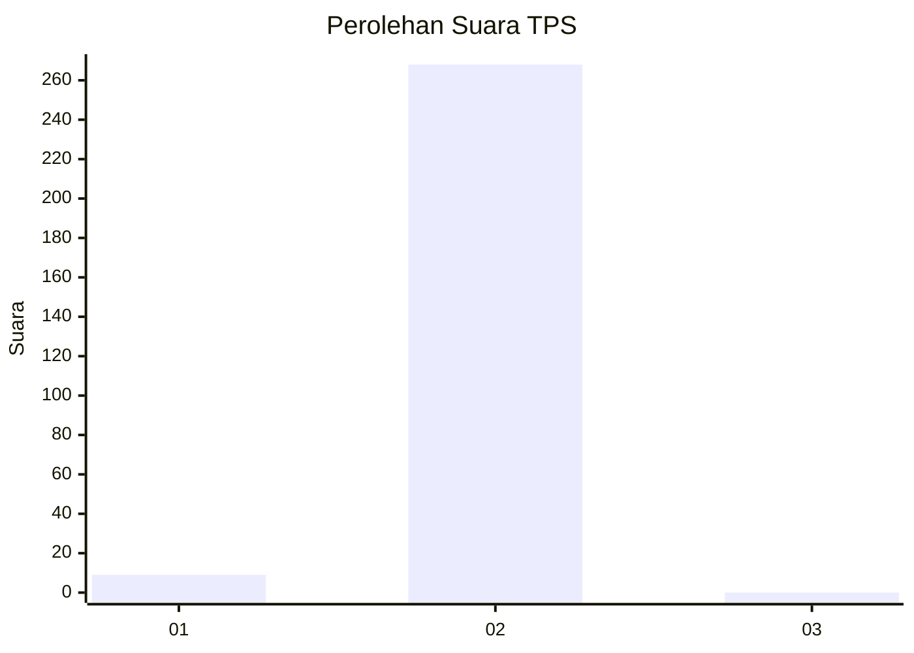
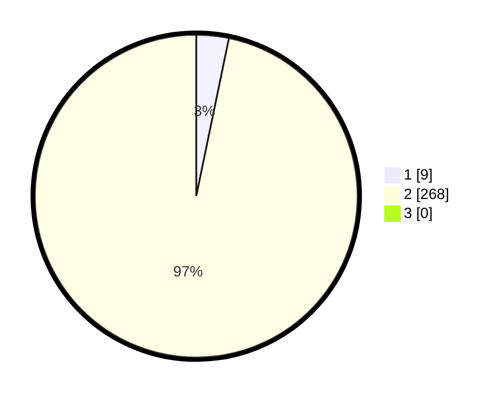

# Hasil

## Grafik

## Tabel

| No. | Nama Paslon    | Suara | Suara (raw) | Persentase |
|:--- |:-------------- | -----:| -----------:| ----------:|
| 1   | ANIES MUHAIMIN | 9     | [9][p-1]    | 3,25       |
| 2   | PRABOWO GIBRAN | 268   | [268][p-2]  | 96,75      |
| 3   | GANJAR MAHFUD  | 0     | [0][p-3]    | 0,00       |

[p-1]: https://github.com/gigit-pemilu/pemilu-2024/blob/main/pilpres/hitung-suara/sub/35-jawa-timur/sub/27-sampang/sub/06-kedungdung/sub/2004-kedungdung/sub/003-tps/sub/paslon-1.txt
[p-2]: https://github.com/gigit-pemilu/pemilu-2024/blob/main/pilpres/hitung-suara/sub/35-jawa-timur/sub/27-sampang/sub/06-kedungdung/sub/2004-kedungdung/sub/003-tps/sub/paslon-2.txt
[p-3]: https://github.com/gigit-pemilu/pemilu-2024/blob/main/pilpres/hitung-suara/sub/35-jawa-timur/sub/27-sampang/sub/06-kedungdung/sub/2004-kedungdung/sub/003-tps/sub/paslon-3.txt

## Foto C Plano

https://sirekap-obj-formc.kpu.go.id/b18a/pemilu/ppwp/35/27/06/20/04/3527062004003-20240214-155730--bf686308-0ef3-44f2-8e75-6975f17380e3.jpg

https://sirekap-obj-formc.kpu.go.id/b18a/pemilu/ppwp/35/27/06/20/04/3527062004003-20240214-191245--d73aaa53-90ca-46b5-a7a9-b43d8183bca0.jpg

https://sirekap-obj-formc.kpu.go.id/b18a/pemilu/ppwp/35/27/06/20/04/3527062004003-20240214-191502--d1dd1771-43c9-445b-b9b9-5543688fdf2b.jpg

## Metadata

| Key        | Value               |
| ---------- | ------------------- |
| Time Stamp | 2024-02-16 10:30:29 |

