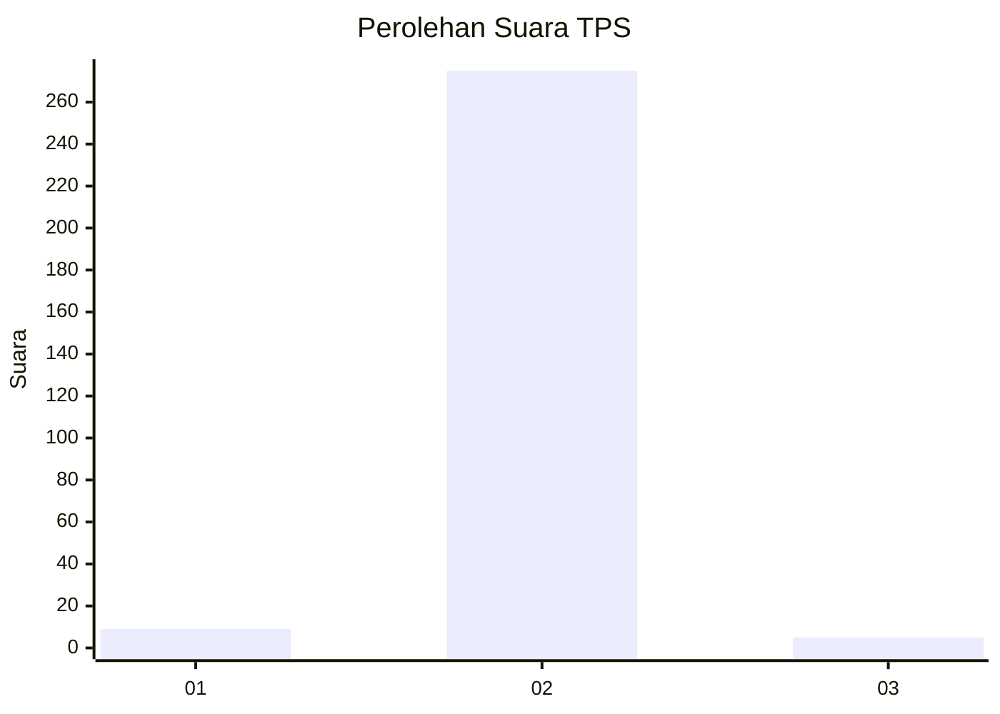
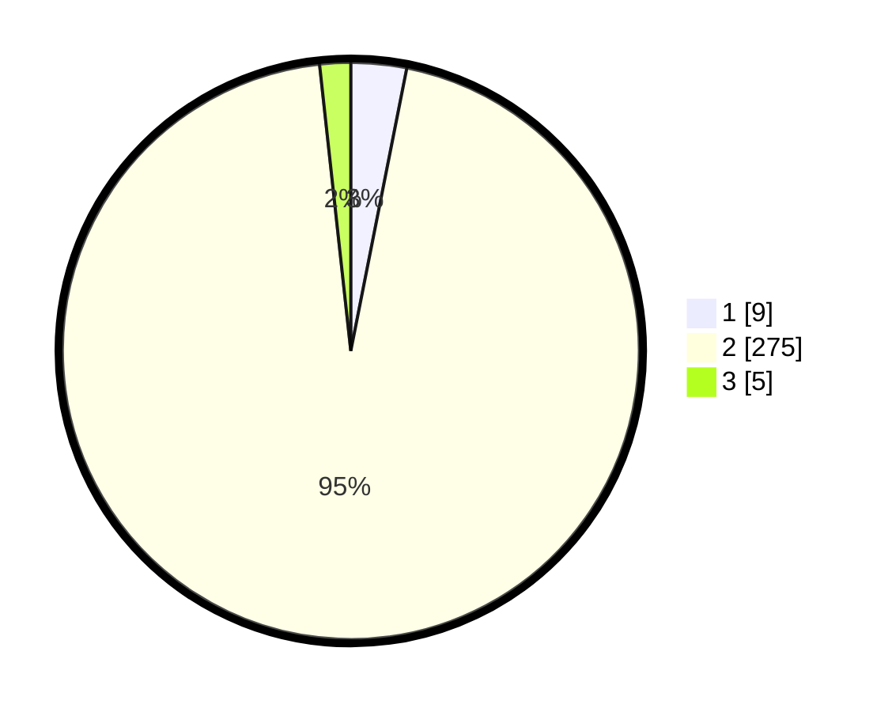

# Hasil

## Grafik

## Tabel

| No. | Nama Paslon    | Suara | Suara (raw) | Persentase |
|:--- |:-------------- | -----:| -----------:| ----------:|
| 1   | ANIES MUHAIMIN | 9     | [9][p-1]    | 3,11       |
| 2   | PRABOWO GIBRAN | 275   | [275][p-2]  | 95,16      |
| 3   | GANJAR MAHFUD  | 5     | [5][p-3]    | 1,73       |

[p-1]: https://github.com/gigit-pemilu/pemilu-2024-35-jawa-timur/blob/main/pilpres/hitung-suara/sub/35-jawa-timur/sub/27-sampang/sub/06-kedungdung/sub/2004-kedungdung/sub/005-tps/sub/paslon-1.txt
[p-2]: https://github.com/gigit-pemilu/pemilu-2024-35-jawa-timur/blob/main/pilpres/hitung-suara/sub/35-jawa-timur/sub/27-sampang/sub/06-kedungdung/sub/2004-kedungdung/sub/005-tps/sub/paslon-2.txt
[p-3]: https://github.com/gigit-pemilu/pemilu-2024-35-jawa-timur/blob/main/pilpres/hitung-suara/sub/35-jawa-timur/sub/27-sampang/sub/06-kedungdung/sub/2004-kedungdung/sub/005-tps/sub/paslon-3.txt

## Foto C Plano

https://sirekap-obj-formc.kpu.go.id/891b/pemilu/ppwp/35/27/06/20/04/3527062004005-20240214-214647--c327a50d-59e9-41fa-be3d-d79368a0637f.jpg

https://sirekap-obj-formc.kpu.go.id/891b/pemilu/ppwp/35/27/06/20/04/3527062004005-20240214-215047--074f3c51-749b-4dc6-a5ac-b9e87ddf1b8e.jpg

https://sirekap-obj-formc.kpu.go.id/891b/pemilu/ppwp/35/27/06/20/04/3527062004005-20240214-215301--09de6665-51c2-4fdb-8bbd-0a88a9e8eb62.jpg

## Metadata

| Key        | Value               |
| ---------- | ------------------- |
| Time Stamp | 2024-02-24 22:31:28 |

