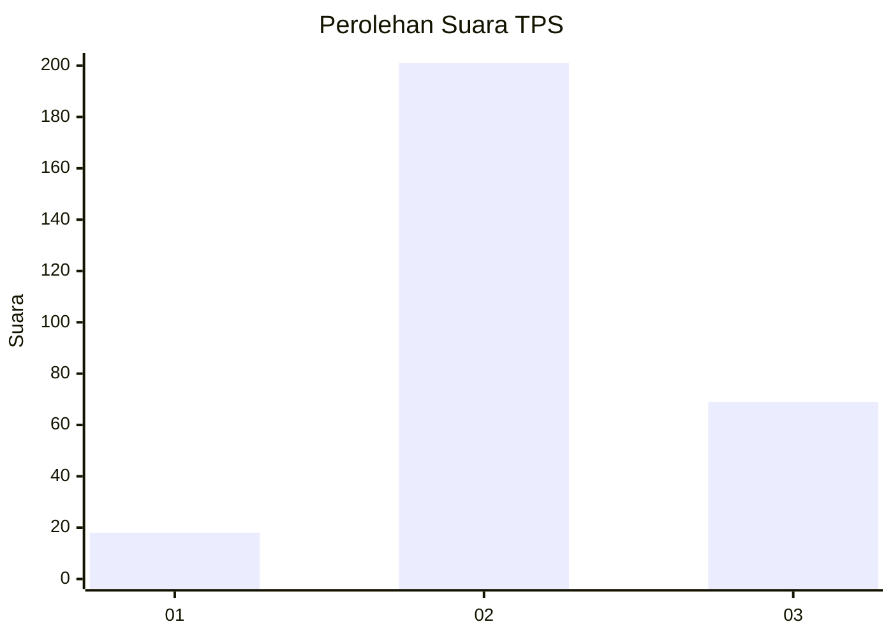
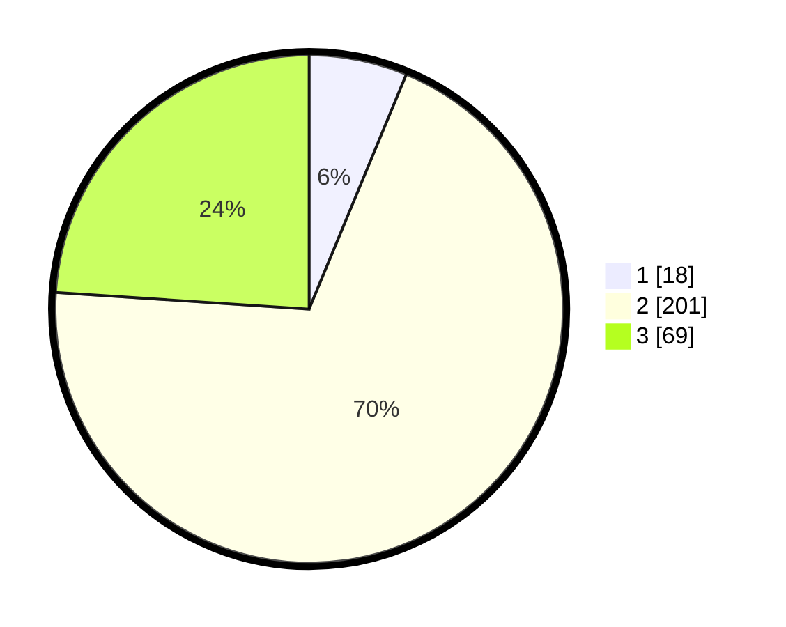

# Hasil

## Grafik

## Tabel

| No. | Nama Paslon    | Suara | Suara (raw) | Persentase |
|:--- |:-------------- | -----:| -----------:| ----------:|
| 1   | ANIES MUHAIMIN | 18    | [18][p-1]   | 6,25       |
| 2   | PRABOWO GIBRAN | 201   | [201][p-2]  | 69,79      |
| 3   | GANJAR MAHFUD  | 69    | [69][p-3]   | 23,96      |

[p-1]: https://github.com/gigit-pemilu/pemilu-2024/blob/main/pilpres/hitung-suara/sub/35-jawa-timur/sub/27-sampang/sub/06-kedungdung/sub/2004-kedungdung/sub/006-tps/sub/paslon-1.txt
[p-2]: https://github.com/gigit-pemilu/pemilu-2024/blob/main/pilpres/hitung-suara/sub/35-jawa-timur/sub/27-sampang/sub/06-kedungdung/sub/2004-kedungdung/sub/006-tps/sub/paslon-2.txt
[p-3]: https://github.com/gigit-pemilu/pemilu-2024/blob/main/pilpres/hitung-suara/sub/35-jawa-timur/sub/27-sampang/sub/06-kedungdung/sub/2004-kedungdung/sub/006-tps/sub/paslon-3.txt

## Foto C Plano

https://sirekap-obj-formc.kpu.go.id/1216/pemilu/ppwp/35/27/06/20/04/3527062004006-20240214-222747--d42794ed-2eae-47bd-ab4d-f2442a5ee871.jpg

https://sirekap-obj-formc.kpu.go.id/1216/pemilu/ppwp/35/27/06/20/04/3527062004006-20240214-200630--a448d024-0454-4366-90fe-3ee903343c0d.jpg

https://sirekap-obj-formc.kpu.go.id/1216/pemilu/ppwp/35/27/06/20/04/3527062004006-20240214-200735--286c45ee-954c-4fc9-8ba6-a2496e19aa00.jpg

## Metadata

| Key        | Value               |
| ---------- | ------------------- |
| Time Stamp | 2024-02-24 22:31:28 |

