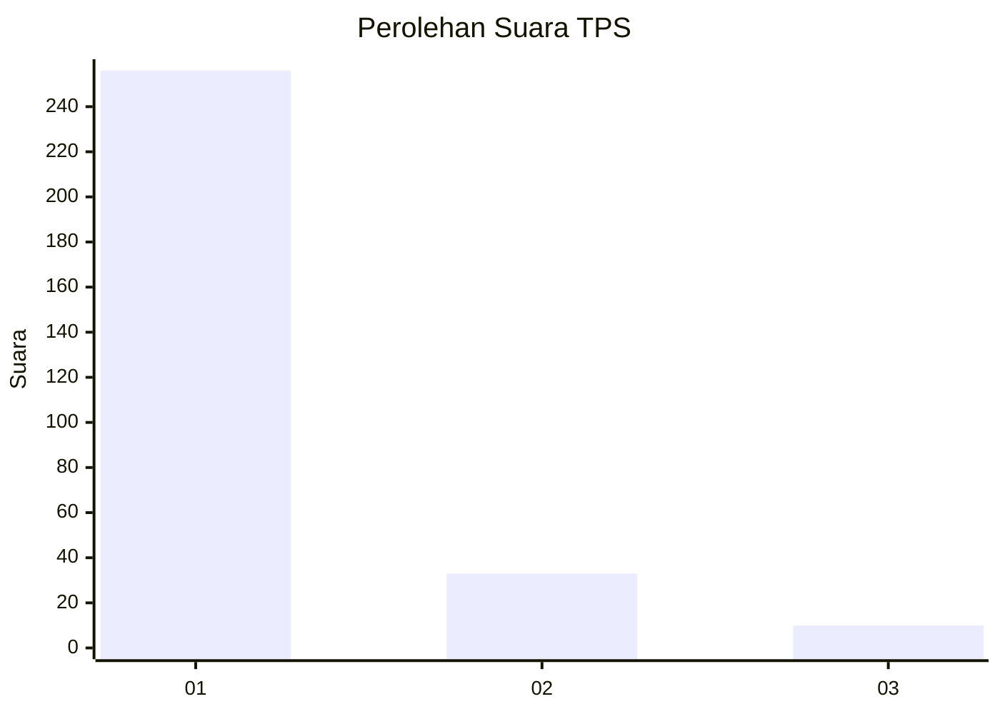
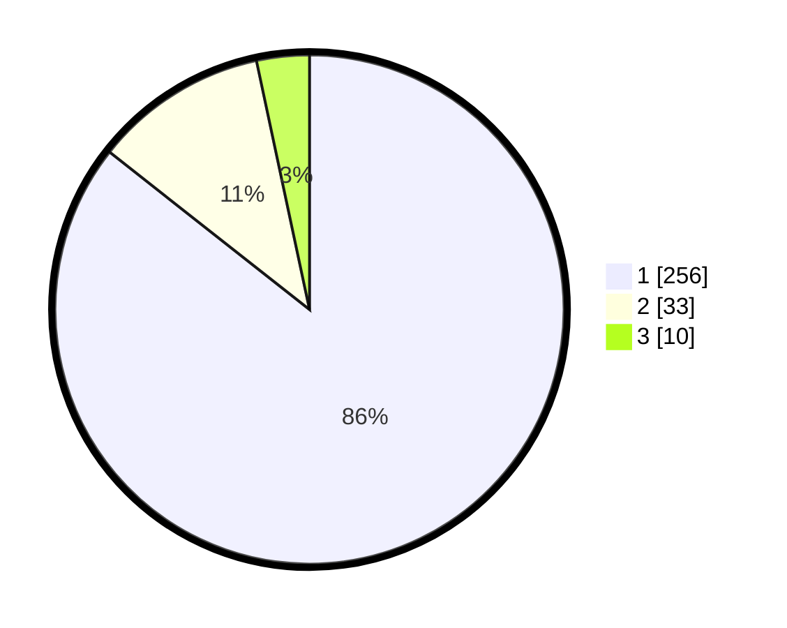

# Hasil

## Grafik

## Tabel

| No. | Nama Paslon    | Suara | Suara (raw) | Persentase |
|:--- |:-------------- | -----:| -----------:| ----------:|
| 1   | ANIES MUHAIMIN | 256   | [256][p-1]  | 85,62      |
| 2   | PRABOWO GIBRAN | 33    | [33][p-2]   | 11,04      |
| 3   | GANJAR MAHFUD  | 10    | [10][p-3]   | 3,34       |

[p-1]: https://github.com/gigit-pemilu/pemilu-2024-35-jawa-timur/blob/main/pilpres/hitung-suara/sub/35-jawa-timur/sub/27-sampang/sub/06-kedungdung/sub/2015-gunungeleh/sub/005-tps/sub/paslon-1.txt
[p-2]: https://github.com/gigit-pemilu/pemilu-2024-35-jawa-timur/blob/main/pilpres/hitung-suara/sub/35-jawa-timur/sub/27-sampang/sub/06-kedungdung/sub/2015-gunungeleh/sub/005-tps/sub/paslon-2.txt
[p-3]: https://github.com/gigit-pemilu/pemilu-2024-35-jawa-timur/blob/main/pilpres/hitung-suara/sub/35-jawa-timur/sub/27-sampang/sub/06-kedungdung/sub/2015-gunungeleh/sub/005-tps/sub/paslon-3.txt

## Foto C Plano

https://sirekap-obj-formc.kpu.go.id/fcef/pemilu/ppwp/35/27/06/20/15/3527062015005-20240214-155303--0aed5c40-018c-4e5a-850a-bd3646c311d4.jpg

https://sirekap-obj-formc.kpu.go.id/fcef/pemilu/ppwp/35/27/06/20/15/3527062015005-20240214-155411--d3c9e95e-260b-4bcd-820d-7183a2ea9ea0.jpg

## Metadata

| Key        | Value               |
| ---------- | ------------------- |
| Time Stamp | 2024-02-24 22:31:28 |

