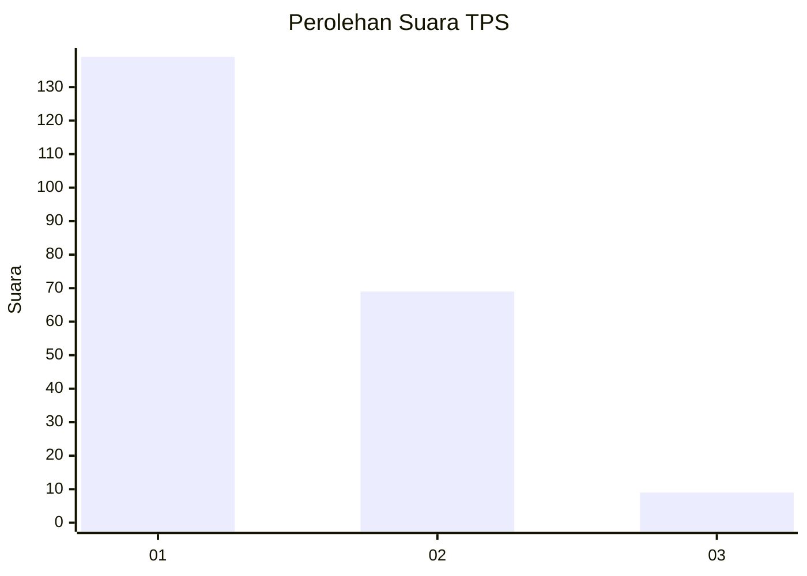
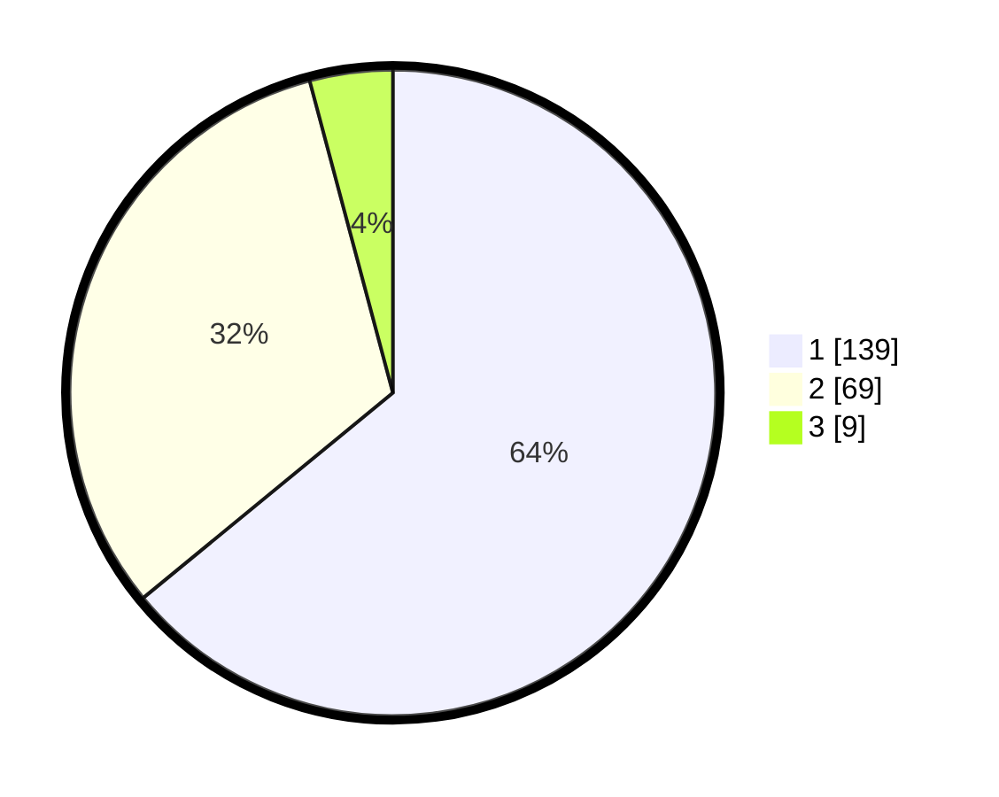

# Hasil

## Grafik

## Tabel

| No. | Nama Paslon    | Suara | Suara (raw) | Persentase |
|:--- |:-------------- | -----:| -----------:| ----------:|
| 1   | ANIES MUHAIMIN | 139   | [139][p-1]  | 64,06      |
| 2   | PRABOWO GIBRAN | 69    | [69][p-2]   | 31,80      |
| 3   | GANJAR MAHFUD  | 9     | [9][p-3]    | 4,15       |

[p-1]: https://github.com/gigit-pemilu/pemilu-2024/blob/main/pilpres/hitung-suara/sub/35-jawa-timur/sub/27-sampang/sub/07-jrengik/sub/2006-penyepen/sub/001-tps/sub/paslon-1.txt
[p-2]: https://github.com/gigit-pemilu/pemilu-2024/blob/main/pilpres/hitung-suara/sub/35-jawa-timur/sub/27-sampang/sub/07-jrengik/sub/2006-penyepen/sub/001-tps/sub/paslon-2.txt
[p-3]: https://github.com/gigit-pemilu/pemilu-2024/blob/main/pilpres/hitung-suara/sub/35-jawa-timur/sub/27-sampang/sub/07-jrengik/sub/2006-penyepen/sub/001-tps/sub/paslon-3.txt

## Foto C Plano

https://sirekap-obj-formc.kpu.go.id/eb5f/pemilu/ppwp/35/27/07/20/06/3527072006001-20240219-101811--71148256-57aa-40ae-97c4-6f4dd5b6f15b.jpg

https://sirekap-obj-formc.kpu.go.id/eb5f/pemilu/ppwp/35/27/07/20/06/3527072006001-20240219-101833--40b9c2b7-ab3c-4697-b2ec-c2fb0333ce27.jpg

https://sirekap-obj-formc.kpu.go.id/eb5f/pemilu/ppwp/35/27/07/20/06/3527072006001-20240219-101846--0cf4dc41-d359-400d-b143-9751ca92f733.jpg

## Metadata

| Key        | Value               |
| ---------- | ------------------- |
| Time Stamp | 2024-02-25 11:00:00 |

