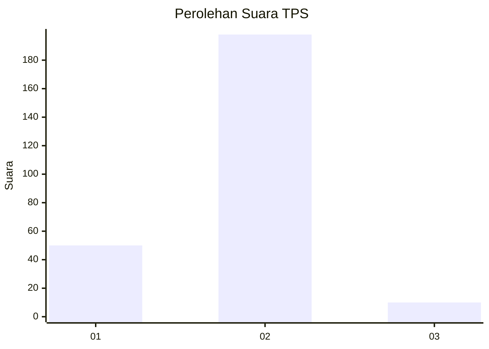
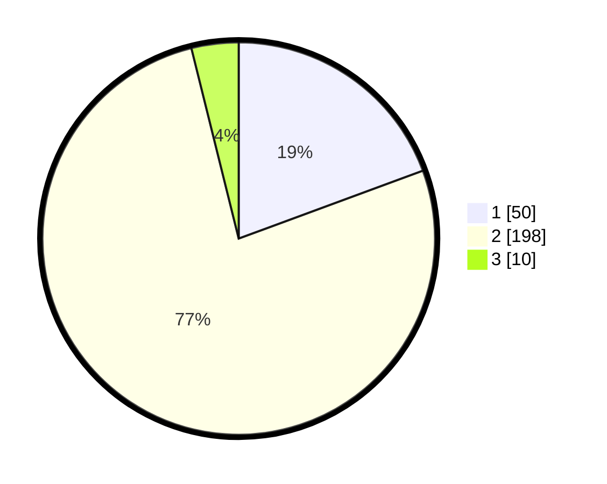

# Hasil

## Grafik

## Tabel

| No. | Nama Paslon    | Suara | Suara (raw) | Persentase |
|:--- |:-------------- | -----:| -----------:| ----------:|
| 1   | ANIES MUHAIMIN | 50    | [50][p-1]   | 19,38      |
| 2   | PRABOWO GIBRAN | 198   | [198][p-2]  | 76,74      |
| 3   | GANJAR MAHFUD  | 10    | [10][p-3]   | 3,88       |

[p-1]: https://github.com/gigit-pemilu/pemilu-2024-35-jawa-timur/blob/main/pilpres/hitung-suara/sub/35-jawa-timur/sub/27-sampang/sub/07-jrengik/sub/2006-penyepen/sub/002-tps/sub/paslon-1.txt
[p-2]: https://github.com/gigit-pemilu/pemilu-2024-35-jawa-timur/blob/main/pilpres/hitung-suara/sub/35-jawa-timur/sub/27-sampang/sub/07-jrengik/sub/2006-penyepen/sub/002-tps/sub/paslon-2.txt
[p-3]: https://github.com/gigit-pemilu/pemilu-2024-35-jawa-timur/blob/main/pilpres/hitung-suara/sub/35-jawa-timur/sub/27-sampang/sub/07-jrengik/sub/2006-penyepen/sub/002-tps/sub/paslon-3.txt

## Foto C Plano

https://sirekap-obj-formc.kpu.go.id/4dd9/pemilu/ppwp/35/27/07/20/06/3527072006002-20240219-102614--4e89d643-fcee-4f80-a99c-c497f7d535e0.jpg

https://sirekap-obj-formc.kpu.go.id/4dd9/pemilu/ppwp/35/27/07/20/06/3527072006002-20240219-102635--bb6a088b-39c8-4ec6-9c0c-a01dd24df5c3.jpg

https://sirekap-obj-formc.kpu.go.id/4dd9/pemilu/ppwp/35/27/07/20/06/3527072006002-20240219-102736--696c34df-ae71-4682-9b1a-2fac472a0ad9.jpg

## Metadata

| Key        | Value               |
| ---------- | ------------------- |
| Time Stamp | 2024-02-25 16:00:00 |

