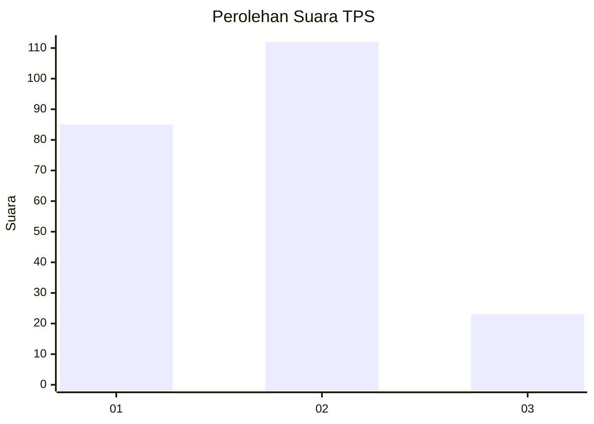
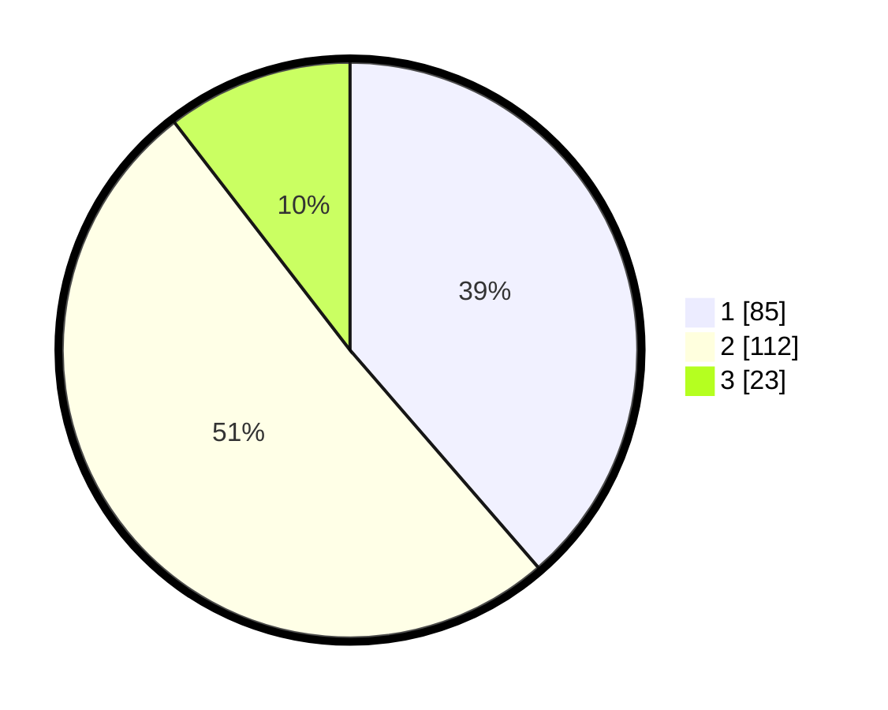

# Hasil

## Grafik

## Tabel

| No. | Nama Paslon    | Suara | Suara (raw) | Persentase |
|:--- |:-------------- | -----:| -----------:| ----------:|
| 1   | ANIES MUHAIMIN | 85    | [85][p-1]   | 38,64      |
| 2   | PRABOWO GIBRAN | 112   | [112][p-2]  | 50,91      |
| 3   | GANJAR MAHFUD  | 23    | [23][p-3]   | 10,45      |

[p-1]: https://github.com/gigit-pemilu/pemilu-2024-35-jawa-timur/blob/main/pilpres/hitung-suara/sub/35-jawa-timur/sub/27-sampang/sub/07-jrengik/sub/2006-penyepen/sub/003-tps/sub/paslon-1.txt
[p-2]: https://github.com/gigit-pemilu/pemilu-2024-35-jawa-timur/blob/main/pilpres/hitung-suara/sub/35-jawa-timur/sub/27-sampang/sub/07-jrengik/sub/2006-penyepen/sub/003-tps/sub/paslon-2.txt
[p-3]: https://github.com/gigit-pemilu/pemilu-2024-35-jawa-timur/blob/main/pilpres/hitung-suara/sub/35-jawa-timur/sub/27-sampang/sub/07-jrengik/sub/2006-penyepen/sub/003-tps/sub/paslon-3.txt

## Foto C Plano

https://sirekap-obj-formc.kpu.go.id/2bc9/pemilu/ppwp/35/27/07/20/06/3527072006003-20240219-103207--d9330a8e-8cae-4dca-860e-56a1ae904707.jpg

https://sirekap-obj-formc.kpu.go.id/2bc9/pemilu/ppwp/35/27/07/20/06/3527072006003-20240219-103227--f06b8a9e-d602-47ad-98dd-1573af0db37d.jpg

https://sirekap-obj-formc.kpu.go.id/2bc9/pemilu/ppwp/35/27/07/20/06/3527072006003-20240219-103239--8b3c8756-2efe-478d-89fb-5f2c07b83fc2.jpg

## Metadata

| Key        | Value               |
| ---------- | ------------------- |
| Time Stamp | 2024-02-24 22:31:28 |

