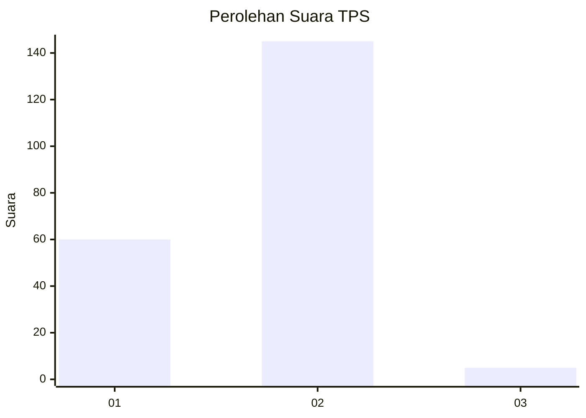
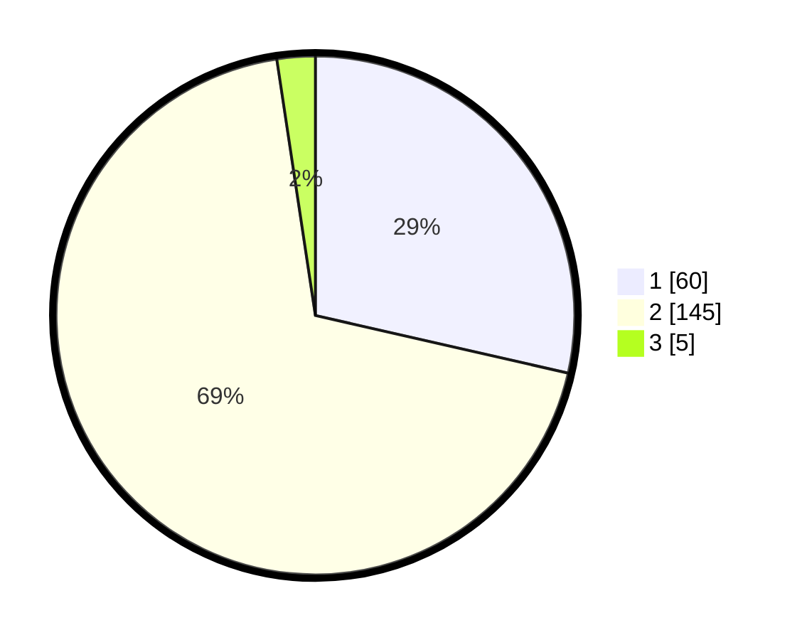

# Hasil

## Grafik

## Tabel

| No. | Nama Paslon    | Suara | Suara (raw) | Persentase |
|:--- |:-------------- | -----:| -----------:| ----------:|
| 1   | ANIES MUHAIMIN | 60    | [60][p-1]   | 28,57      |
| 2   | PRABOWO GIBRAN | 145   | [145][p-2]  | 69,05      |
| 3   | GANJAR MAHFUD  | 5     | [5][p-3]    | 2,38       |

[p-1]: https://github.com/gigit-pemilu/pemilu-2024-35-jawa-timur/blob/main/pilpres/hitung-suara/sub/35-jawa-timur/sub/27-sampang/sub/07-jrengik/sub/2006-penyepen/sub/004-tps/sub/paslon-1.txt
[p-2]: https://github.com/gigit-pemilu/pemilu-2024-35-jawa-timur/blob/main/pilpres/hitung-suara/sub/35-jawa-timur/sub/27-sampang/sub/07-jrengik/sub/2006-penyepen/sub/004-tps/sub/paslon-2.txt
[p-3]: https://github.com/gigit-pemilu/pemilu-2024-35-jawa-timur/blob/main/pilpres/hitung-suara/sub/35-jawa-timur/sub/27-sampang/sub/07-jrengik/sub/2006-penyepen/sub/004-tps/sub/paslon-3.txt

## Foto C Plano

https://sirekap-obj-formc.kpu.go.id/b61f/pemilu/ppwp/35/27/07/20/06/3527072006004-20240219-103522--5eb00ea9-1e5b-49d7-81ec-93368652443e.jpg

https://sirekap-obj-formc.kpu.go.id/b61f/pemilu/ppwp/35/27/07/20/06/3527072006004-20240219-103540--97b4d418-ed36-40e9-972d-146f3ea51114.jpg

https://sirekap-obj-formc.kpu.go.id/b61f/pemilu/ppwp/35/27/07/20/06/3527072006004-20240219-103559--a2182657-5cf4-4338-9acb-ac6de653ac37.jpg

## Metadata

| Key        | Value               |
| ---------- | ------------------- |
| Time Stamp | 2024-02-24 22:31:28 |

