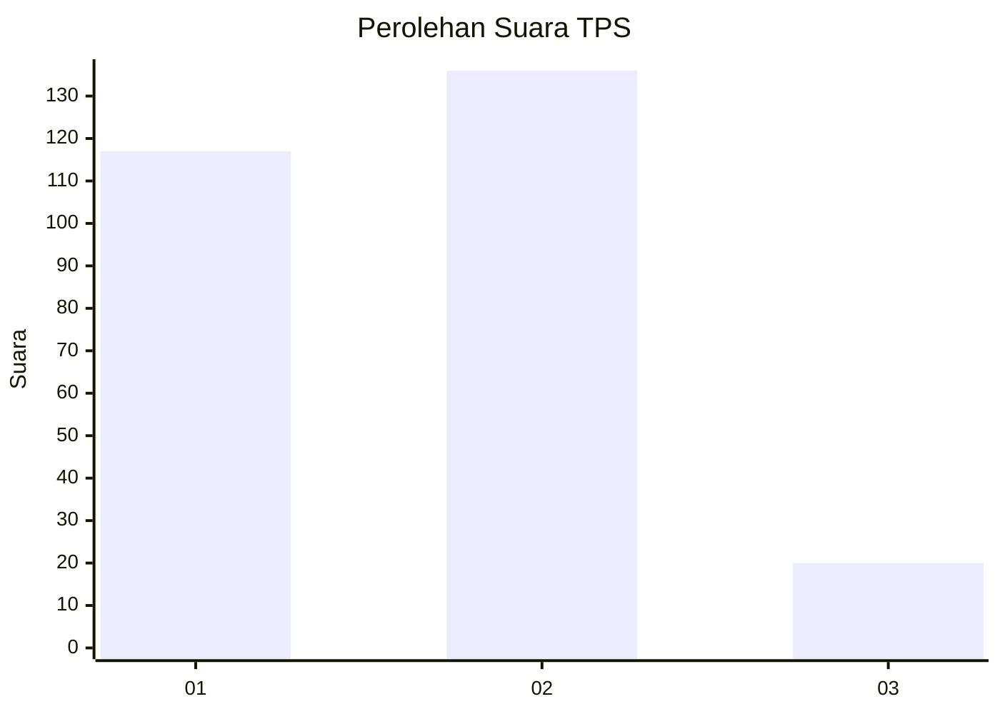
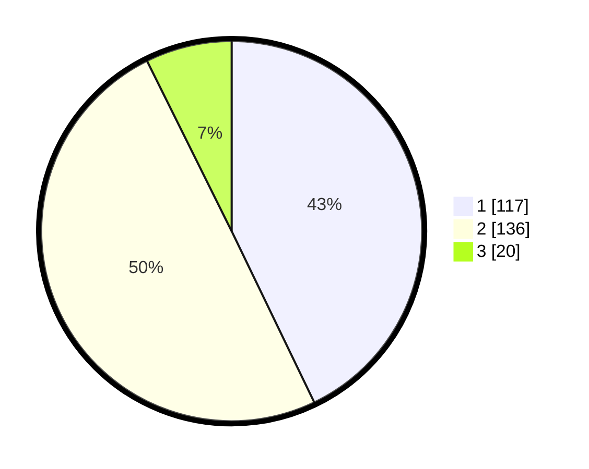

# Hasil

## Grafik

## Tabel

| No. | Nama Paslon    | Suara | Suara (raw) | Persentase |
|:--- |:-------------- | -----:| -----------:| ----------:|
| 1   | ANIES MUHAIMIN | 117   | [117][p-1]  | 42,86      |
| 2   | PRABOWO GIBRAN | 136   | [136][p-2]  | 49,82      |
| 3   | GANJAR MAHFUD  | 20    | [20][p-3]   | 7,33       |

[p-1]: https://github.com/gigit-pemilu/pemilu-2024/blob/main/pilpres/hitung-suara/sub/35-jawa-timur/sub/27-sampang/sub/07-jrengik/sub/2006-penyepen/sub/006-tps/sub/paslon-1.txt
[p-2]: https://github.com/gigit-pemilu/pemilu-2024/blob/main/pilpres/hitung-suara/sub/35-jawa-timur/sub/27-sampang/sub/07-jrengik/sub/2006-penyepen/sub/006-tps/sub/paslon-2.txt
[p-3]: https://github.com/gigit-pemilu/pemilu-2024/blob/main/pilpres/hitung-suara/sub/35-jawa-timur/sub/27-sampang/sub/07-jrengik/sub/2006-penyepen/sub/006-tps/sub/paslon-3.txt

## Foto C Plano

https://sirekap-obj-formc.kpu.go.id/bee7/pemilu/ppwp/35/27/07/20/06/3527072006006-20240214-231138--a2a13386-e671-460d-b59a-db835b983d4d.jpg

https://sirekap-obj-formc.kpu.go.id/bee7/pemilu/ppwp/35/27/07/20/06/3527072006006-20240214-231237--edd9b52c-7b21-4466-ac2c-b1778c7eb717.jpg

https://sirekap-obj-formc.kpu.go.id/bee7/pemilu/ppwp/35/27/07/20/06/3527072006006-20240214-231416--9c6175d3-2cab-4c48-b529-e867a7ef7a8b.jpg

## Metadata

| Key        | Value               |
| ---------- | ------------------- |
| Time Stamp | 2024-02-16 10:00:28 |

