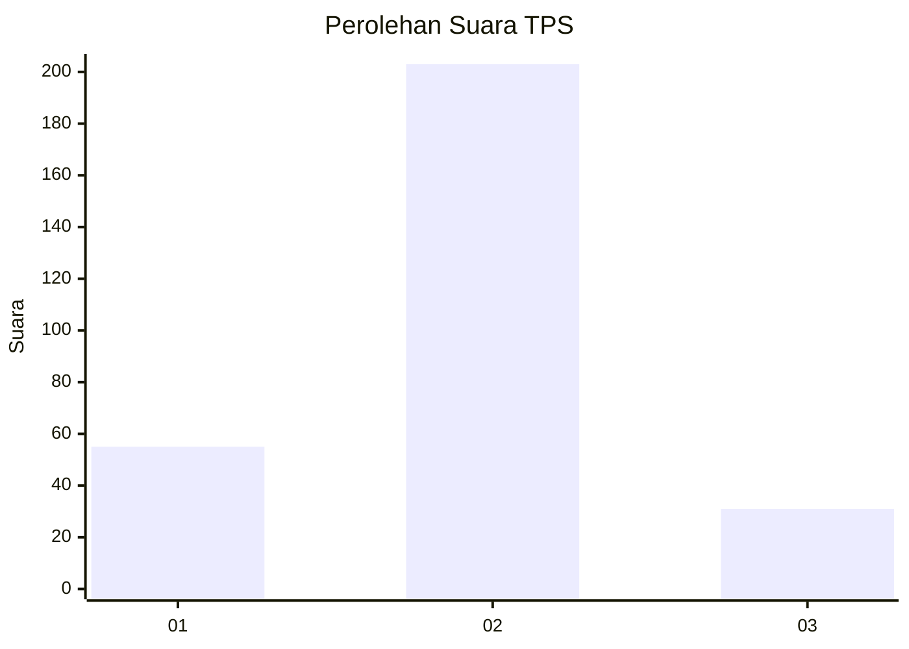
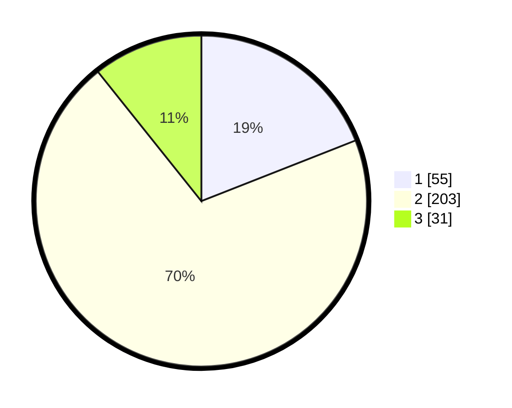

# Hasil

## Grafik

## Tabel

| No. | Nama Paslon    | Suara | Suara (raw) | Persentase |
|:--- |:-------------- | -----:| -----------:| ----------:|
| 1   | ANIES MUHAIMIN | 55    | [55][p-1]   | 19,03      |
| 2   | PRABOWO GIBRAN | 203   | [203][p-2]  | 70,24      |
| 3   | GANJAR MAHFUD  | 31    | [31][p-3]   | 10,73      |

[p-1]: https://github.com/gigit-pemilu/pemilu-2024/blob/main/pilpres/hitung-suara/sub/35-jawa-timur/sub/27-sampang/sub/07-jrengik/sub/2008-jrengik/sub/003-tps/sub/paslon-1.txt
[p-2]: https://github.com/gigit-pemilu/pemilu-2024/blob/main/pilpres/hitung-suara/sub/35-jawa-timur/sub/27-sampang/sub/07-jrengik/sub/2008-jrengik/sub/003-tps/sub/paslon-2.txt
[p-3]: https://github.com/gigit-pemilu/pemilu-2024/blob/main/pilpres/hitung-suara/sub/35-jawa-timur/sub/27-sampang/sub/07-jrengik/sub/2008-jrengik/sub/003-tps/sub/paslon-3.txt

## Foto C Plano

https://sirekap-obj-formc.kpu.go.id/db25/pemilu/ppwp/35/27/07/20/08/3527072008003-20240220-091849--98881462-ca1f-4e20-b5e5-2004034b0ebd.jpg

https://sirekap-obj-formc.kpu.go.id/db25/pemilu/ppwp/35/27/07/20/08/3527072008003-20240220-092008--0720ead6-7123-4941-8e41-81628292cfab.jpg

https://sirekap-obj-formc.kpu.go.id/db25/pemilu/ppwp/35/27/07/20/08/3527072008003-20240220-091953--a0abaa15-9324-4f58-b584-4deeff2f47ef.jpg

## Metadata

| Key        | Value               |
| ---------- | ------------------- |
| Time Stamp | 2024-02-24 22:31:28 |

