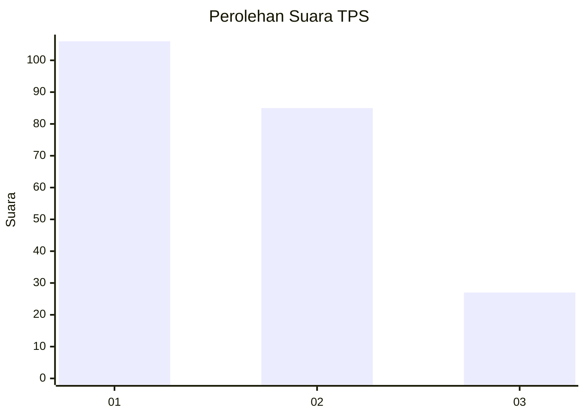
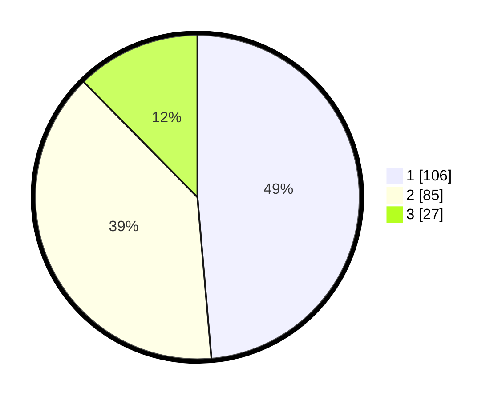

# Hasil

## Grafik

## Tabel

| No. | Nama Paslon    | Suara | Suara (raw) | Persentase |
|:--- |:-------------- | -----:| -----------:| ----------:|
| 1   | ANIES MUHAIMIN | 106   | [106][p-1]  | 48,62      |
| 2   | PRABOWO GIBRAN | 85    | [85][p-2]   | 38,99      |
| 3   | GANJAR MAHFUD  | 27    | [27][p-3]   | 12,39      |

[p-1]: https://github.com/gigit-pemilu/pemilu-2024-35-jawa-timur/blob/main/pilpres/hitung-suara/sub/35-jawa-timur/sub/27-sampang/sub/07-jrengik/sub/2008-jrengik/sub/005-tps/sub/paslon-1.txt
[p-2]: https://github.com/gigit-pemilu/pemilu-2024-35-jawa-timur/blob/main/pilpres/hitung-suara/sub/35-jawa-timur/sub/27-sampang/sub/07-jrengik/sub/2008-jrengik/sub/005-tps/sub/paslon-2.txt
[p-3]: https://github.com/gigit-pemilu/pemilu-2024-35-jawa-timur/blob/main/pilpres/hitung-suara/sub/35-jawa-timur/sub/27-sampang/sub/07-jrengik/sub/2008-jrengik/sub/005-tps/sub/paslon-3.txt

## Foto C Plano

https://sirekap-obj-formc.kpu.go.id/2789/pemilu/ppwp/35/27/07/20/08/3527072008005-20240220-092348--090bb4d8-0e1a-450c-a775-243354293833.jpg

https://sirekap-obj-formc.kpu.go.id/2789/pemilu/ppwp/35/27/07/20/08/3527072008005-20240220-092449--6c6facac-4c22-4e16-a355-47131a554ab8.jpg

https://sirekap-obj-formc.kpu.go.id/2789/pemilu/ppwp/35/27/07/20/08/3527072008005-20240220-092504--0ff6b901-99f1-4285-97d5-1f243e0fda8f.jpg

## Metadata

| Key        | Value               |
| ---------- | ------------------- |
| Time Stamp | 2024-02-27 12:00:00 |

