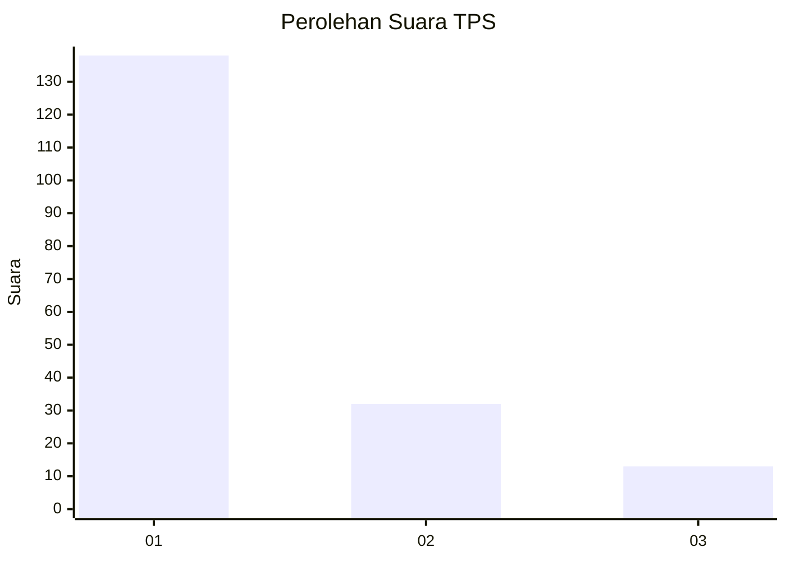
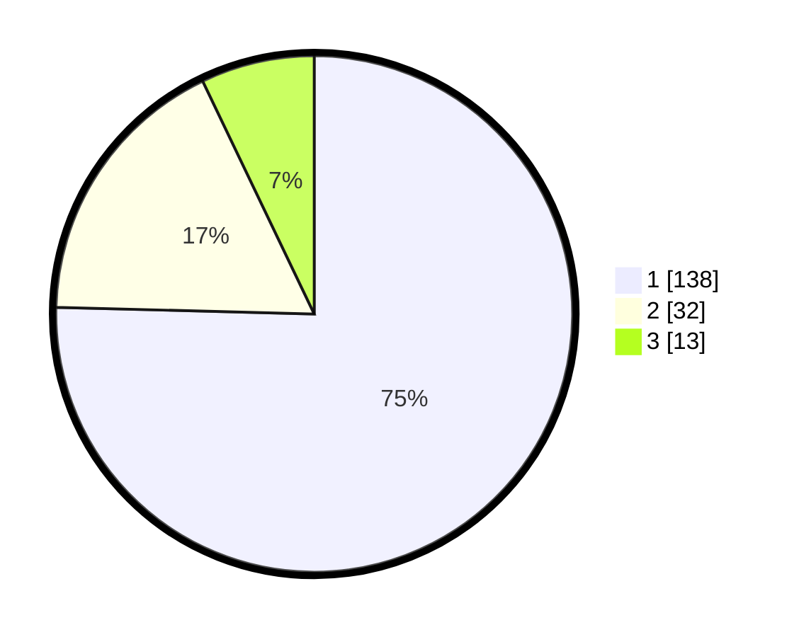

# Hasil

## Grafik

## Tabel

| No. | Nama Paslon    | Suara | Suara (raw) | Persentase |
|:--- |:-------------- | -----:| -----------:| ----------:|
| 1   | ANIES MUHAIMIN | 138   | [138][p-1]  | 75,41      |
| 2   | PRABOWO GIBRAN | 32    | [32][p-2]   | 17,49      |
| 3   | GANJAR MAHFUD  | 13    | [13][p-3]   | 7,10       |

[p-1]: https://github.com/gigit-pemilu/pemilu-2024/blob/main/pilpres/hitung-suara/sub/35-jawa-timur/sub/27-sampang/sub/07-jrengik/sub/2008-jrengik/sub/006-tps/sub/paslon-1.txt
[p-2]: https://github.com/gigit-pemilu/pemilu-2024/blob/main/pilpres/hitung-suara/sub/35-jawa-timur/sub/27-sampang/sub/07-jrengik/sub/2008-jrengik/sub/006-tps/sub/paslon-2.txt
[p-3]: https://github.com/gigit-pemilu/pemilu-2024/blob/main/pilpres/hitung-suara/sub/35-jawa-timur/sub/27-sampang/sub/07-jrengik/sub/2008-jrengik/sub/006-tps/sub/paslon-3.txt

## Foto C Plano

https://sirekap-obj-formc.kpu.go.id/0666/pemilu/ppwp/35/27/07/20/08/3527072008006-20240220-092541--a8f65fa6-6cda-45c1-af53-f32e65535ede.jpg

https://sirekap-obj-formc.kpu.go.id/0666/pemilu/ppwp/35/27/07/20/08/3527072008006-20240220-092635--7648258e-fe08-4936-be90-ce06c8620566.jpg

https://sirekap-obj-formc.kpu.go.id/0666/pemilu/ppwp/35/27/07/20/08/3527072008006-20240220-092657--dd6bcbde-8873-4d67-9f87-098da881f322.jpg

## Metadata

| Key        | Value               |
| ---------- | ------------------- |
| Time Stamp | 2024-02-25 22:00:00 |

