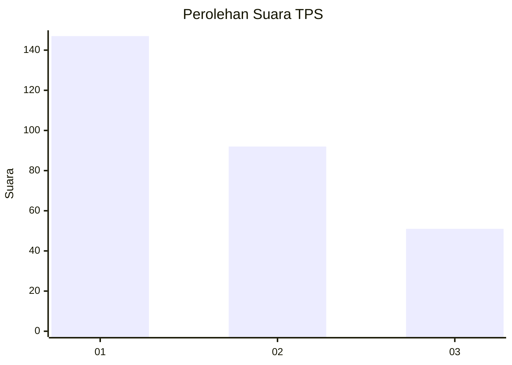
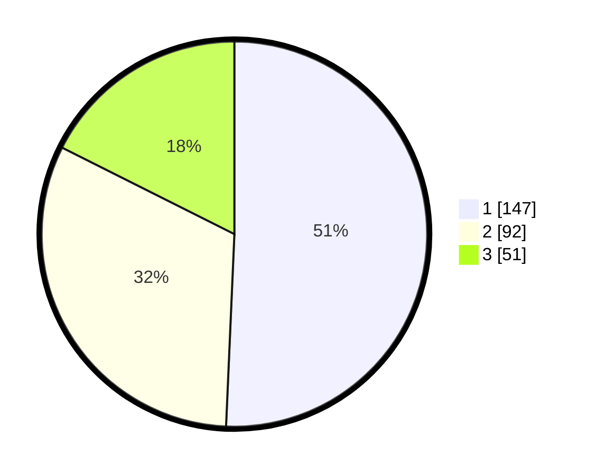

# Hasil

## Grafik

## Tabel

| No. | Nama Paslon    | Suara | Suara (raw) | Persentase |
|:--- |:-------------- | -----:| -----------:| ----------:|
| 1   | ANIES MUHAIMIN | 147   | [147][p-1]  | 50,69      |
| 2   | PRABOWO GIBRAN | 92    | [92][p-2]   | 31,72      |
| 3   | GANJAR MAHFUD  | 51    | [51][p-3]   | 17,59      |

[p-1]: https://github.com/gigit-pemilu/pemilu-2024-35-jawa-timur/blob/main/pilpres/hitung-suara/sub/35-jawa-timur/sub/27-sampang/sub/07-jrengik/sub/2008-jrengik/sub/007-tps/sub/paslon-1.txt
[p-2]: https://github.com/gigit-pemilu/pemilu-2024-35-jawa-timur/blob/main/pilpres/hitung-suara/sub/35-jawa-timur/sub/27-sampang/sub/07-jrengik/sub/2008-jrengik/sub/007-tps/sub/paslon-2.txt
[p-3]: https://github.com/gigit-pemilu/pemilu-2024-35-jawa-timur/blob/main/pilpres/hitung-suara/sub/35-jawa-timur/sub/27-sampang/sub/07-jrengik/sub/2008-jrengik/sub/007-tps/sub/paslon-3.txt

## Foto C Plano

https://sirekap-obj-formc.kpu.go.id/3f4d/pemilu/ppwp/35/27/07/20/08/3527072008007-20240220-092732--a794de4f-363b-44a0-8a21-156981dfc541.jpg

https://sirekap-obj-formc.kpu.go.id/3f4d/pemilu/ppwp/35/27/07/20/08/3527072008007-20240220-092848--c251f95c-2884-4b42-9255-609ffc94e404.jpg

https://sirekap-obj-formc.kpu.go.id/3f4d/pemilu/ppwp/35/27/07/20/08/3527072008007-20240220-092911--c0da3b7f-efbb-4877-b0e6-440a679559a2.jpg

## Metadata

| Key        | Value               |
| ---------- | ------------------- |
| Time Stamp | 2024-02-25 14:00:00 |

