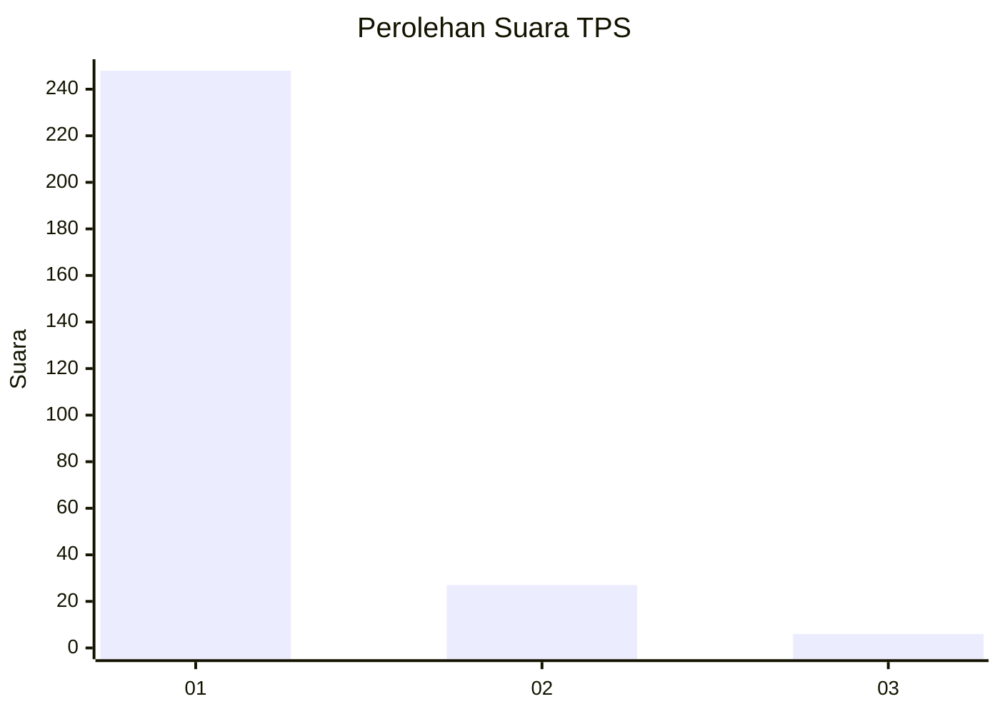
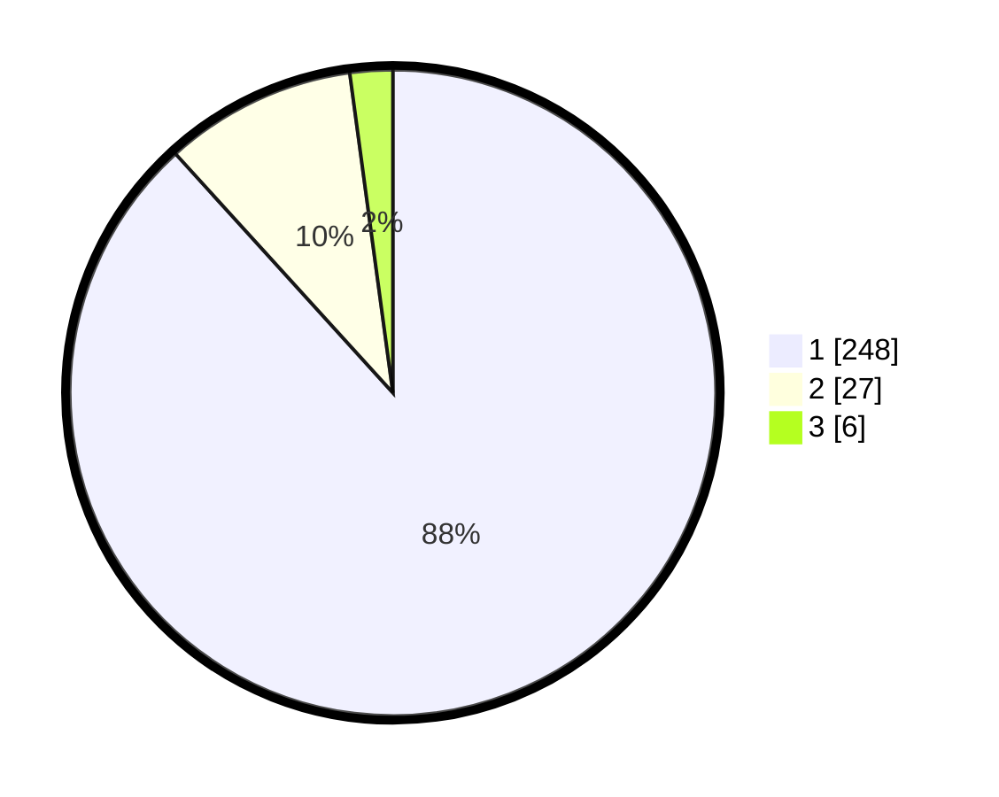

# Hasil

## Grafik

## Tabel

| No. | Nama Paslon    | Suara | Suara (raw) | Persentase |
|:--- |:-------------- | -----:| -----------:| ----------:|
| 1   | ANIES MUHAIMIN | 248   | [248][p-1]  | 88,26      |
| 2   | PRABOWO GIBRAN | 27    | [27][p-2]   | 9,61       |
| 3   | GANJAR MAHFUD  | 6     | [6][p-3]    | 2,14       |

[p-1]: https://github.com/gigit-pemilu/pemilu-2024-35-jawa-timur/blob/main/pilpres/hitung-suara/sub/35-jawa-timur/sub/27-sampang/sub/07-jrengik/sub/2008-jrengik/sub/008-tps/sub/paslon-1.txt
[p-2]: https://github.com/gigit-pemilu/pemilu-2024-35-jawa-timur/blob/main/pilpres/hitung-suara/sub/35-jawa-timur/sub/27-sampang/sub/07-jrengik/sub/2008-jrengik/sub/008-tps/sub/paslon-2.txt
[p-3]: https://github.com/gigit-pemilu/pemilu-2024-35-jawa-timur/blob/main/pilpres/hitung-suara/sub/35-jawa-timur/sub/27-sampang/sub/07-jrengik/sub/2008-jrengik/sub/008-tps/sub/paslon-3.txt

## Foto C Plano

https://sirekap-obj-formc.kpu.go.id/3af2/pemilu/ppwp/35/27/07/20/08/3527072008008-20240220-092949--c62ad2c1-29e0-4cbd-bdc3-ea4918dcb11c.jpg

https://sirekap-obj-formc.kpu.go.id/3af2/pemilu/ppwp/35/27/07/20/08/3527072008008-20240220-093037--e661e973-7fda-462a-9f26-4219305f6c65.jpg

https://sirekap-obj-formc.kpu.go.id/3af2/pemilu/ppwp/35/27/07/20/08/3527072008008-20240220-093059--5c8b6736-32a1-42ca-bc4a-dcd9716d9513.jpg

## Metadata

| Key        | Value               |
| ---------- | ------------------- |
| Time Stamp | 2024-02-25 15:00:00 |

