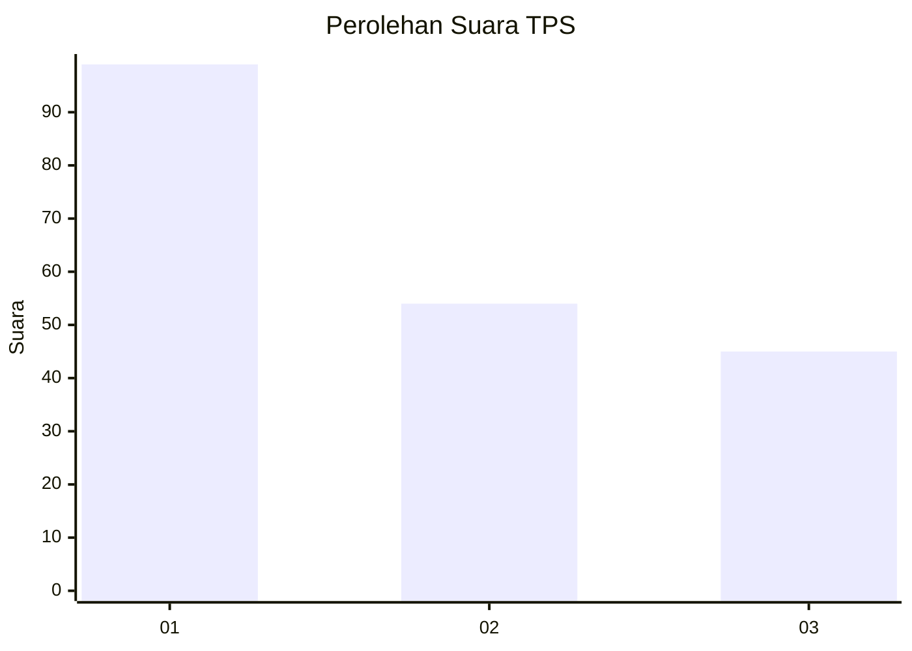
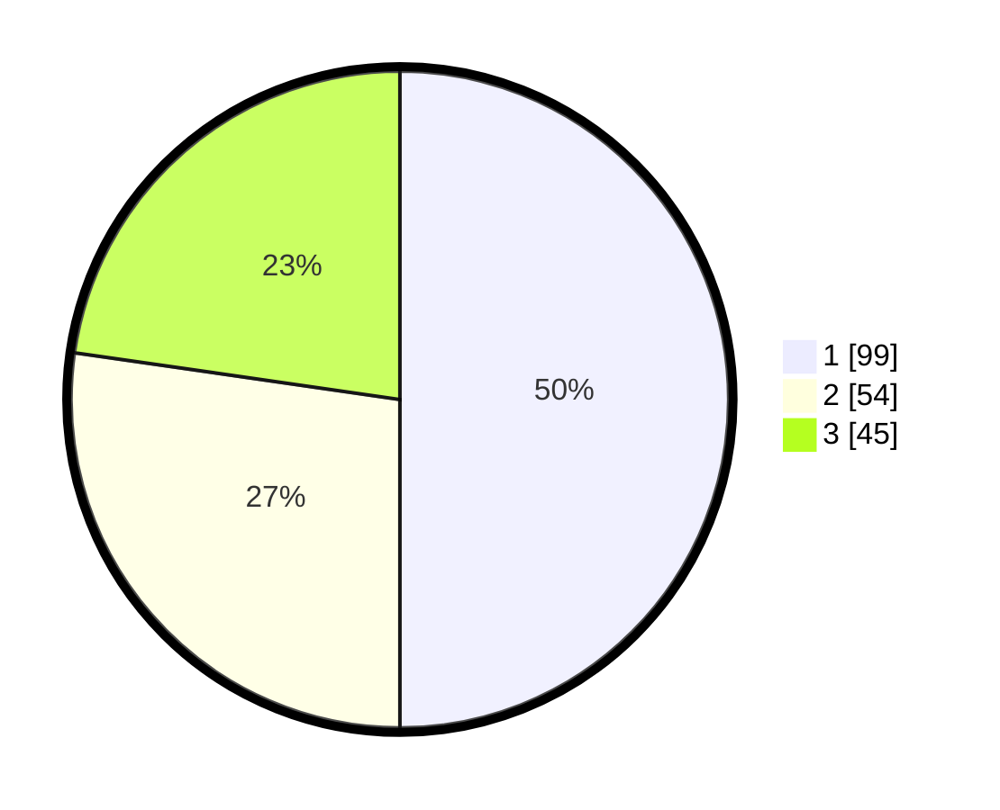

# Hasil

## Grafik

## Tabel

| No. | Nama Paslon    | Suara | Suara (raw) | Persentase |
|:--- |:-------------- | -----:| -----------:| ----------:|
| 1   | ANIES MUHAIMIN | 99    | [99][p-1]   | 50,00      |
| 2   | PRABOWO GIBRAN | 54    | [54][p-2]   | 27,27      |
| 3   | GANJAR MAHFUD  | 45    | [45][p-3]   | 22,73      |

[p-1]: https://github.com/gigit-pemilu/pemilu-2024/blob/main/pilpres/hitung-suara/sub/35-jawa-timur/sub/27-sampang/sub/07-jrengik/sub/2008-jrengik/sub/009-tps/sub/paslon-1.txt
[p-2]: https://github.com/gigit-pemilu/pemilu-2024/blob/main/pilpres/hitung-suara/sub/35-jawa-timur/sub/27-sampang/sub/07-jrengik/sub/2008-jrengik/sub/009-tps/sub/paslon-2.txt
[p-3]: https://github.com/gigit-pemilu/pemilu-2024/blob/main/pilpres/hitung-suara/sub/35-jawa-timur/sub/27-sampang/sub/07-jrengik/sub/2008-jrengik/sub/009-tps/sub/paslon-3.txt

## Foto C Plano

https://sirekap-obj-formc.kpu.go.id/43cb/pemilu/ppwp/35/27/07/20/08/3527072008009-20240220-093306--a2edb920-e9ee-4577-8a43-db73066fc83d.jpg

https://sirekap-obj-formc.kpu.go.id/43cb/pemilu/ppwp/35/27/07/20/08/3527072008009-20240220-093414--4d0521ba-3b0d-47eb-9b29-669b271a022d.jpg

https://sirekap-obj-formc.kpu.go.id/43cb/pemilu/ppwp/35/27/07/20/08/3527072008009-20240220-093429--122a22f2-4abf-45fb-bcce-c96f80275ef3.jpg

## Metadata

| Key        | Value               |
| ---------- | ------------------- |
| Time Stamp | 2024-02-24 22:31:28 |

