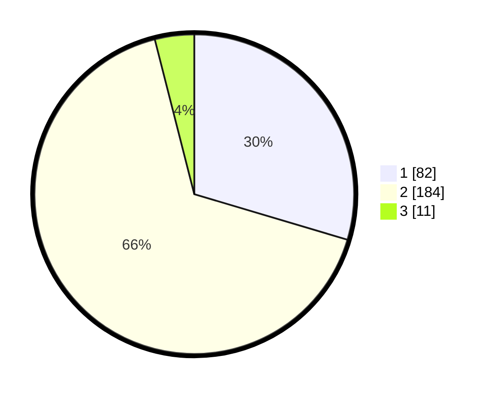

# Hasil

## Grafik

## Tabel

| No. | Nama Paslon    | Suara | Suara (raw) | Persentase |
|:--- |:-------------- | -----:| -----------:| ----------:|
| 1   | ANIES MUHAIMIN | 82    | [82][p-1]   | 29,60      |
| 2   | PRABOWO GIBRAN | 184   | [184][p-2]  | 66,43      |
| 3   | GANJAR MAHFUD  | 11    | [11][p-3]   | 3,97       |

[p-1]: https://github.com/gigit-pemilu/pemilu-2024/blob/main/pilpres/hitung-suara/sub/35-jawa-timur/sub/27-sampang/sub/07-jrengik/sub/2009-kalangan-prao/sub/002-tps/sub/paslon-1.txt
[p-2]: https://github.com/gigit-pemilu/pemilu-2024/blob/main/pilpres/hitung-suara/sub/35-jawa-timur/sub/27-sampang/sub/07-jrengik/sub/2009-kalangan-prao/sub/002-tps/sub/paslon-2.txt
[p-3]: https://github.com/gigit-pemilu/pemilu-2024/blob/main/pilpres/hitung-suara/sub/35-jawa-timur/sub/27-sampang/sub/07-jrengik/sub/2009-kalangan-prao/sub/002-tps/sub/paslon-3.txt

## Foto C Plano

https://sirekap-obj-formc.kpu.go.id/2b03/pemilu/ppwp/35/27/07/20/09/3527072009002-20240214-225352--91264ace-001c-4fb2-bdfb-22895a8abf27.jpg

https://sirekap-obj-formc.kpu.go.id/2b03/pemilu/ppwp/35/27/07/20/09/3527072009002-20240214-225628--461502eb-3830-4ccb-b842-e9ffdb8e398e.jpg

https://sirekap-obj-formc.kpu.go.id/2b03/pemilu/ppwp/35/27/07/20/09/3527072009002-20240214-225914--2023b165-9413-4048-acf4-c20ef647214b.jpg

## Metadata

| Key        | Value               |
| ---------- | ------------------- |
| Time Stamp | 2024-02-16 11:00:29 |

