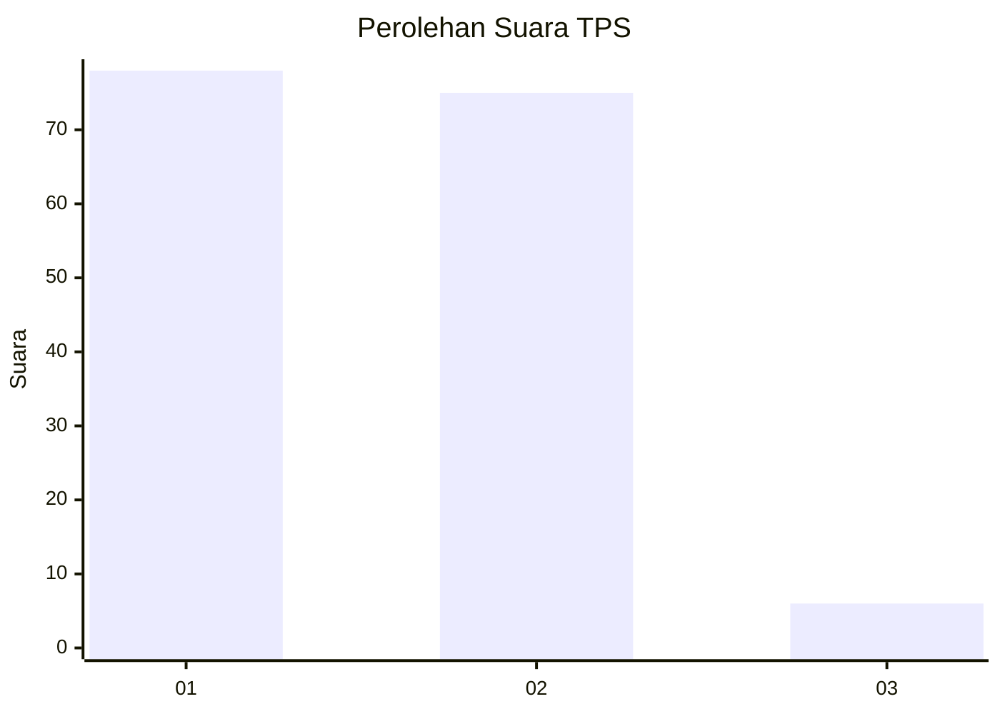
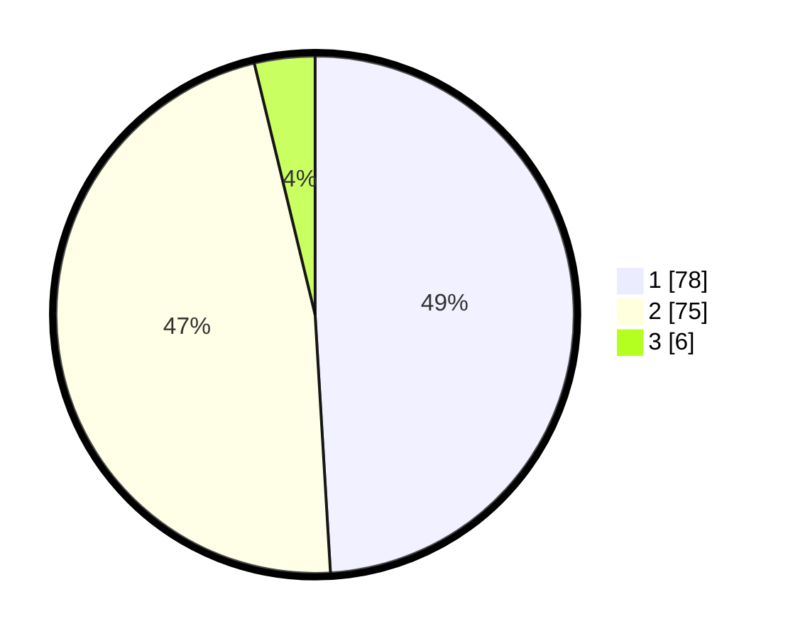

# Hasil

## Grafik

## Tabel

| No. | Nama Paslon    | Suara | Suara (raw) | Persentase |
|:--- |:-------------- | -----:| -----------:| ----------:|
| 1   | ANIES MUHAIMIN | 78    | [78][p-1]   | 49,06      |
| 2   | PRABOWO GIBRAN | 75    | [75][p-2]   | 47,17      |
| 3   | GANJAR MAHFUD  | 6     | [6][p-3]    | 3,77       |

[p-1]: https://github.com/gigit-pemilu/pemilu-2024/blob/main/pilpres/hitung-suara/sub/35-jawa-timur/sub/27-sampang/sub/07-jrengik/sub/2012-mlakah/sub/005-tps/sub/paslon-1.txt
[p-2]: https://github.com/gigit-pemilu/pemilu-2024/blob/main/pilpres/hitung-suara/sub/35-jawa-timur/sub/27-sampang/sub/07-jrengik/sub/2012-mlakah/sub/005-tps/sub/paslon-2.txt
[p-3]: https://github.com/gigit-pemilu/pemilu-2024/blob/main/pilpres/hitung-suara/sub/35-jawa-timur/sub/27-sampang/sub/07-jrengik/sub/2012-mlakah/sub/005-tps/sub/paslon-3.txt

## Foto C Plano

https://sirekap-obj-formc.kpu.go.id/d136/pemilu/ppwp/35/27/07/20/12/3527072012005-20240214-212233--b49984e1-7d5f-4675-8764-94431a62c310.jpg

https://sirekap-obj-formc.kpu.go.id/d136/pemilu/ppwp/35/27/07/20/12/3527072012005-20240214-212353--a9b0fab4-8d42-4824-8c24-b75385bf8c5f.jpg

https://sirekap-obj-formc.kpu.go.id/d136/pemilu/ppwp/35/27/07/20/12/3527072012005-20240214-212712--0bad42cc-4fbb-4dc2-a416-499796884236.jpg

## Metadata

| Key        | Value               |
| ---------- | ------------------- |
| Time Stamp | 2024-02-25 12:00:00 |

