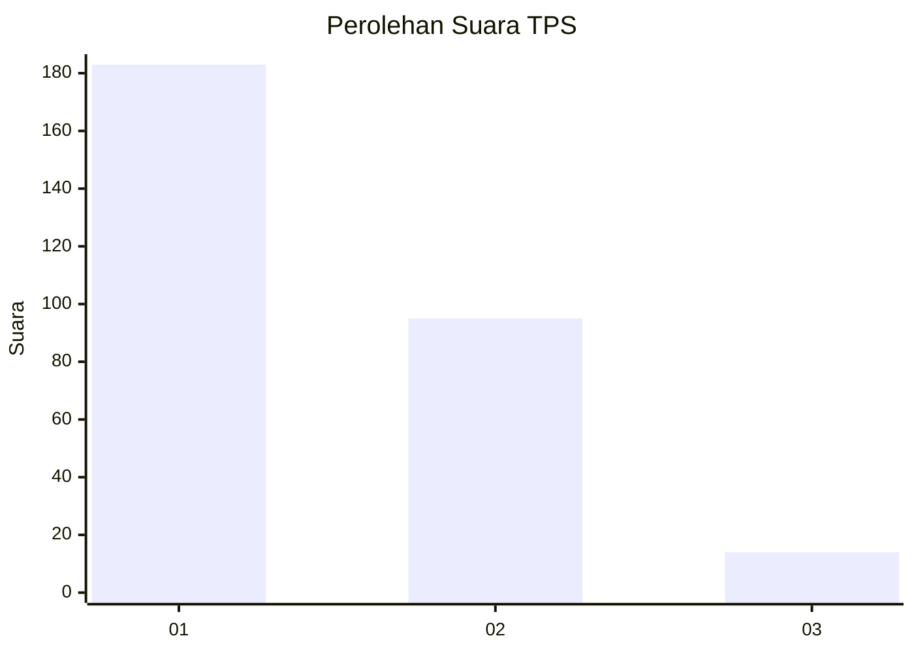
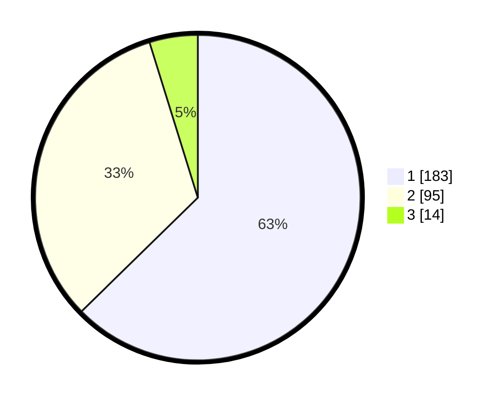

# Hasil

## Grafik

## Tabel

| No. | Nama Paslon    | Suara | Suara (raw) | Persentase |
|:--- |:-------------- | -----:| -----------:| ----------:|
| 1   | ANIES MUHAIMIN | 183   | [183][p-1]  | 62,67      |
| 2   | PRABOWO GIBRAN | 95    | [95][p-2]   | 32,53      |
| 3   | GANJAR MAHFUD  | 14    | [14][p-3]   | 4,79       |

[p-1]: https://github.com/gigit-pemilu/pemilu-2024-35-jawa-timur/blob/main/pilpres/hitung-suara/sub/35-jawa-timur/sub/27-sampang/sub/07-jrengik/sub/2012-mlakah/sub/007-tps/sub/paslon-1.txt
[p-2]: https://github.com/gigit-pemilu/pemilu-2024-35-jawa-timur/blob/main/pilpres/hitung-suara/sub/35-jawa-timur/sub/27-sampang/sub/07-jrengik/sub/2012-mlakah/sub/007-tps/sub/paslon-2.txt
[p-3]: https://github.com/gigit-pemilu/pemilu-2024-35-jawa-timur/blob/main/pilpres/hitung-suara/sub/35-jawa-timur/sub/27-sampang/sub/07-jrengik/sub/2012-mlakah/sub/007-tps/sub/paslon-3.txt

## Foto C Plano

https://sirekap-obj-formc.kpu.go.id/c10f/pemilu/ppwp/35/27/07/20/12/3527072012007-20240214-220811--1bebb9ff-f72d-4435-aa6c-4a21d09b42eb.jpg

https://sirekap-obj-formc.kpu.go.id/c10f/pemilu/ppwp/35/27/07/20/12/3527072012007-20240214-221200--8bf0a0ce-117e-4437-96d8-492a3c63ad1a.jpg

https://sirekap-obj-formc.kpu.go.id/c10f/pemilu/ppwp/35/27/07/20/12/3527072012007-20240214-221453--a6ffbf4c-6f58-4520-a01a-70331a2232bd.jpg

## Metadata

| Key        | Value               |
| ---------- | ------------------- |
| Time Stamp | 2024-02-24 22:31:28 |

