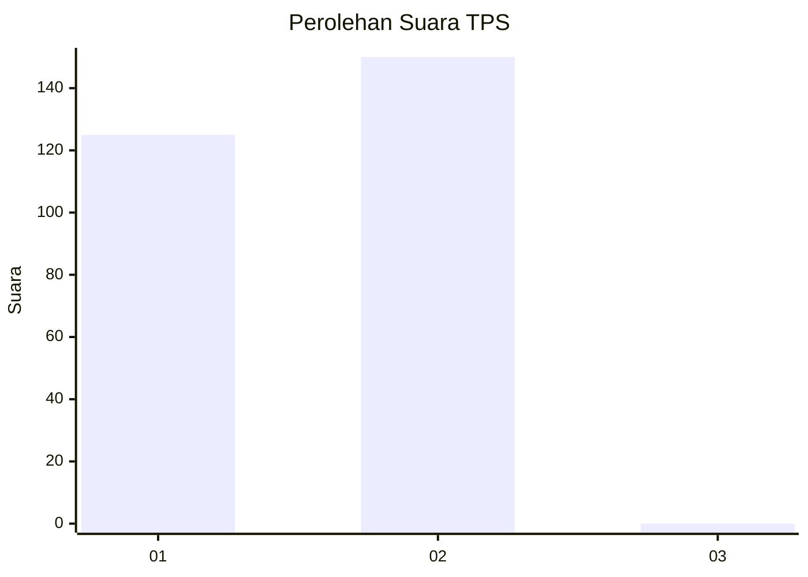
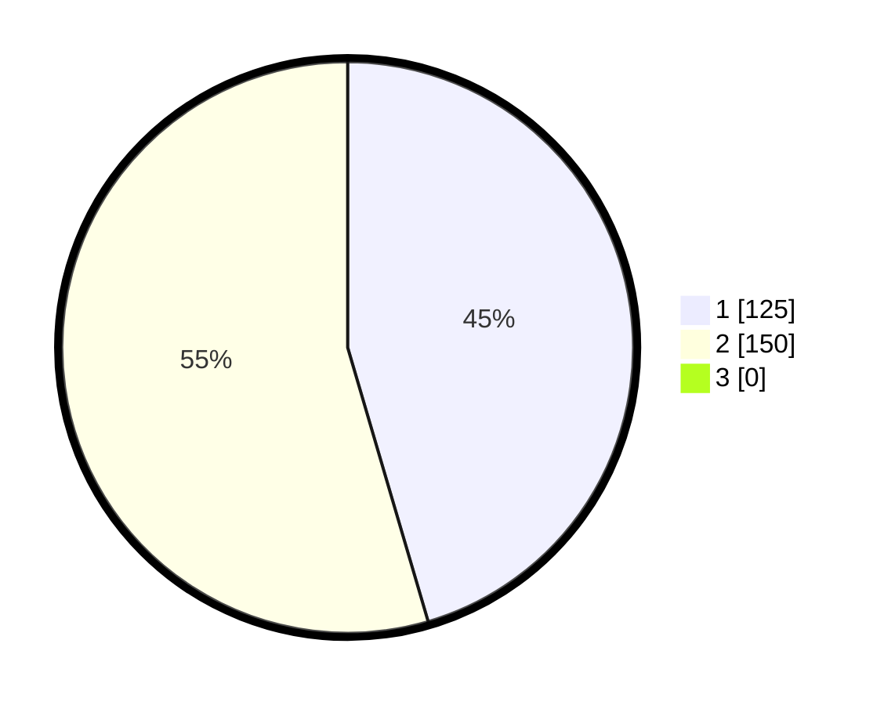

# Hasil

## Grafik

## Tabel

| No. | Nama Paslon    | Suara | Suara (raw) | Persentase |
|:--- |:-------------- | -----:| -----------:| ----------:|
| 1   | ANIES MUHAIMIN | 125   | [125][p-1]  | 45,45      |
| 2   | PRABOWO GIBRAN | 150   | [150][p-2]  | 54,55      |
| 3   | GANJAR MAHFUD  | 0     | [0][p-3]    | 0,00       |

[p-1]: https://github.com/gigit-pemilu/pemilu-2024/blob/main/pilpres/hitung-suara/sub/35-jawa-timur/sub/27-sampang/sub/07-jrengik/sub/2013-bancelok/sub/001-tps/sub/paslon-1.txt
[p-2]: https://github.com/gigit-pemilu/pemilu-2024/blob/main/pilpres/hitung-suara/sub/35-jawa-timur/sub/27-sampang/sub/07-jrengik/sub/2013-bancelok/sub/001-tps/sub/paslon-2.txt
[p-3]: https://github.com/gigit-pemilu/pemilu-2024/blob/main/pilpres/hitung-suara/sub/35-jawa-timur/sub/27-sampang/sub/07-jrengik/sub/2013-bancelok/sub/001-tps/sub/paslon-3.txt

## Foto C Plano

https://sirekap-obj-formc.kpu.go.id/544b/pemilu/ppwp/35/27/07/20/13/3527072013001-20240219-151417--b5c6c9bb-7071-466f-8660-189c2c7736f6.jpg

https://sirekap-obj-formc.kpu.go.id/544b/pemilu/ppwp/35/27/07/20/13/3527072013001-20240219-151741--967c1e46-1806-4ae6-b3b1-e13c4e74bce5.jpg

https://sirekap-obj-formc.kpu.go.id/544b/pemilu/ppwp/35/27/07/20/13/3527072013001-20240219-151808--556d6cc3-2ef4-4af3-aca4-9ff1c600ffe9.jpg

## Metadata

| Key        | Value               |
| ---------- | ------------------- |
| Time Stamp | 2024-02-25 15:00:00 |

