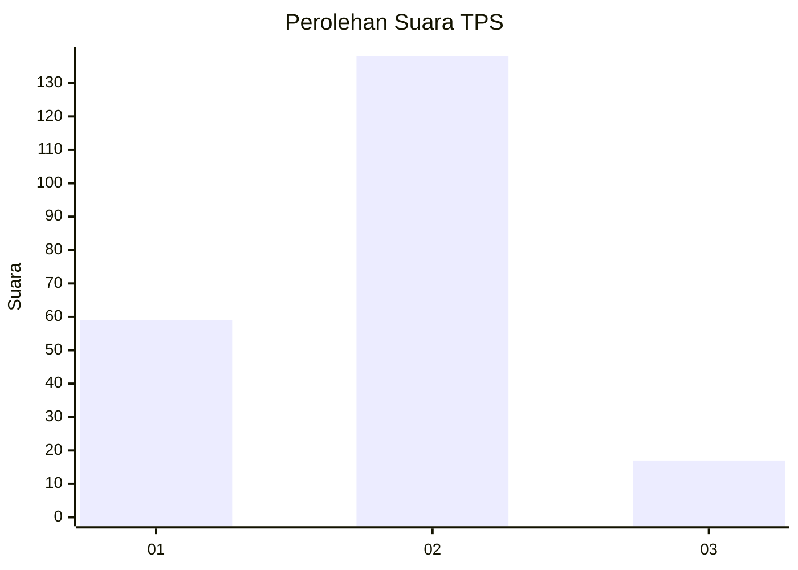
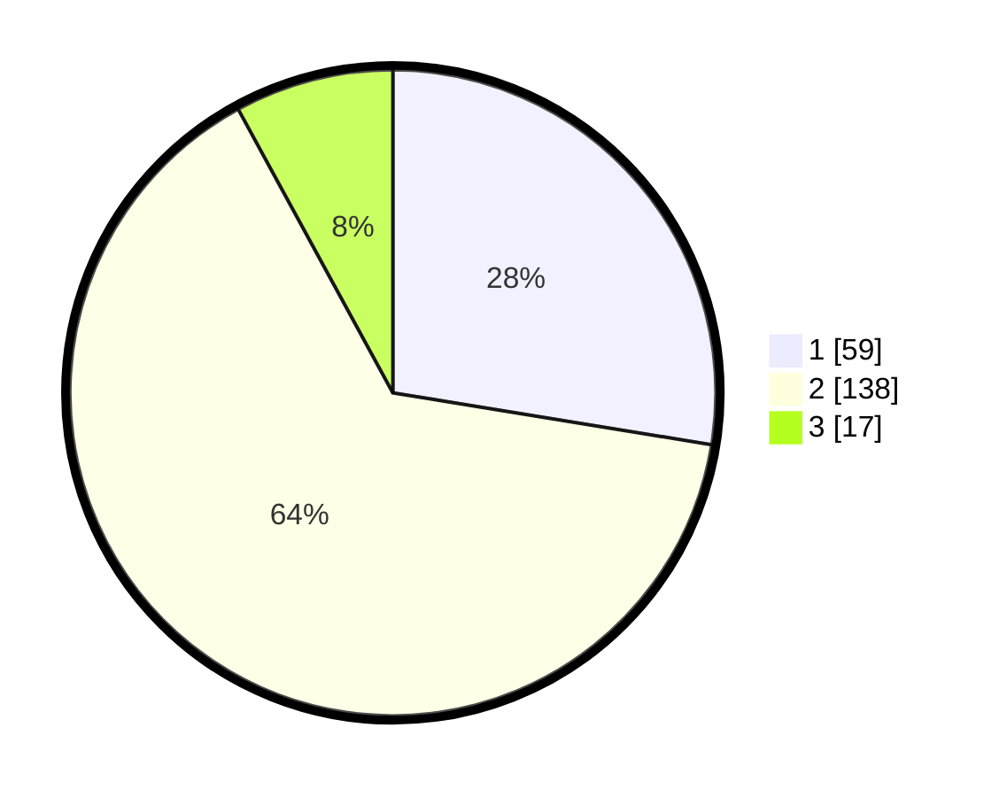

# Hasil

## Grafik

## Tabel

| No. | Nama Paslon    | Suara | Suara (raw) | Persentase |
|:--- |:-------------- | -----:| -----------:| ----------:|
| 1   | ANIES MUHAIMIN | 59    | [59][p-1]   | 27,57      |
| 2   | PRABOWO GIBRAN | 138   | [138][p-2]  | 64,49      |
| 3   | GANJAR MAHFUD  | 17    | [17][p-3]   | 7,94       |

[p-1]: https://github.com/gigit-pemilu/pemilu-2024/blob/main/pilpres/hitung-suara/sub/35-jawa-timur/sub/27-sampang/sub/07-jrengik/sub/2013-bancelok/sub/002-tps/sub/paslon-1.txt
[p-2]: https://github.com/gigit-pemilu/pemilu-2024/blob/main/pilpres/hitung-suara/sub/35-jawa-timur/sub/27-sampang/sub/07-jrengik/sub/2013-bancelok/sub/002-tps/sub/paslon-2.txt
[p-3]: https://github.com/gigit-pemilu/pemilu-2024/blob/main/pilpres/hitung-suara/sub/35-jawa-timur/sub/27-sampang/sub/07-jrengik/sub/2013-bancelok/sub/002-tps/sub/paslon-3.txt

## Foto C Plano

https://sirekap-obj-formc.kpu.go.id/6dd3/pemilu/ppwp/35/27/07/20/13/3527072013002-20240219-151926--cc5aebd4-056e-455e-91db-4c4c0f7dc3c8.jpg

https://sirekap-obj-formc.kpu.go.id/6dd3/pemilu/ppwp/35/27/07/20/13/3527072013002-20240219-152111--ca5548ad-cfca-4a07-bbf5-e21c50cdf6de.jpg

https://sirekap-obj-formc.kpu.go.id/6dd3/pemilu/ppwp/35/27/07/20/13/3527072013002-20240219-152149--3a3a6817-f4a7-473c-a32a-30bfa7afd419.jpg

## Metadata

| Key        | Value               |
| ---------- | ------------------- |
| Time Stamp | 2024-02-24 22:31:28 |

