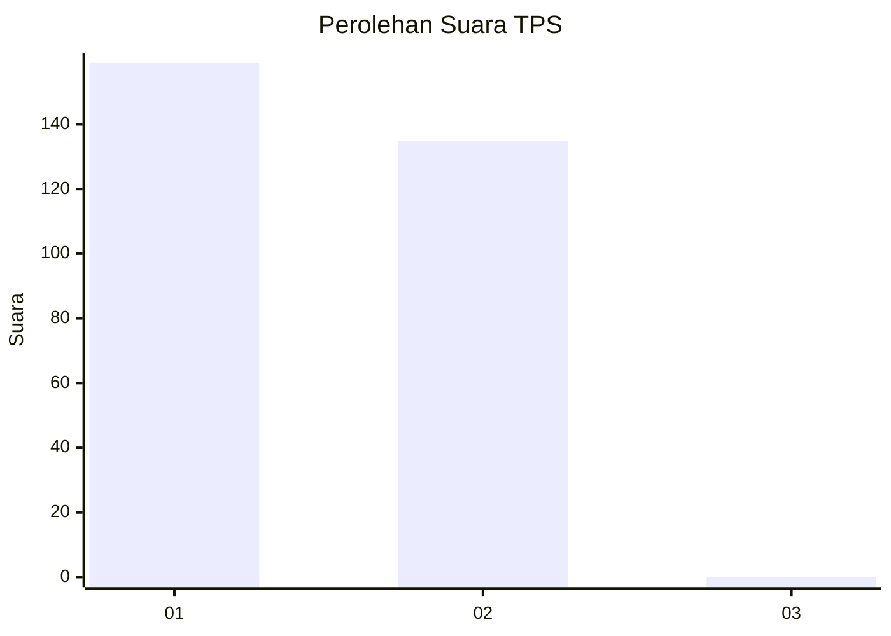
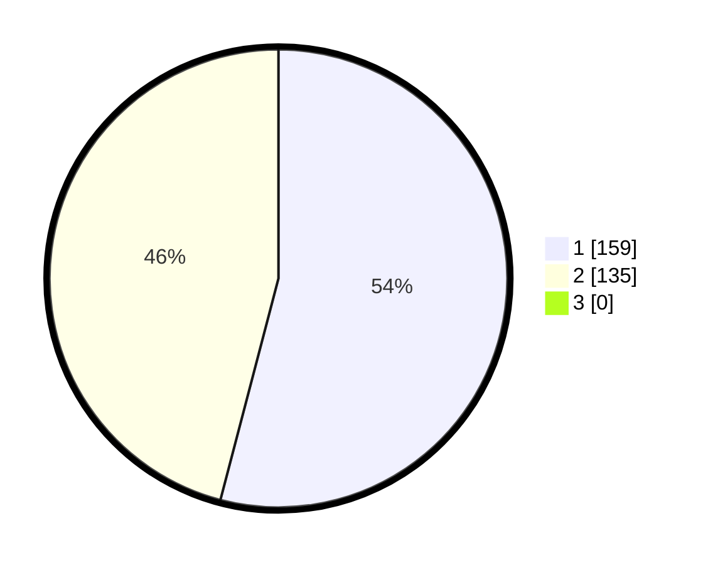

# Hasil

## Grafik

## Tabel

| No. | Nama Paslon    | Suara | Suara (raw) | Persentase |
|:--- |:-------------- | -----:| -----------:| ----------:|
| 1   | ANIES MUHAIMIN | 159   | [159][p-1]  | 54,08      |
| 2   | PRABOWO GIBRAN | 135   | [135][p-2]  | 45,92      |
| 3   | GANJAR MAHFUD  | 0     | [0][p-3]    | 0,00       |

[p-1]: https://github.com/gigit-pemilu/pemilu-2024/blob/main/pilpres/hitung-suara/sub/35-jawa-timur/sub/27-sampang/sub/07-jrengik/sub/2013-bancelok/sub/003-tps/sub/paslon-1.txt
[p-2]: https://github.com/gigit-pemilu/pemilu-2024/blob/main/pilpres/hitung-suara/sub/35-jawa-timur/sub/27-sampang/sub/07-jrengik/sub/2013-bancelok/sub/003-tps/sub/paslon-2.txt
[p-3]: https://github.com/gigit-pemilu/pemilu-2024/blob/main/pilpres/hitung-suara/sub/35-jawa-timur/sub/27-sampang/sub/07-jrengik/sub/2013-bancelok/sub/003-tps/sub/paslon-3.txt

## Foto C Plano

https://sirekap-obj-formc.kpu.go.id/fbd3/pemilu/ppwp/35/27/07/20/13/3527072013003-20240219-152305--c77b25fb-69ff-455d-997f-a16e3f50cdb5.jpg

https://sirekap-obj-formc.kpu.go.id/fbd3/pemilu/ppwp/35/27/07/20/13/3527072013003-20240219-152504--6b1de89b-c5a9-4f0d-9438-f21a214b3c66.jpg

https://sirekap-obj-formc.kpu.go.id/fbd3/pemilu/ppwp/35/27/07/20/13/3527072013003-20240219-152524--d8384769-26c7-4bcb-a140-73695e3da7dc.jpg

## Metadata

| Key        | Value               |
| ---------- | ------------------- |
| Time Stamp | 2024-02-24 22:31:28 |

