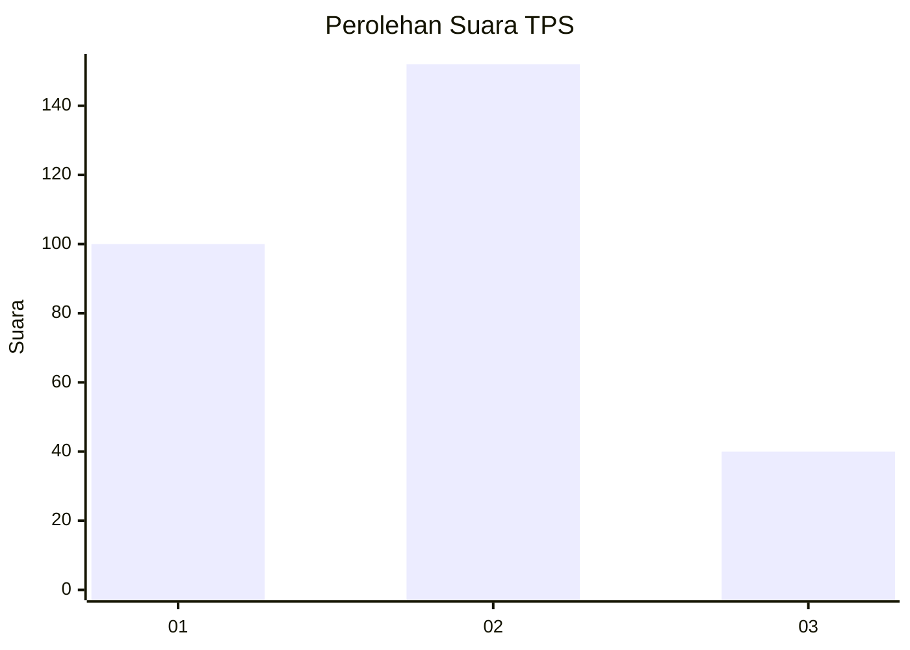
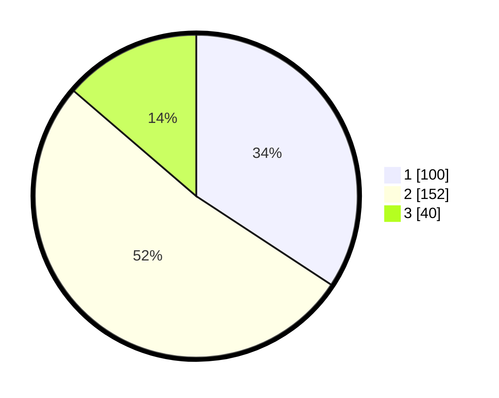

# Hasil

## Grafik

## Tabel

| No. | Nama Paslon    | Suara | Suara (raw) | Persentase |
|:--- |:-------------- | -----:| -----------:| ----------:|
| 1   | ANIES MUHAIMIN | 100   | [100][p-1]  | 34,25      |
| 2   | PRABOWO GIBRAN | 152   | [152][p-2]  | 52,05      |
| 3   | GANJAR MAHFUD  | 40    | [40][p-3]   | 13,70      |

[p-1]: https://github.com/gigit-pemilu/pemilu-2024-35-jawa-timur/blob/main/pilpres/hitung-suara/sub/35-jawa-timur/sub/27-sampang/sub/07-jrengik/sub/2013-bancelok/sub/005-tps/sub/paslon-1.txt
[p-2]: https://github.com/gigit-pemilu/pemilu-2024-35-jawa-timur/blob/main/pilpres/hitung-suara/sub/35-jawa-timur/sub/27-sampang/sub/07-jrengik/sub/2013-bancelok/sub/005-tps/sub/paslon-2.txt
[p-3]: https://github.com/gigit-pemilu/pemilu-2024-35-jawa-timur/blob/main/pilpres/hitung-suara/sub/35-jawa-timur/sub/27-sampang/sub/07-jrengik/sub/2013-bancelok/sub/005-tps/sub/paslon-3.txt

## Foto C Plano

https://sirekap-obj-formc.kpu.go.id/3c49/pemilu/ppwp/35/27/07/20/13/3527072013005-20240219-152854--6df37eb1-588d-4da4-8872-c1d7c3ee7472.jpg

https://sirekap-obj-formc.kpu.go.id/3c49/pemilu/ppwp/35/27/07/20/13/3527072013005-20240219-153116--ca21cb0f-e3e2-4f1c-af49-597ff792411b.jpg

https://sirekap-obj-formc.kpu.go.id/3c49/pemilu/ppwp/35/27/07/20/13/3527072013005-20240219-153135--1556289d-90c3-4870-8956-6acc96e87647.jpg

## Metadata

| Key        | Value               |
| ---------- | ------------------- |
| Time Stamp | 2024-02-25 18:00:00 |

