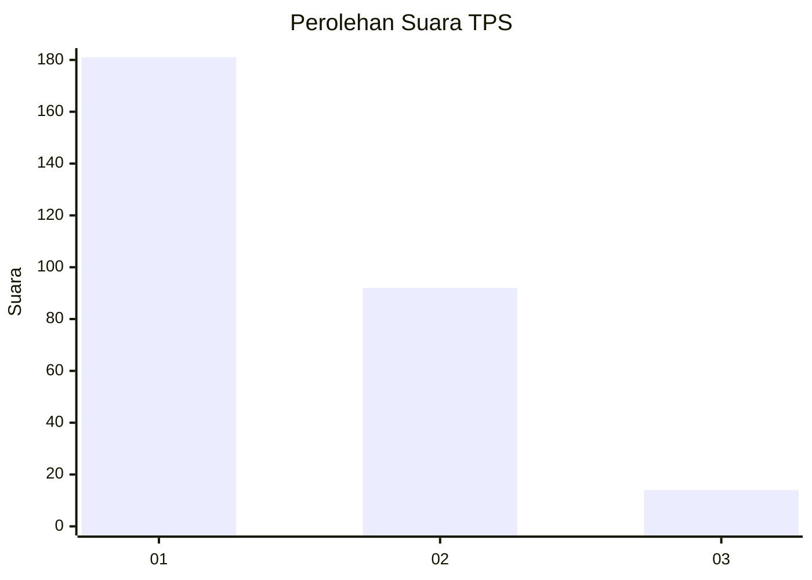
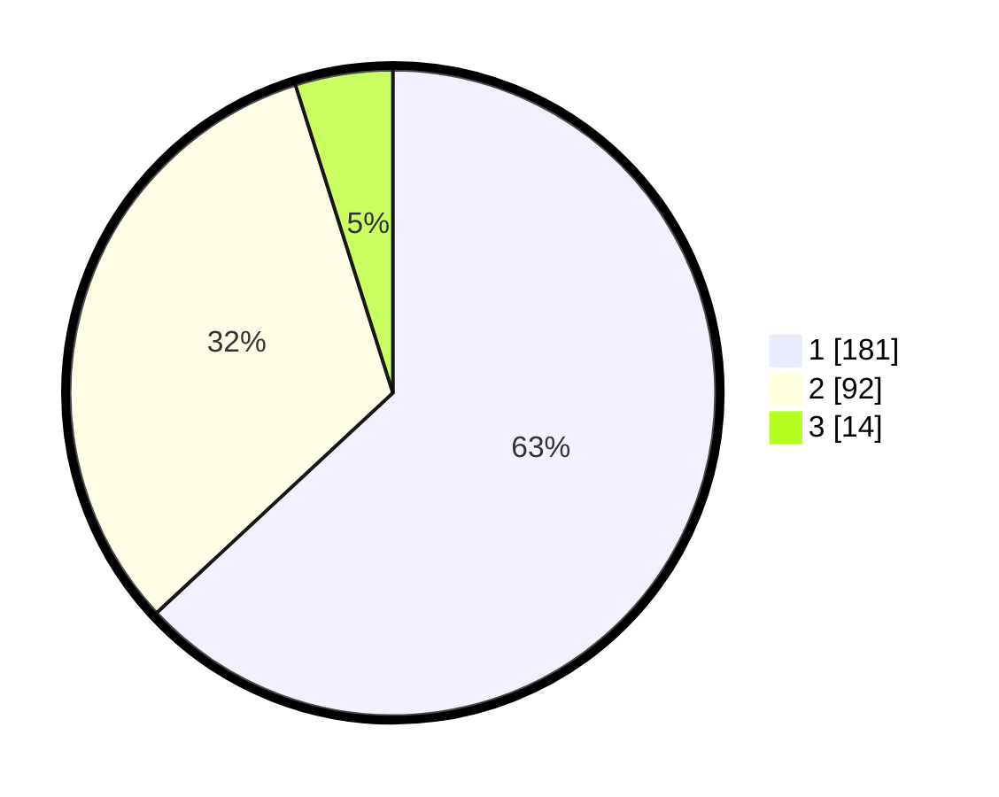

# Hasil

## Grafik

## Tabel

| No. | Nama Paslon    | Suara | Suara (raw) | Persentase |
|:--- |:-------------- | -----:| -----------:| ----------:|
| 1   | ANIES MUHAIMIN | 181   | [181][p-1]  | 63,07      |
| 2   | PRABOWO GIBRAN | 92    | [92][p-2]   | 32,06      |
| 3   | GANJAR MAHFUD  | 14    | [14][p-3]   | 4,88       |

[p-1]: https://github.com/gigit-pemilu/pemilu-2024-35-jawa-timur/blob/main/pilpres/hitung-suara/sub/35-jawa-timur/sub/27-sampang/sub/07-jrengik/sub/2013-bancelok/sub/006-tps/sub/paslon-1.txt
[p-2]: https://github.com/gigit-pemilu/pemilu-2024-35-jawa-timur/blob/main/pilpres/hitung-suara/sub/35-jawa-timur/sub/27-sampang/sub/07-jrengik/sub/2013-bancelok/sub/006-tps/sub/paslon-2.txt
[p-3]: https://github.com/gigit-pemilu/pemilu-2024-35-jawa-timur/blob/main/pilpres/hitung-suara/sub/35-jawa-timur/sub/27-sampang/sub/07-jrengik/sub/2013-bancelok/sub/006-tps/sub/paslon-3.txt

## Foto C Plano

https://sirekap-obj-formc.kpu.go.id/055c/pemilu/ppwp/35/27/07/20/13/3527072013006-20240219-153227--8b412036-f907-42a8-9c14-52036aa3ea37.jpg

https://sirekap-obj-formc.kpu.go.id/055c/pemilu/ppwp/35/27/07/20/13/3527072013006-20240219-153316--47aaa52f-1ff0-4ca1-b6bc-21c9b017e307.jpg

https://sirekap-obj-formc.kpu.go.id/055c/pemilu/ppwp/35/27/07/20/13/3527072013006-20240219-153349--ceeffdbf-ddd6-4f6e-b855-ce322fe11ac8.jpg

## Metadata

| Key        | Value               |
| ---------- | ------------------- |
| Time Stamp | 2024-02-25 15:00:00 |

