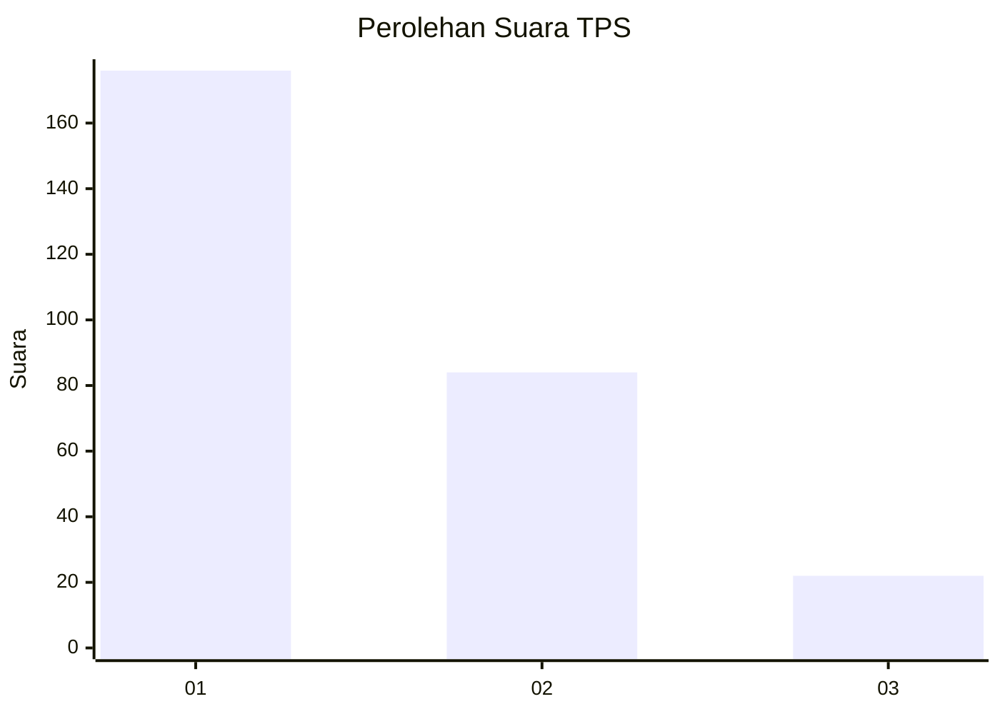
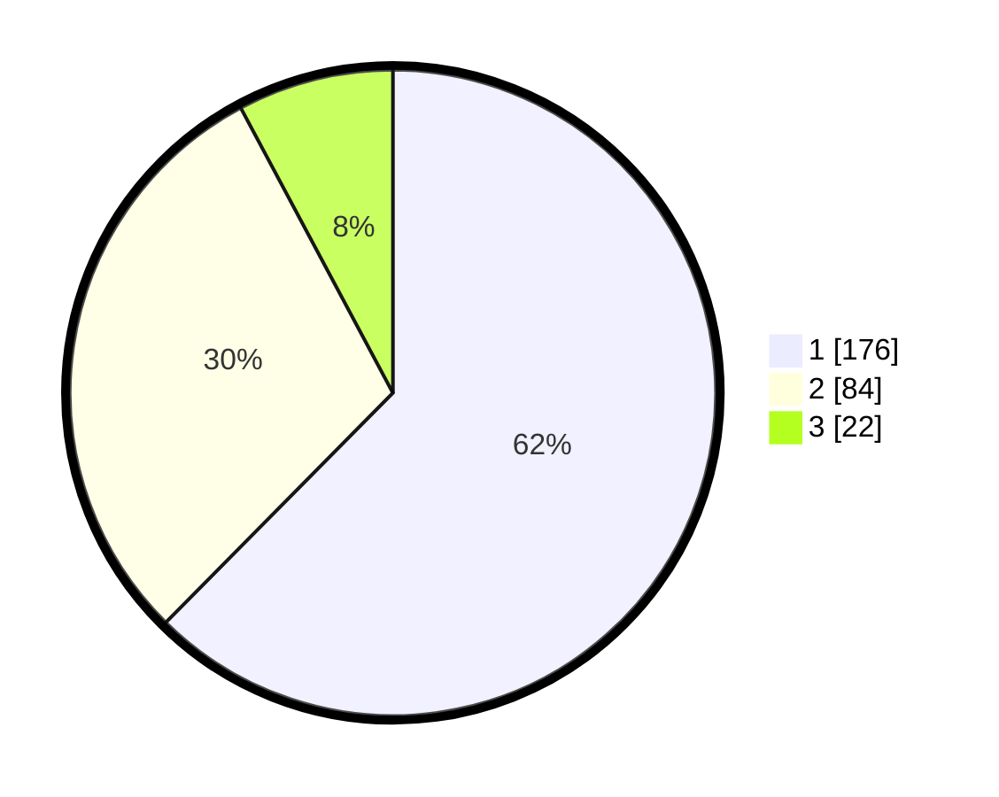

# Hasil

## Grafik

## Tabel

| No. | Nama Paslon    | Suara | Suara (raw) | Persentase |
|:--- |:-------------- | -----:| -----------:| ----------:|
| 1   | ANIES MUHAIMIN | 176   | [176][p-1]  | 62,41      |
| 2   | PRABOWO GIBRAN | 84    | [84][p-2]   | 29,79      |
| 3   | GANJAR MAHFUD  | 22    | [22][p-3]   | 7,80       |

[p-1]: https://github.com/gigit-pemilu/pemilu-2024-35-jawa-timur/blob/main/pilpres/hitung-suara/sub/35-jawa-timur/sub/27-sampang/sub/07-jrengik/sub/2013-bancelok/sub/007-tps/sub/paslon-1.txt
[p-2]: https://github.com/gigit-pemilu/pemilu-2024-35-jawa-timur/blob/main/pilpres/hitung-suara/sub/35-jawa-timur/sub/27-sampang/sub/07-jrengik/sub/2013-bancelok/sub/007-tps/sub/paslon-2.txt
[p-3]: https://github.com/gigit-pemilu/pemilu-2024-35-jawa-timur/blob/main/pilpres/hitung-suara/sub/35-jawa-timur/sub/27-sampang/sub/07-jrengik/sub/2013-bancelok/sub/007-tps/sub/paslon-3.txt

## Foto C Plano

https://sirekap-obj-formc.kpu.go.id/73a5/pemilu/ppwp/35/27/07/20/13/3527072013007-20240219-153715--f78df4c5-5928-4318-8faf-0c36c060d032.jpg

https://sirekap-obj-formc.kpu.go.id/73a5/pemilu/ppwp/35/27/07/20/13/3527072013007-20240219-153806--2597343f-167c-43f3-bc7b-500a007a641a.jpg

https://sirekap-obj-formc.kpu.go.id/73a5/pemilu/ppwp/35/27/07/20/13/3527072013007-20240219-153835--fb5b89c7-d934-41e4-96cd-35641041af4d.jpg

## Metadata

| Key        | Value               |
| ---------- | ------------------- |
| Time Stamp | 2024-02-25 21:00:00 |

