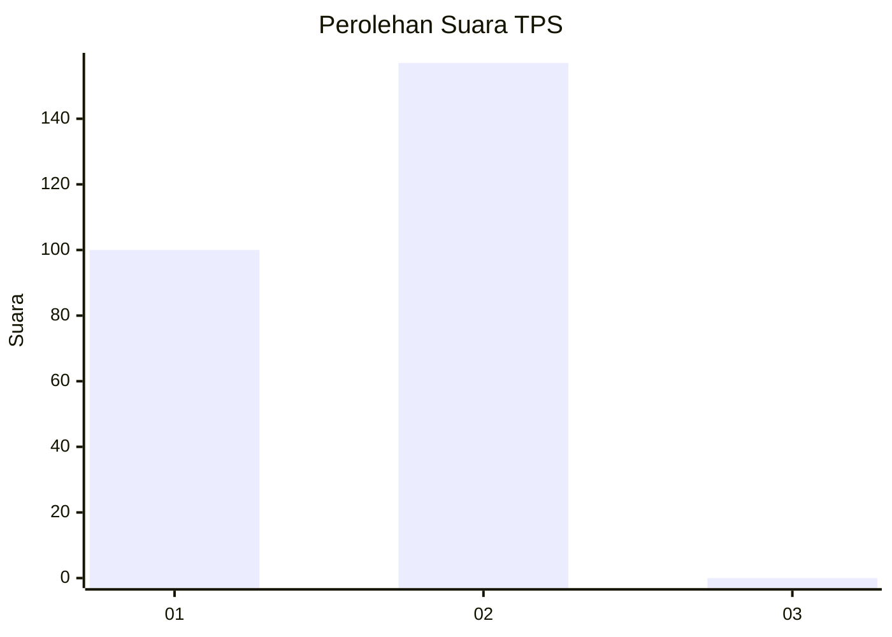
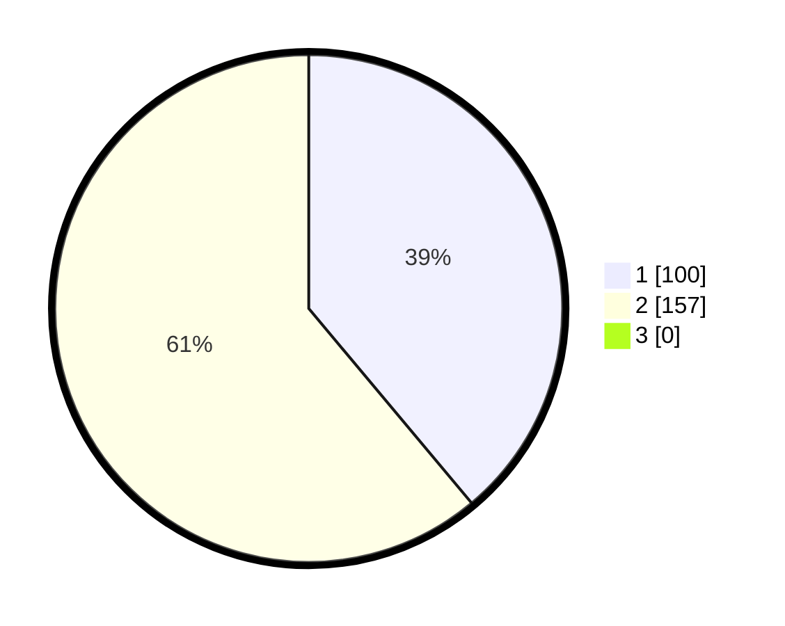

# Hasil

## Grafik

## Tabel

| No. | Nama Paslon    | Suara | Suara (raw) | Persentase |
|:--- |:-------------- | -----:| -----------:| ----------:|
| 1   | ANIES MUHAIMIN | 100   | [100][p-1]  | 38,91      |
| 2   | PRABOWO GIBRAN | 157   | [157][p-2]  | 61,09      |
| 3   | GANJAR MAHFUD  | 0     | [0][p-3]    | 0,00       |

[p-1]: https://github.com/gigit-pemilu/pemilu-2024/blob/main/pilpres/hitung-suara/sub/35-jawa-timur/sub/27-sampang/sub/07-jrengik/sub/2013-bancelok/sub/008-tps/sub/paslon-1.txt
[p-2]: https://github.com/gigit-pemilu/pemilu-2024/blob/main/pilpres/hitung-suara/sub/35-jawa-timur/sub/27-sampang/sub/07-jrengik/sub/2013-bancelok/sub/008-tps/sub/paslon-2.txt
[p-3]: https://github.com/gigit-pemilu/pemilu-2024/blob/main/pilpres/hitung-suara/sub/35-jawa-timur/sub/27-sampang/sub/07-jrengik/sub/2013-bancelok/sub/008-tps/sub/paslon-3.txt

## Foto C Plano

https://sirekap-obj-formc.kpu.go.id/4000/pemilu/ppwp/35/27/07/20/13/3527072013008-20240219-153901--8815d444-ae1c-4b42-b52b-80d0522a8783.jpg

https://sirekap-obj-formc.kpu.go.id/4000/pemilu/ppwp/35/27/07/20/13/3527072013008-20240219-154026--3d0300ec-c98d-40fc-9a45-3fbc1b13dd8c.jpg

https://sirekap-obj-formc.kpu.go.id/4000/pemilu/ppwp/35/27/07/20/13/3527072013008-20240219-154157--11cfe133-179b-4b1c-8f2a-72e1237d2652.jpg

## Metadata

| Key        | Value               |
| ---------- | ------------------- |
| Time Stamp | 2024-02-24 22:31:28 |

