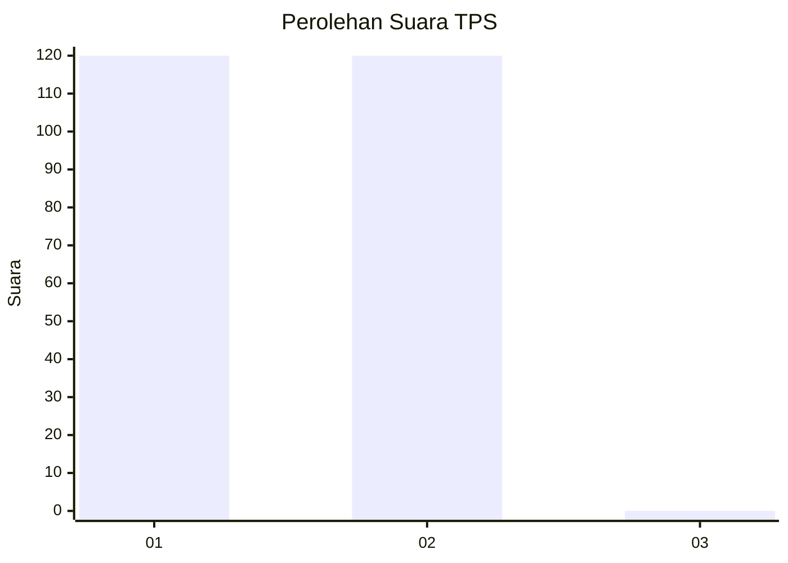
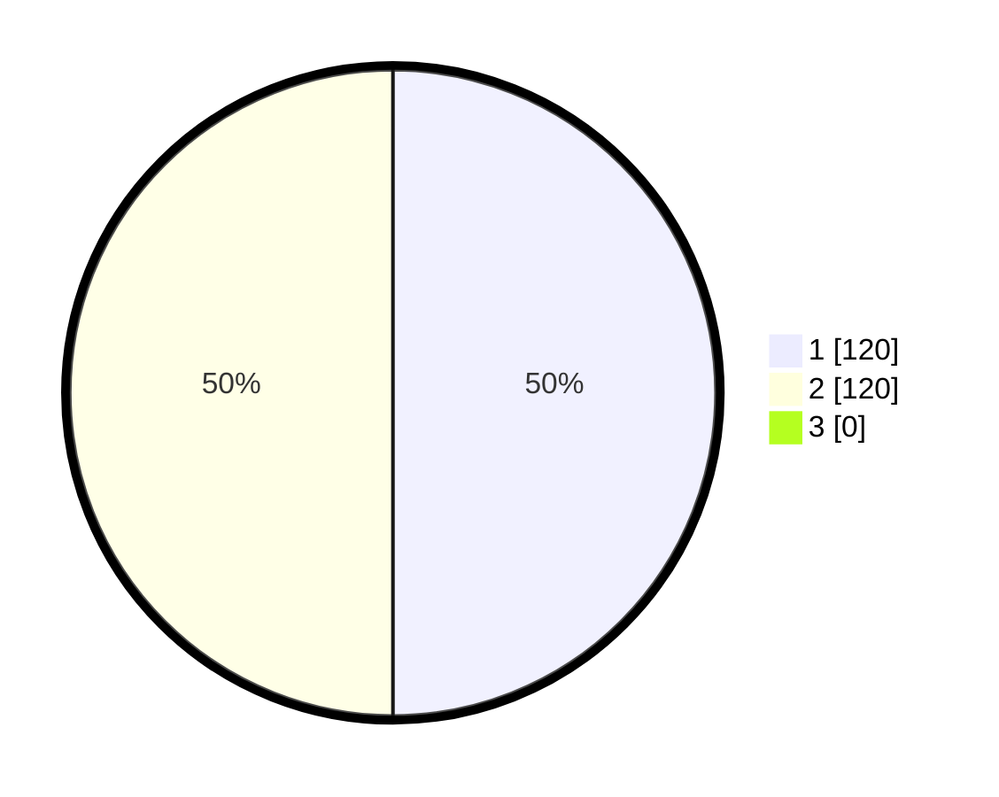

# Hasil

## Grafik

## Tabel

| No. | Nama Paslon    | Suara | Suara (raw) | Persentase |
|:--- |:-------------- | -----:| -----------:| ----------:|
| 1   | ANIES MUHAIMIN | 120   | [120][p-1]  | 50,00      |
| 2   | PRABOWO GIBRAN | 120   | [120][p-2]  | 50,00      |
| 3   | GANJAR MAHFUD  | 0     | [0][p-3]    | 0,00       |

[p-1]: https://github.com/gigit-pemilu/pemilu-2024-35-jawa-timur/blob/main/pilpres/hitung-suara/sub/35-jawa-timur/sub/27-sampang/sub/07-jrengik/sub/2013-bancelok/sub/009-tps/sub/paslon-1.txt
[p-2]: https://github.com/gigit-pemilu/pemilu-2024-35-jawa-timur/blob/main/pilpres/hitung-suara/sub/35-jawa-timur/sub/27-sampang/sub/07-jrengik/sub/2013-bancelok/sub/009-tps/sub/paslon-2.txt
[p-3]: https://github.com/gigit-pemilu/pemilu-2024-35-jawa-timur/blob/main/pilpres/hitung-suara/sub/35-jawa-timur/sub/27-sampang/sub/07-jrengik/sub/2013-bancelok/sub/009-tps/sub/paslon-3.txt

## Foto C Plano

https://sirekap-obj-formc.kpu.go.id/6303/pemilu/ppwp/35/27/07/20/13/3527072013009-20240219-154229--90881100-af39-426f-a5ea-ef98b4906e82.jpg

https://sirekap-obj-formc.kpu.go.id/6303/pemilu/ppwp/35/27/07/20/13/3527072013009-20240219-154341--f94a779b-02aa-4f20-bc53-44f17a47068b.jpg

https://sirekap-obj-formc.kpu.go.id/6303/pemilu/ppwp/35/27/07/20/13/3527072013009-20240219-154408--77aef4ee-a359-4699-a85b-cd9e55836614.jpg

## Metadata

| Key        | Value               |
| ---------- | ------------------- |
| Time Stamp | 2024-02-25 15:00:00 |

