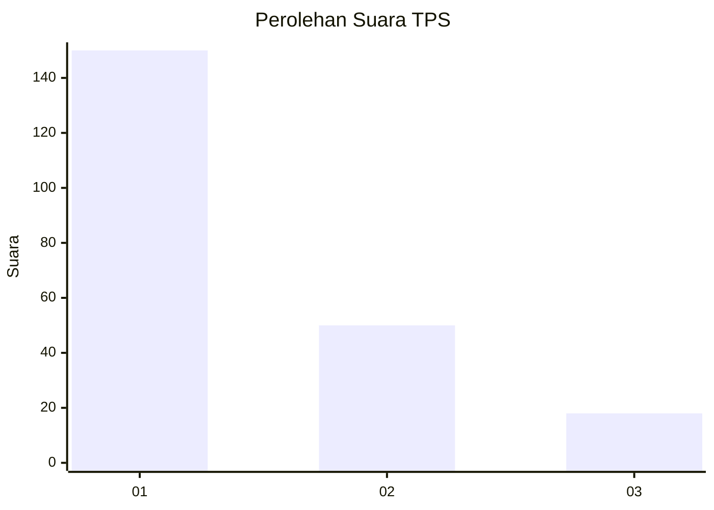
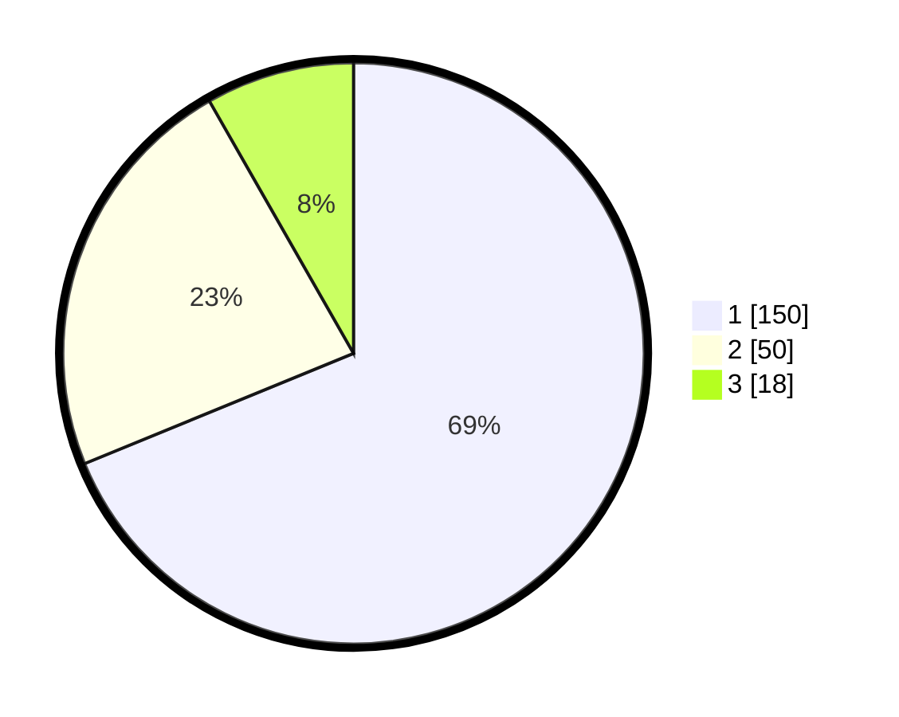

# Hasil

## Grafik

## Tabel

| No. | Nama Paslon    | Suara | Suara (raw) | Persentase |
|:--- |:-------------- | -----:| -----------:| ----------:|
| 1   | ANIES MUHAIMIN | 150   | [150][p-1]  | 68,81      |
| 2   | PRABOWO GIBRAN | 50    | [50][p-2]   | 22,94      |
| 3   | GANJAR MAHFUD  | 18    | [18][p-3]   | 8,26       |

[p-1]: https://github.com/gigit-pemilu/pemilu-2024/blob/main/pilpres/hitung-suara/sub/35-jawa-timur/sub/27-sampang/sub/07-jrengik/sub/2013-bancelok/sub/011-tps/sub/paslon-1.txt
[p-2]: https://github.com/gigit-pemilu/pemilu-2024/blob/main/pilpres/hitung-suara/sub/35-jawa-timur/sub/27-sampang/sub/07-jrengik/sub/2013-bancelok/sub/011-tps/sub/paslon-2.txt
[p-3]: https://github.com/gigit-pemilu/pemilu-2024/blob/main/pilpres/hitung-suara/sub/35-jawa-timur/sub/27-sampang/sub/07-jrengik/sub/2013-bancelok/sub/011-tps/sub/paslon-3.txt

## Foto C Plano

https://sirekap-obj-formc.kpu.go.id/f615/pemilu/ppwp/35/27/07/20/13/3527072013011-20240219-154852--c9b151b9-872b-4f21-9189-4e849ab52ee4.jpg

https://sirekap-obj-formc.kpu.go.id/f615/pemilu/ppwp/35/27/07/20/13/3527072013011-20240219-154942--7df9de0a-f034-4397-b063-b09da5b6bc56.jpg

https://sirekap-obj-formc.kpu.go.id/f615/pemilu/ppwp/35/27/07/20/13/3527072013011-20240219-155008--9193ef93-9741-4de3-9c4c-fb71b95eaa9b.jpg

## Metadata

| Key        | Value               |
| ---------- | ------------------- |
| Time Stamp | 2024-02-24 22:31:28 |

