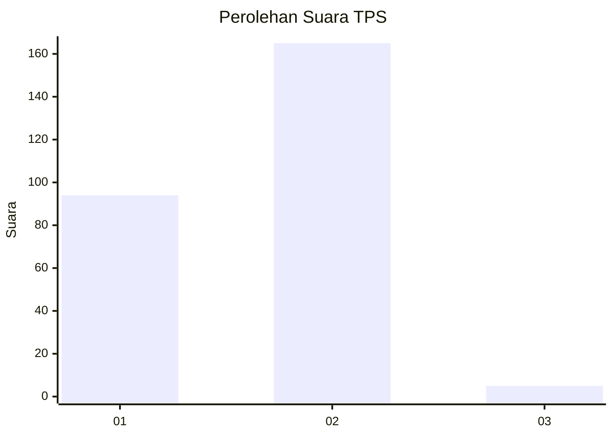
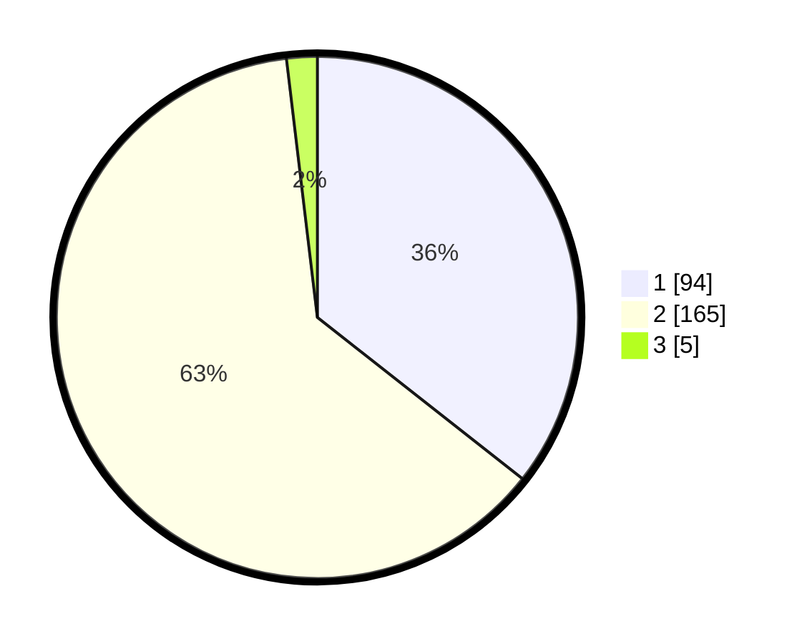

# Hasil

## Grafik

## Tabel

| No. | Nama Paslon    | Suara | Suara (raw) | Persentase |
|:--- |:-------------- | -----:| -----------:| ----------:|
| 1   | ANIES MUHAIMIN | 94    | [94][p-1]   | 35,61      |
| 2   | PRABOWO GIBRAN | 165   | [165][p-2]  | 62,50      |
| 3   | GANJAR MAHFUD  | 5     | [5][p-3]    | 1,89       |

[p-1]: https://github.com/gigit-pemilu/pemilu-2024-35-jawa-timur/blob/main/pilpres/hitung-suara/sub/35-jawa-timur/sub/27-sampang/sub/07-jrengik/sub/2013-bancelok/sub/012-tps/sub/paslon-1.txt
[p-2]: https://github.com/gigit-pemilu/pemilu-2024-35-jawa-timur/blob/main/pilpres/hitung-suara/sub/35-jawa-timur/sub/27-sampang/sub/07-jrengik/sub/2013-bancelok/sub/012-tps/sub/paslon-2.txt
[p-3]: https://github.com/gigit-pemilu/pemilu-2024-35-jawa-timur/blob/main/pilpres/hitung-suara/sub/35-jawa-timur/sub/27-sampang/sub/07-jrengik/sub/2013-bancelok/sub/012-tps/sub/paslon-3.txt

## Foto C Plano

https://sirekap-obj-formc.kpu.go.id/f270/pemilu/ppwp/35/27/07/20/13/3527072013012-20240219-155049--00f1536b-2443-40aa-8ca9-c1c7f2e7e167.jpg

https://sirekap-obj-formc.kpu.go.id/f270/pemilu/ppwp/35/27/07/20/13/3527072013012-20240219-155156--6501d2bb-75df-4ced-95e8-df54b41f1e00.jpg

https://sirekap-obj-formc.kpu.go.id/f270/pemilu/ppwp/35/27/07/20/13/3527072013012-20240219-155401--01a857d0-4c2f-4d5e-adc9-a377db413352.jpg

## Metadata

| Key        | Value               |
| ---------- | ------------------- |
| Time Stamp | 2024-02-25 14:00:00 |

