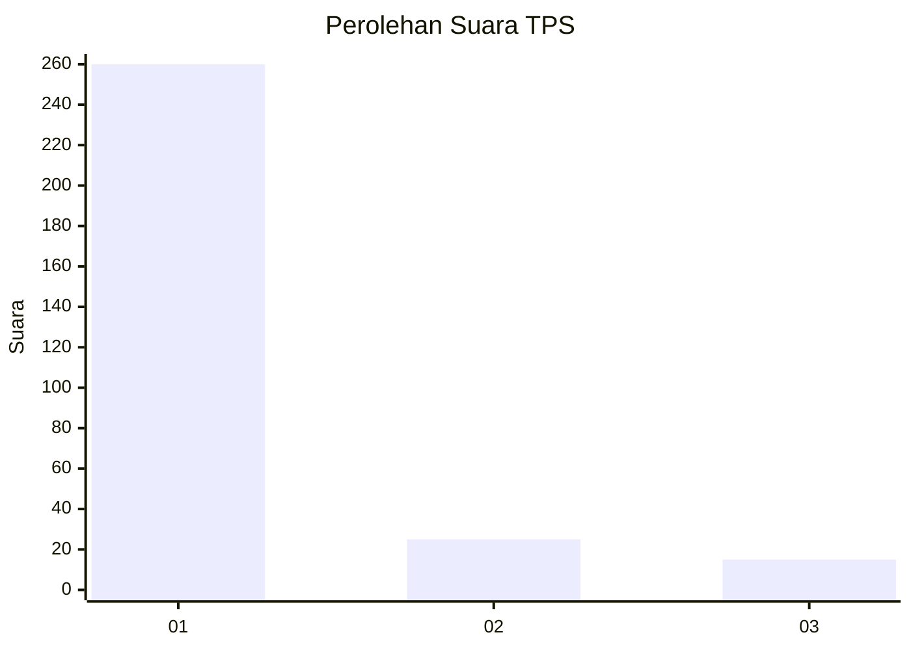
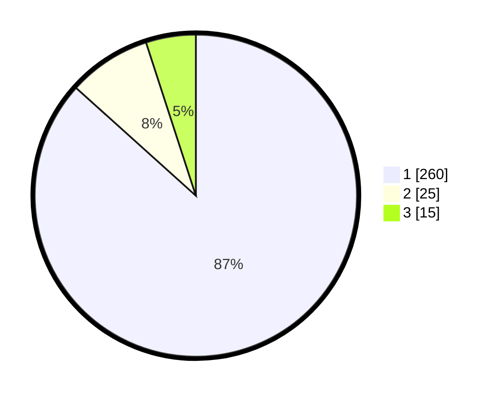

# Hasil

## Grafik

## Tabel

| No. | Nama Paslon    | Suara | Suara (raw) | Persentase |
|:--- |:-------------- | -----:| -----------:| ----------:|
| 1   | ANIES MUHAIMIN | 260   | [260][p-1]  | 86,67      |
| 2   | PRABOWO GIBRAN | 25    | [25][p-2]   | 8,33       |
| 3   | GANJAR MAHFUD  | 15    | [15][p-3]   | 5,00       |

[p-1]: https://github.com/gigit-pemilu/pemilu-2024-35-jawa-timur/blob/main/pilpres/hitung-suara/sub/35-jawa-timur/sub/27-sampang/sub/08-tambelangan/sub/2002-baturasang/sub/005-tps/sub/paslon-1.txt
[p-2]: https://github.com/gigit-pemilu/pemilu-2024-35-jawa-timur/blob/main/pilpres/hitung-suara/sub/35-jawa-timur/sub/27-sampang/sub/08-tambelangan/sub/2002-baturasang/sub/005-tps/sub/paslon-2.txt
[p-3]: https://github.com/gigit-pemilu/pemilu-2024-35-jawa-timur/blob/main/pilpres/hitung-suara/sub/35-jawa-timur/sub/27-sampang/sub/08-tambelangan/sub/2002-baturasang/sub/005-tps/sub/paslon-3.txt

## Foto C Plano

https://sirekap-obj-formc.kpu.go.id/a0bb/pemilu/ppwp/35/27/08/20/02/3527082002005-20240214-220203--0fa739f4-4399-41a7-b34a-eb3f75e9e379.jpg

https://sirekap-obj-formc.kpu.go.id/a0bb/pemilu/ppwp/35/27/08/20/02/3527082002005-20240214-220416--ca03b32b-62be-470b-9845-450951e259f1.jpg

https://sirekap-obj-formc.kpu.go.id/a0bb/pemilu/ppwp/35/27/08/20/02/3527082002005-20240214-220600--6dcf86ec-0a1a-4b67-b90b-de98cfad803f.jpg

## Metadata

| Key        | Value               |
| ---------- | ------------------- |
| Time Stamp | 2024-02-16 11:00:29 |

