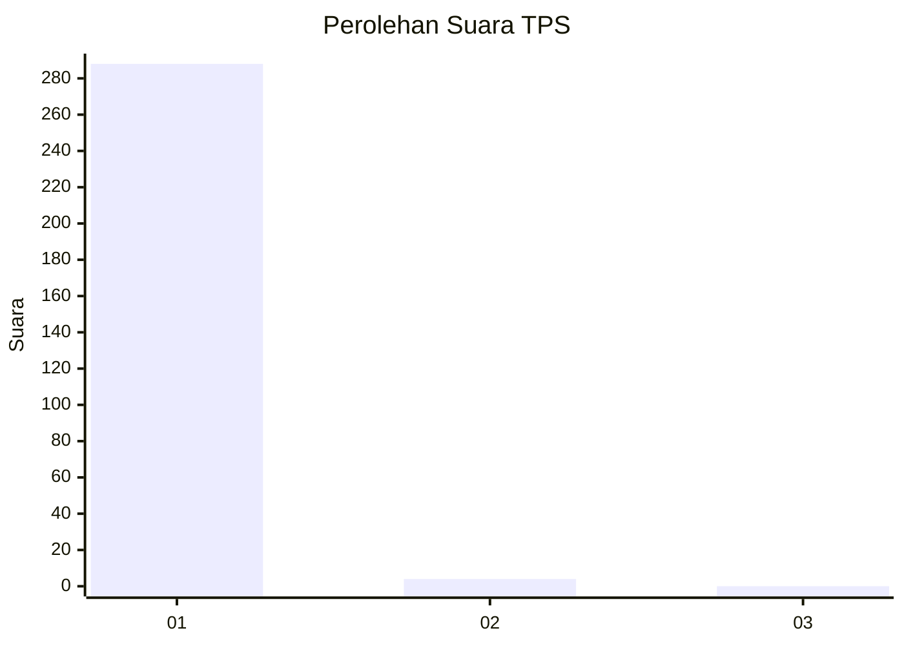
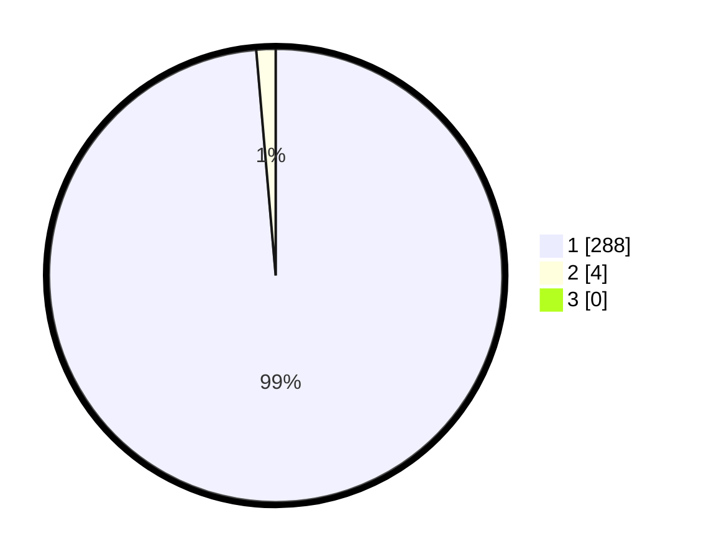

# Hasil

## Grafik

## Tabel

| No. | Nama Paslon    | Suara | Suara (raw) | Persentase |
|:--- |:-------------- | -----:| -----------:| ----------:|
| 1   | ANIES MUHAIMIN | 288   | [288][p-1]  | 98,63      |
| 2   | PRABOWO GIBRAN | 4     | [4][p-2]    | 1,37       |
| 3   | GANJAR MAHFUD  | 0     | [0][p-3]    | 0,00       |

[p-1]: https://github.com/gigit-pemilu/pemilu-2024-35-jawa-timur/blob/main/pilpres/hitung-suara/sub/35-jawa-timur/sub/27-sampang/sub/08-tambelangan/sub/2002-baturasang/sub/008-tps/sub/paslon-1.txt
[p-2]: https://github.com/gigit-pemilu/pemilu-2024-35-jawa-timur/blob/main/pilpres/hitung-suara/sub/35-jawa-timur/sub/27-sampang/sub/08-tambelangan/sub/2002-baturasang/sub/008-tps/sub/paslon-2.txt
[p-3]: https://github.com/gigit-pemilu/pemilu-2024-35-jawa-timur/blob/main/pilpres/hitung-suara/sub/35-jawa-timur/sub/27-sampang/sub/08-tambelangan/sub/2002-baturasang/sub/008-tps/sub/paslon-3.txt

## Foto C Plano

https://sirekap-obj-formc.kpu.go.id/31da/pemilu/ppwp/35/27/08/20/02/3527082002008-20240215-075004--ec04f7ab-f53a-45ba-9104-9573a12c4533.jpg

https://sirekap-obj-formc.kpu.go.id/31da/pemilu/ppwp/35/27/08/20/02/3527082002008-20240215-005148--c98da1d8-2a97-4d67-9677-3a40c21ddaf4.jpg

https://sirekap-obj-formc.kpu.go.id/31da/pemilu/ppwp/35/27/08/20/02/3527082002008-20240215-005244--3b14ffc5-a6c0-4a46-b752-b438a24630c1.jpg

## Metadata

| Key        | Value               |
| ---------- | ------------------- |
| Time Stamp | 2024-02-16 10:30:29 |

