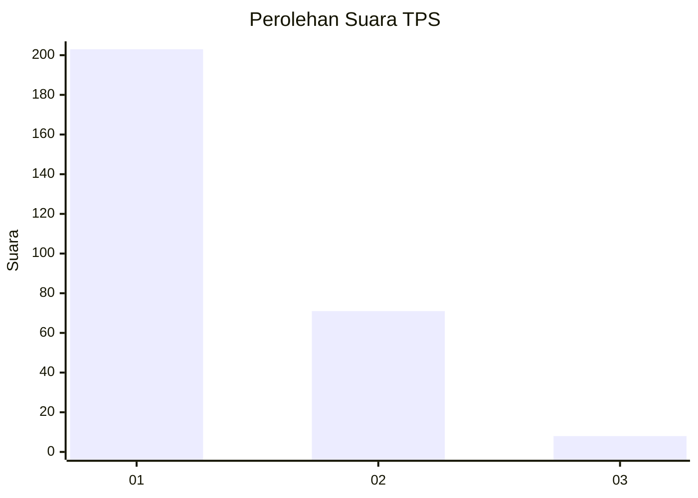
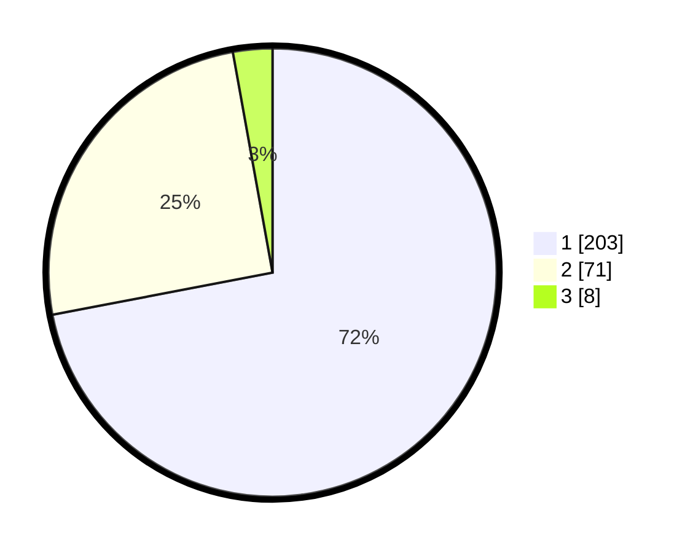

# Hasil

## Grafik

## Tabel

| No. | Nama Paslon    | Suara | Suara (raw) | Persentase |
|:--- |:-------------- | -----:| -----------:| ----------:|
| 1   | ANIES MUHAIMIN | 203   | [203][p-1]  | 71,99      |
| 2   | PRABOWO GIBRAN | 71    | [71][p-2]   | 25,18      |
| 3   | GANJAR MAHFUD  | 8     | [8][p-3]    | 2,84       |

[p-1]: https://github.com/gigit-pemilu/pemilu-2024-35-jawa-timur/blob/main/pilpres/hitung-suara/sub/35-jawa-timur/sub/27-sampang/sub/08-tambelangan/sub/2002-baturasang/sub/009-tps/sub/paslon-1.txt
[p-2]: https://github.com/gigit-pemilu/pemilu-2024-35-jawa-timur/blob/main/pilpres/hitung-suara/sub/35-jawa-timur/sub/27-sampang/sub/08-tambelangan/sub/2002-baturasang/sub/009-tps/sub/paslon-2.txt
[p-3]: https://github.com/gigit-pemilu/pemilu-2024-35-jawa-timur/blob/main/pilpres/hitung-suara/sub/35-jawa-timur/sub/27-sampang/sub/08-tambelangan/sub/2002-baturasang/sub/009-tps/sub/paslon-3.txt

## Foto C Plano

https://sirekap-obj-formc.kpu.go.id/3cf1/pemilu/ppwp/35/27/08/20/02/3527082002009-20240215-081050--d8a17fc2-506f-4505-9a48-137df97bbe5a.jpg

https://sirekap-obj-formc.kpu.go.id/3cf1/pemilu/ppwp/35/27/08/20/02/3527082002009-20240215-081437--4958cae9-bb28-4891-b851-f821c4e4ab3a.jpg

## Metadata

| Key        | Value               |
| ---------- | ------------------- |
| Time Stamp | 2024-02-25 11:00:00 |

