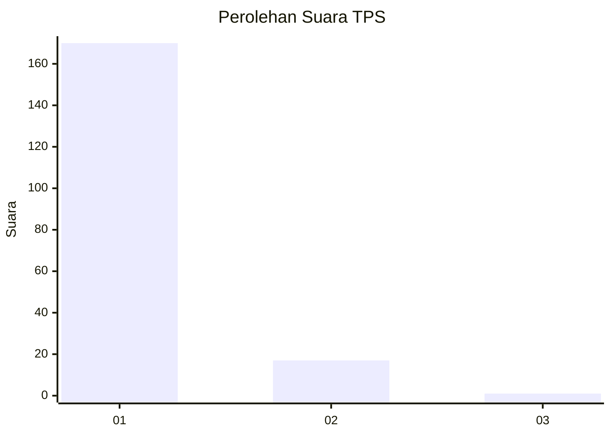
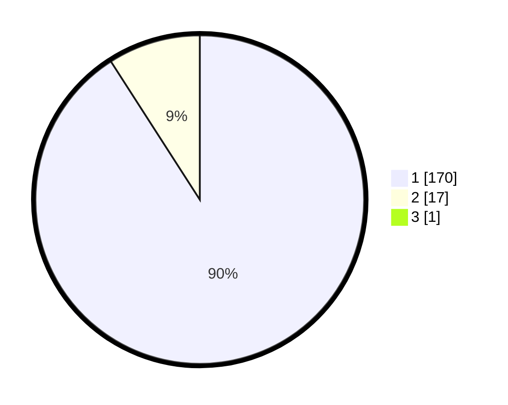

# Hasil

## Grafik

## Tabel

| No. | Nama Paslon    | Suara | Suara (raw) | Persentase |
|:--- |:-------------- | -----:| -----------:| ----------:|
| 1   | ANIES MUHAIMIN | 170   | [170][p-1]  | 90,43      |
| 2   | PRABOWO GIBRAN | 17    | [17][p-2]   | 9,04       |
| 3   | GANJAR MAHFUD  | 1     | [1][p-3]    | 0,53       |

[p-1]: https://github.com/gigit-pemilu/pemilu-2024/blob/main/pilpres/hitung-suara/sub/35-jawa-timur/sub/27-sampang/sub/08-tambelangan/sub/2002-baturasang/sub/010-tps/sub/paslon-1.txt
[p-2]: https://github.com/gigit-pemilu/pemilu-2024/blob/main/pilpres/hitung-suara/sub/35-jawa-timur/sub/27-sampang/sub/08-tambelangan/sub/2002-baturasang/sub/010-tps/sub/paslon-2.txt
[p-3]: https://github.com/gigit-pemilu/pemilu-2024/blob/main/pilpres/hitung-suara/sub/35-jawa-timur/sub/27-sampang/sub/08-tambelangan/sub/2002-baturasang/sub/010-tps/sub/paslon-3.txt

## Foto C Plano

https://sirekap-obj-formc.kpu.go.id/3a38/pemilu/ppwp/35/27/08/20/02/3527082002010-20240215-075945--219dc7d9-fda3-42ca-8696-b9cd1b461713.jpg

https://sirekap-obj-formc.kpu.go.id/3a38/pemilu/ppwp/35/27/08/20/02/3527082002010-20240215-081054--69a1d91f-d138-40b5-9e03-8c53469b8fc1.jpg

https://sirekap-obj-formc.kpu.go.id/3a38/pemilu/ppwp/35/27/08/20/02/3527082002010-20240215-081351--a985527e-b6e0-442d-8605-7f368d1a1ace.jpg

## Metadata

| Key        | Value               |
| ---------- | ------------------- |
| Time Stamp | 2024-02-16 14:30:33 |

