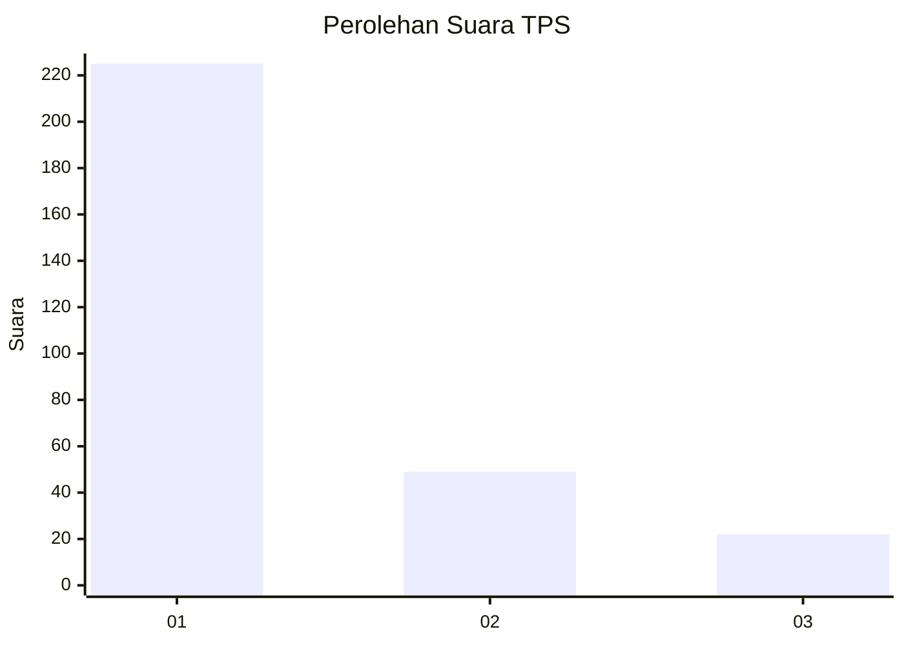
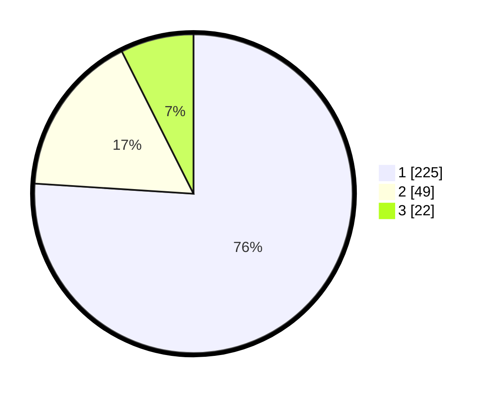

# Hasil

## Grafik

## Tabel

| No. | Nama Paslon    | Suara | Suara (raw) | Persentase |
|:--- |:-------------- | -----:| -----------:| ----------:|
| 1   | ANIES MUHAIMIN | 225   | [225][p-1]  | 76,01      |
| 2   | PRABOWO GIBRAN | 49    | [49][p-2]   | 16,55      |
| 3   | GANJAR MAHFUD  | 22    | [22][p-3]   | 7,43       |

[p-1]: https://github.com/gigit-pemilu/pemilu-2024/blob/main/pilpres/hitung-suara/sub/35-jawa-timur/sub/27-sampang/sub/08-tambelangan/sub/2003-mambulu-barat/sub/002-tps/sub/paslon-1.txt
[p-2]: https://github.com/gigit-pemilu/pemilu-2024/blob/main/pilpres/hitung-suara/sub/35-jawa-timur/sub/27-sampang/sub/08-tambelangan/sub/2003-mambulu-barat/sub/002-tps/sub/paslon-2.txt
[p-3]: https://github.com/gigit-pemilu/pemilu-2024/blob/main/pilpres/hitung-suara/sub/35-jawa-timur/sub/27-sampang/sub/08-tambelangan/sub/2003-mambulu-barat/sub/002-tps/sub/paslon-3.txt

## Foto C Plano

https://sirekap-obj-formc.kpu.go.id/e208/pemilu/ppwp/35/27/08/20/03/3527082003002-20240214-205130--0f8e3744-c201-4a53-ad1e-a60d6a921c3f.jpg

https://sirekap-obj-formc.kpu.go.id/e208/pemilu/ppwp/35/27/08/20/03/3527082003002-20240214-205201--c7ce5feb-4bce-4852-aca3-84a0280c188a.jpg

https://sirekap-obj-formc.kpu.go.id/e208/pemilu/ppwp/35/27/08/20/03/3527082003002-20240214-205242--cd96b569-441a-449f-83c9-1fd22c147fc2.jpg

## Metadata

| Key        | Value               |
| ---------- | ------------------- |
| Time Stamp | 2024-02-16 10:30:29 |

