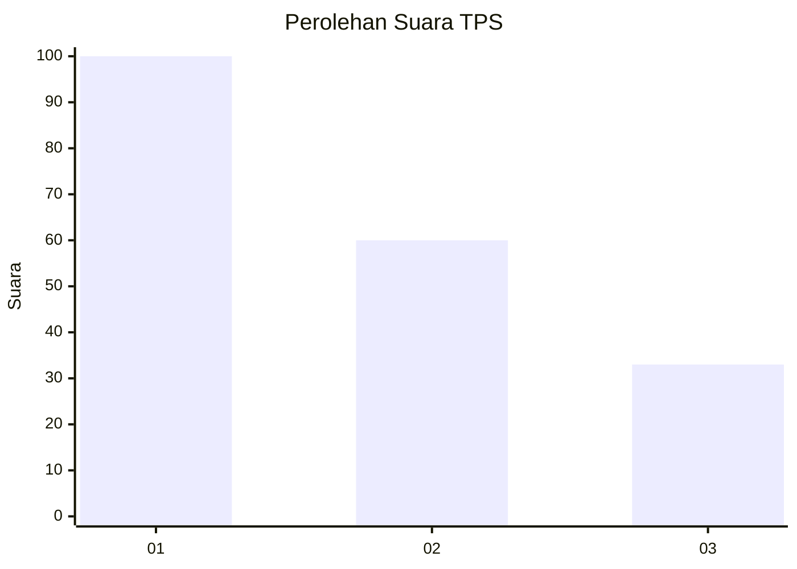
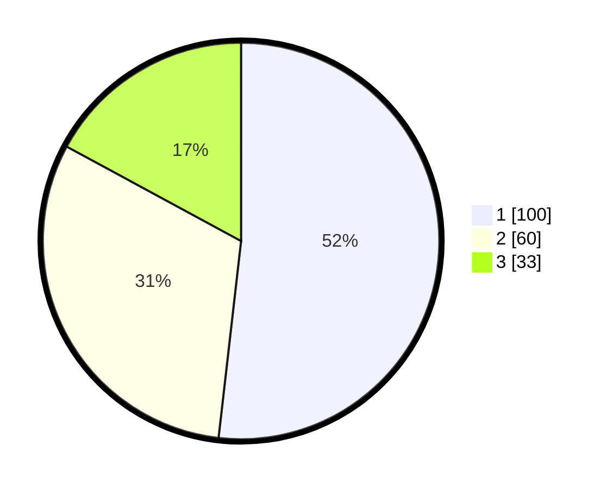

# Hasil

## Grafik

## Tabel

| No. | Nama Paslon    | Suara | Suara (raw) | Persentase |
|:--- |:-------------- | -----:| -----------:| ----------:|
| 1   | ANIES MUHAIMIN | 100   | [100][p-1]  | 51,81      |
| 2   | PRABOWO GIBRAN | 60    | [60][p-2]   | 31,09      |
| 3   | GANJAR MAHFUD  | 33    | [33][p-3]   | 17,10      |

[p-1]: https://github.com/gigit-pemilu/pemilu-2024-35-jawa-timur/blob/main/pilpres/hitung-suara/sub/35-jawa-timur/sub/27-sampang/sub/08-tambelangan/sub/2003-mambulu-barat/sub/005-tps/sub/paslon-1.txt
[p-2]: https://github.com/gigit-pemilu/pemilu-2024-35-jawa-timur/blob/main/pilpres/hitung-suara/sub/35-jawa-timur/sub/27-sampang/sub/08-tambelangan/sub/2003-mambulu-barat/sub/005-tps/sub/paslon-2.txt
[p-3]: https://github.com/gigit-pemilu/pemilu-2024-35-jawa-timur/blob/main/pilpres/hitung-suara/sub/35-jawa-timur/sub/27-sampang/sub/08-tambelangan/sub/2003-mambulu-barat/sub/005-tps/sub/paslon-3.txt

## Foto C Plano

https://sirekap-obj-formc.kpu.go.id/9781/pemilu/ppwp/35/27/08/20/03/3527082003005-20240226-115022--1bf2ca10-81b9-4fe7-9891-8ae34c1fc07c.jpg

https://sirekap-obj-formc.kpu.go.id/9781/pemilu/ppwp/35/27/08/20/03/3527082003005-20240226-112732--6136f6fb-6d87-4857-a654-41bbf29f2aac.jpg

https://sirekap-obj-formc.kpu.go.id/9781/pemilu/ppwp/35/27/08/20/03/3527082003005-20240226-112748--817d0ab0-4378-4891-99e2-8a4c685144ae.jpg

## Metadata

| Key        | Value               |
| ---------- | ------------------- |
| Time Stamp | 2024-02-26 12:00:00 |

