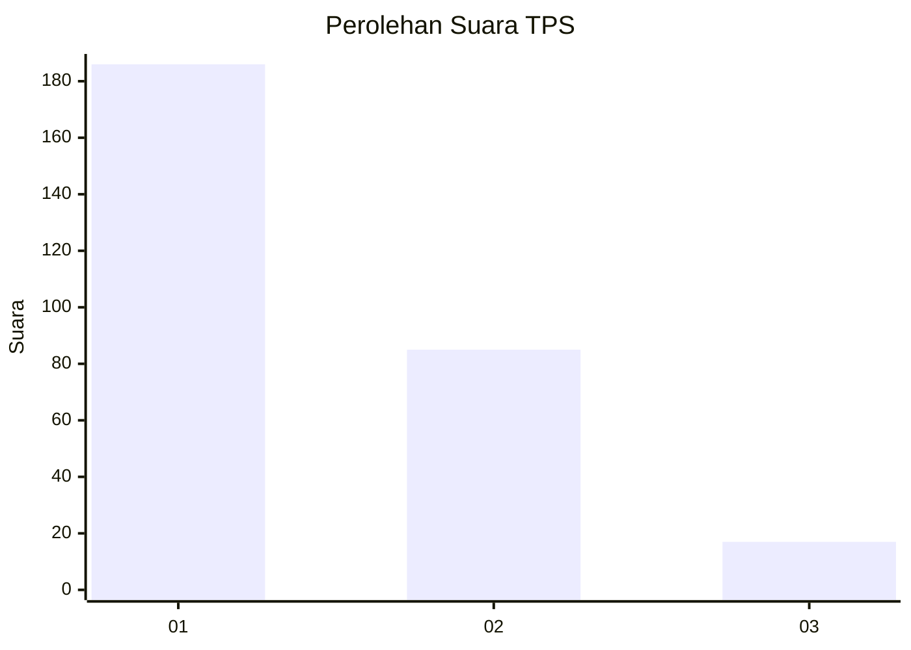
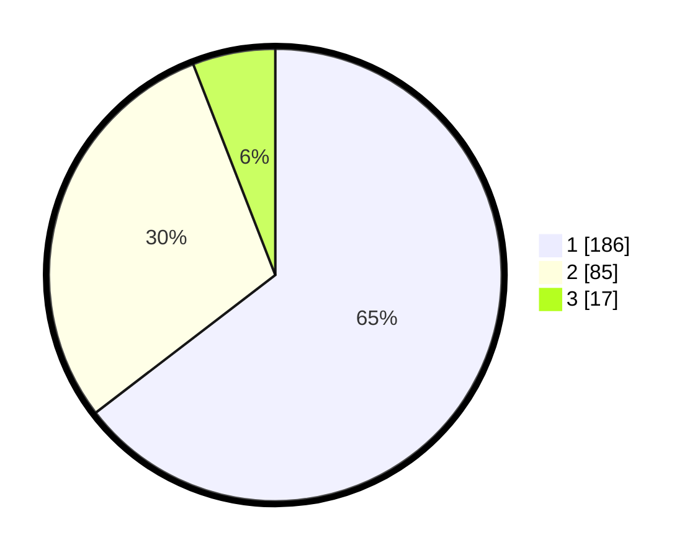

# Hasil

## Grafik

## Tabel

| No. | Nama Paslon    | Suara | Suara (raw) | Persentase |
|:--- |:-------------- | -----:| -----------:| ----------:|
| 1   | ANIES MUHAIMIN | 186   | [186][p-1]  | 64,58      |
| 2   | PRABOWO GIBRAN | 85    | [85][p-2]   | 29,51      |
| 3   | GANJAR MAHFUD  | 17    | [17][p-3]   | 5,90       |

[p-1]: https://github.com/gigit-pemilu/pemilu-2024/blob/main/pilpres/hitung-suara/sub/35-jawa-timur/sub/27-sampang/sub/08-tambelangan/sub/2003-mambulu-barat/sub/012-tps/sub/paslon-1.txt
[p-2]: https://github.com/gigit-pemilu/pemilu-2024/blob/main/pilpres/hitung-suara/sub/35-jawa-timur/sub/27-sampang/sub/08-tambelangan/sub/2003-mambulu-barat/sub/012-tps/sub/paslon-2.txt
[p-3]: https://github.com/gigit-pemilu/pemilu-2024/blob/main/pilpres/hitung-suara/sub/35-jawa-timur/sub/27-sampang/sub/08-tambelangan/sub/2003-mambulu-barat/sub/012-tps/sub/paslon-3.txt

## Foto C Plano

https://sirekap-obj-formc.kpu.go.id/55ae/pemilu/ppwp/35/27/08/20/03/3527082003012-20240215-085211--c1184fe9-8241-41a5-b720-644353edc288.jpg

https://sirekap-obj-formc.kpu.go.id/55ae/pemilu/ppwp/35/27/08/20/03/3527082003012-20240215-085321--95e938ed-0ba2-465f-89c0-ec940f773b42.jpg

https://sirekap-obj-formc.kpu.go.id/55ae/pemilu/ppwp/35/27/08/20/03/3527082003012-20240215-085520--c7e21388-b60d-46ff-ac15-ae205072d5b8.jpg

## Metadata

| Key        | Value               |
| ---------- | ------------------- |
| Time Stamp | 2024-02-16 14:30:33 |

