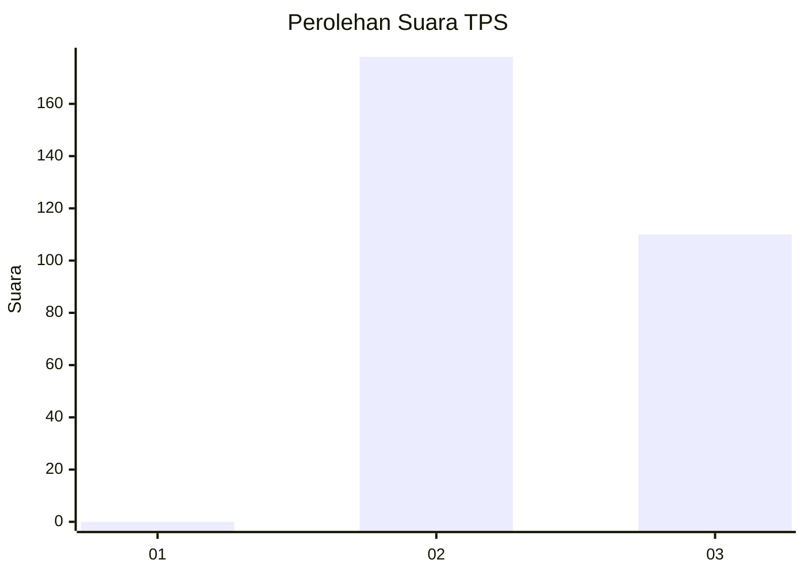
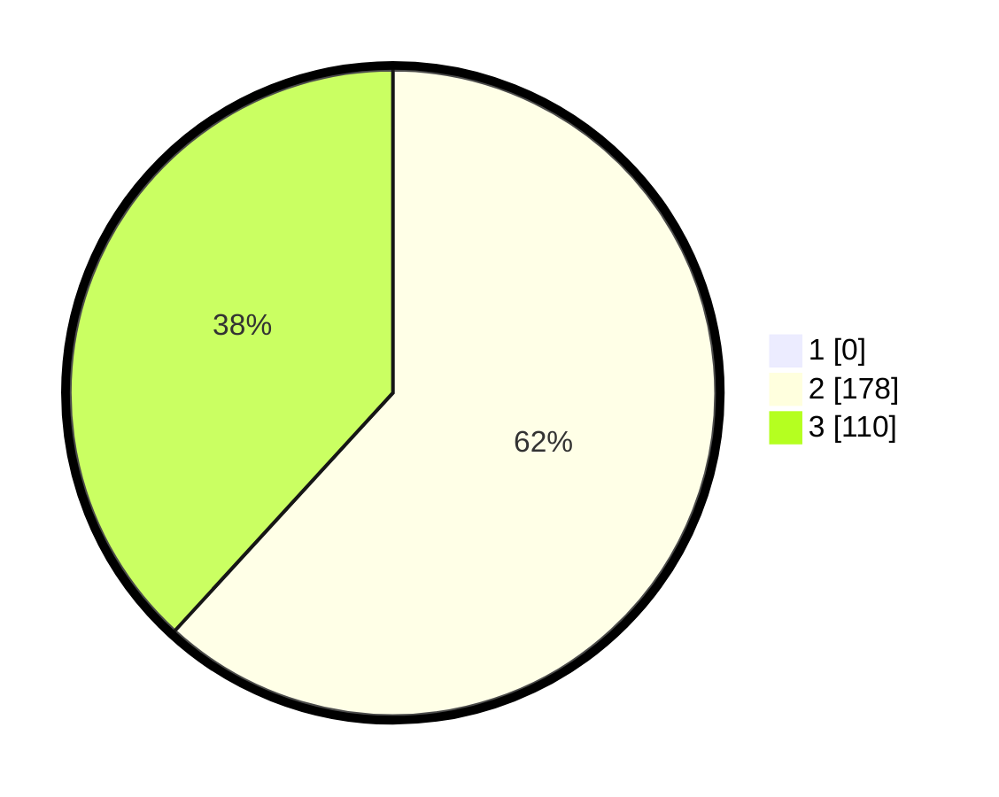

# Hasil

## Grafik

## Tabel

| No. | Nama Paslon    | Suara | Suara (raw) | Persentase |
|:--- |:-------------- | -----:| -----------:| ----------:|
| 1   | ANIES MUHAIMIN | 0     | [0][p-1]    | 0,00       |
| 2   | PRABOWO GIBRAN | 178   | [178][p-2]  | 61,81      |
| 3   | GANJAR MAHFUD  | 110   | [110][p-3]  | 38,19      |

[p-1]: https://github.com/gigit-pemilu/pemilu-2024/blob/main/pilpres/hitung-suara/sub/35-jawa-timur/sub/27-sampang/sub/08-tambelangan/sub/2006-tambelangan/sub/010-tps/sub/paslon-1.txt
[p-2]: https://github.com/gigit-pemilu/pemilu-2024/blob/main/pilpres/hitung-suara/sub/35-jawa-timur/sub/27-sampang/sub/08-tambelangan/sub/2006-tambelangan/sub/010-tps/sub/paslon-2.txt
[p-3]: https://github.com/gigit-pemilu/pemilu-2024/blob/main/pilpres/hitung-suara/sub/35-jawa-timur/sub/27-sampang/sub/08-tambelangan/sub/2006-tambelangan/sub/010-tps/sub/paslon-3.txt

## Foto C Plano

https://sirekap-obj-formc.kpu.go.id/e33f/pemilu/ppwp/35/27/08/20/06/3527082006010-20240214-210847--125f0cd5-43c8-4acd-9b01-90c88bc31ce9.jpg

https://sirekap-obj-formc.kpu.go.id/e33f/pemilu/ppwp/35/27/08/20/06/3527082006010-20240214-201609--855e8fa0-01e4-473b-b5b3-6a8b99b66991.jpg

https://sirekap-obj-formc.kpu.go.id/e33f/pemilu/ppwp/35/27/08/20/06/3527082006010-20240214-201644--7431dae4-cfae-41dd-b50d-302156640374.jpg

## Metadata

| Key        | Value               |
| ---------- | ------------------- |
| Time Stamp | 2024-02-16 22:30:00 |

